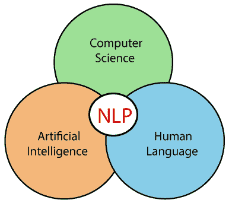
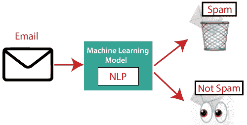
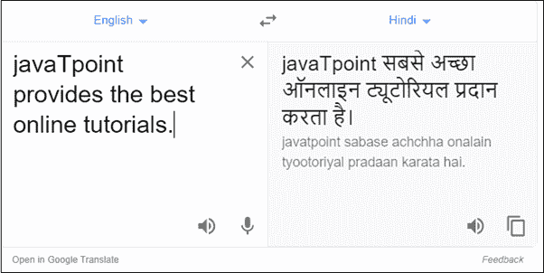
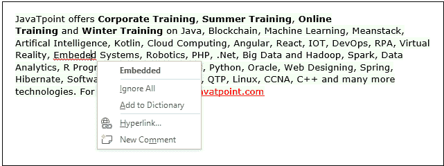
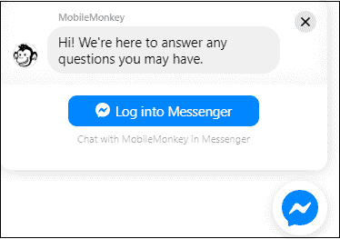
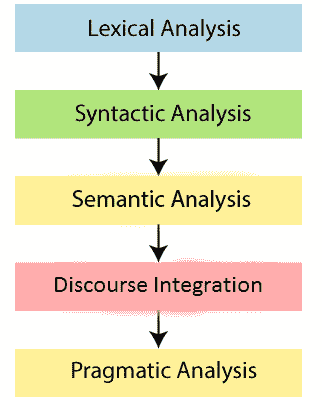

# NLP 教程

> 原文：<https://www.javatpoint.com/nlp>

NLP 教程提供了 NLP 教程的基本和高级概念。我们的 NLP 教程是为初学者和专业人士设计的。

*   [什么是 NLP？](#What)
*   [NLP 的历史](#History)
*   [NLP 的优势](#Advantages)
*   [NLP 的缺点](#Disadvantages)
*   [NLP 的组成部分](#Components)
*   [自然语言处理的应用](#Applications)
*   [如何搭建 NLP 管道？](#How)
*   [自然语言处理阶段](#Phases)
*   [为什么 NLP 难？](#Why)
*   [NLP API](#APIs)
*   [NLP 库](#Libraries)
*   [自然语言和计算机语言的区别](#Difference)

* * *

## 什么是 NLP？

NLP 代表**自然语言处理**，是**计算机科学、人类语言、**和**人工智能**的一部分。它是机器用来理解、分析、操作和解释人类语言的技术。它帮助开发人员组织知识以执行任务，例如**翻译、自动摘要、命名实体识别(NER)、语音识别、关系提取、**和**主题分割**。

* * *

## NLP 的历史

**(1940-1960)——专注于机器翻译(MT)**

自然语言处理始于 20 世纪 40 年代。

**1948 年**-1948 年，第一个可识别的 NLP 应用程序在伦敦伯克贝克学院推出。

**20 世纪 50 年代**-20 世纪 50 年代，语言学和计算机科学之间有一种冲突的观点。现在，乔姆斯基发展了他的第一本书《句法结构》，并声称语言本质上是生成的。

1957 年，乔姆斯基还引入了生成语法的概念，这是一种基于规则的句法结构描述。

**(1960-1980)——用人工智能(AI)调味**

从 1960 年到 1980 年，主要的发展是:

**增强转移网络(ATN)**

增广转换网络是一种有限状态机，能够识别常规语言。

**格语法**

格语法是由语言学家查尔斯·j·菲尔莫在 1968 年发展起来的。格语法使用英语等语言，通过使用介词来表达名词和动词之间的关系。

在格语法中，可以定义格角色来链接某些种类的动词和对象。

**例如:**“尼哈用锤子打碎了镜子”。在本例中，语法将 Neha 标识为代理，将镜像标识为主题，将锤子标识为工具。

从 1960 年到 1980 年，关键系统是:

shrdlu

SHRDLU 是由**特里·维诺格拉德**在 1968-70 年编写的程序。它帮助用户与计算机和移动的物体进行交流。它可以处理诸如“捡起绿铃”之类的指令，还可以回答诸如“黑匣子里面是什么”之类的问题 SHRDLU 的主要重要性在于它展示了那些语法、语义和关于世界的推理，这些可以结合起来产生一个理解自然语言的系统。

**农历**

LUNAR 是自然语言数据库接口系统的经典例子，它使用了 ATNs 和 Woods 的过程语义。它能够将复杂的自然语言表达式转换成数据库查询，并处理 78%的请求而不出错。

**1980 -当前**

直到 1980 年，自然语言处理系统都是基于复杂的手写规则集。1980 年后，自然语言处理引入了机器学习算法用于语言处理。

20 世纪 90 年代初，自然语言处理开始快速发展，并取得了良好的过程准确性，尤其是在英语语法方面。同样在 1990 年，引入了电子文本，这为自然语言程序的培训和检查提供了良好的资源。其他因素可能包括拥有快速 CPU 和更多内存的计算机的可用性。自然语言处理进步背后的主要因素是互联网。

现在，现代自然语言处理包括各种应用，像**语音识别、机器翻译、**和**机器文本阅读**。当我们结合所有这些应用程序时，它允许人工智能获得世界知识。让我们考虑一下 AMAZON ALEXA 的例子，使用这个机器人，你可以向 ALEXA 提出问题，它会回答你。

* * *

## 自然语言处理的优势

*   NLP 帮助用户就任何主题提问，并在几秒钟内得到直接回应。
*   NLP 为这个问题提供了准确的答案，这意味着它不会提供不必要和不需要的信息。
*   NLP 帮助计算机用人类的语言与他们交流。
*   它非常节省时间。
*   大多数公司使用自然语言处理来提高文档处理的效率、文档的准确性以及从大型数据库中识别信息。

* * *

## 自然语言处理的缺点

下表列出了自然语言处理的缺点:

*   NLP 可能不显示上下文。
*   NLP 是不可预测的
*   NLP 可能需要更多的击键。
*   NLP 无法适应新的领域，并且它的功能有限，这就是为什么 NLP 只为单一和特定的任务而构建。

* * *

## 自然语言处理组件

NLP 有以下两个组成部分-

**1。自然语言理解(NLU)**

自然语言理解(NLU)通过从概念、实体、关键词、情感、关系和语义角色等内容中提取元数据，帮助机器理解和分析人类语言。

NLU 主要在商业应用程序中使用口语和书面语来理解客户的问题。

NLU 涉及以下任务-

*   它用于将给定的输入映射成有用的表示。
*   它被用来分析语言的不同方面。

**2。自然语言生成(NLG)**

自然语言生成(NLG)充当翻译器，将计算机化的数据转换成自然语言表示。它主要包括文本规划、句子规划和文本实现。

#### 注:NLU 比 NLG 难。

**NLU 和 NLG 的区别**

| 自然语言理解 | 荷兰盾 |
| NLU 是阅读和解释语言的过程。 | NLG 是书写或生成语言的过程。 |
| 它从自然语言输入中产生非语言输出。 | 它从非语言输入中产生构建自然语言输出。 |

* * *

## 自然语言处理的应用

NLP 有以下应用-

**1。问答**

问题回答侧重于构建系统，自动回答人类用自然语言提出的问题。

**2。垃圾邮件检测**

垃圾邮件检测用于检测到达用户收件箱的不需要的电子邮件。

**3。情绪分析**

情感分析又称**意见挖掘**。它在网络上被用来分析发送者的态度、行为和情绪状态。这个应用程序是通过自然语言处理(NLP)和统计的结合来实现的，通过给文本赋值(肯定的、否定的或自然的)，识别上下文的情绪(高兴、悲伤、生气等)。)

**4。机器翻译**

机器翻译用于将文本或语音从一种自然语言翻译成另一种自然语言。

**示例:**谷歌翻译

**5。拼写纠正**

微软公司提供像微软 word、PowerPoint 这样的文字处理软件来进行拼写纠正。

**6。语音识别**

语音识别用于将口语单词转换为文本。它用于移动、家庭自动化、视频恢复、向微软 Word 口述、语音生物识别、语音用户界面等应用。

**7 号。聊天机器人〔t1〕**

实现聊天机器人是自然语言处理的重要应用之一。它被许多公司用来提供客户的聊天服务。

**8。信息提取**

信息抽取是自然语言处理最重要的应用之一。它用于从非结构化或半结构化的机器可读文档中提取结构化信息。

**9。自然语言理解(NLU)**

它将大量文本转换成更正式的表示形式，例如一阶逻辑结构，这对于计算机程序来说更容易操作自然语言处理的符号。

* * *

## 如何构建 NLP 管道

构建 NLP 管道有以下步骤-

**第一步:句子切分**

句子片段是构建自然语言处理管道的第一步。它把这一段分成单独的句子。

**示例:**考虑以下段落-

**独立日是每个印度公民的重要节日之一。自从印度脱离英国统治获得独立以来，每年的 8 月 15 日都会庆祝这个节日。这一天庆祝真正意义上的独立。**

**句子片段产生以下结果:**

1.  "独立日是每个印度公民的重要节日之一。"
2.  “自从印度脱离英国统治获得独立以来，每年的 8 月 15 日都会庆祝这个节日。”
3.  "这一天庆祝真正意义上的独立。"

**第二步:单词标记化**

单词标记器用于将句子分成单独的单词或标记。

**示例:**

JavaTpoint 提供企业培训、夏季培训、在线培训和冬季培训。

单词标记器生成以下结果:

“JavaTpoint”、“优惠”、“企业”、“培训”、“夏季”、“培训”、“在线”、“培训”、“和”、“冬季”、“培训”、“和”

**第三步:堵塞**

词干用于将单词规范化为基本形式或词根形式。例如，庆祝，庆祝和庆祝，所有这些词都源于一个词根词“庆祝”词干的大问题是，有时它会产生没有任何意义的词根。

**例如**intelligent，intelligent，和 intelligent，所有这些词都起源于一个词根词“intelligent”在英语中，“intelligen”这个词没有任何意义。

**第四步:引理**

引理化与标记非常相似。它被用来对单词的不同屈折形式进行分组，称为 Lemma。词干化和引理化的主要区别在于它产生词根，词根有意义。

**例如:**在引理化中，intelligence、intelligent、intelligent 这几个词有一个词根 intelligent，有一个意思。

**第五步:识别停止词**

在英语中，有很多词出现得非常频繁，比如“是”、“和”、“该”和“一”。NLP 管道会将这些单词标记为停止单词。**在进行任何统计分析之前，停止词**可能会被过滤掉。

**例:**他**是个**好孩子。

#### 注意:当你在建立一个摇滚乐队搜索引擎时，不要忽略“the”这个词

**第 6 步:依赖解析**

依存句法分析用于发现句子中所有的单词是如何相互关联的。

**第七步:POS 标签**

词性代表词类，包括名词、动词、副词和形容词。它表明一个词在句子中的语法和意义是如何运作的。一个单词有一个或多个词类，这取决于它使用的上下文。

**例:“谷歌”**互联网上的东西。

在上面的例子中，谷歌被用作动词，尽管它是一个专有名词。

**第 8 步:命名实体识别(NER)**

命名实体识别(NER)是检测命名实体的过程，如人名、电影名、组织名或地点。

**例:史蒂夫·乔布斯**在加州旧金山的 Macworld 大会上介绍 iPhone。

**第九步:分块**

组块是用来收集单个的信息，并把它们组合成更大的句子。

* * *

## 自然语言处理的阶段

自然语言处理有以下五个阶段:

**1。词汇分析和形态学**

自然语言处理的第一阶段是词汇分析。这个阶段将源代码扫描为字符流，并将其转换为有意义的词汇。它把整篇文章分成段落、句子和单词。

**2。句法分析(解析)**

句法分析用于检查语法、单词排列，并显示单词之间的关系。

**例:**阿格拉去了普那姆

In the real world, Agra goes to the Poonam, does not make any sense, so this sentence is rejected by the Syntactic analyzer.

**3。语义分析**

语义分析关注的是意义的表达。它主要关注单词、短语和句子的字面意思。

**4。话语整合**

语篇整合依赖于进行语篇整合的句子，也依赖于其后句子的意义。

**5。语用分析**

务实是 NLP 的第五个阶段，也是最后一个阶段。它通过应用一套描述合作对话的规则来帮助你发现预期的效果。

**例如:**“开门”解释为请求，而不是命令。

* * *

## 为什么 NLP 难？

自然语言处理是困难的，因为语言中存在歧义和不确定性。

**歧义**

有以下三个歧义——

*   **词汇歧义**

词汇歧义存在于一个单词中存在两个或更多可能的句子意义。

**示例:**

玛妮雅正在寻找一个**匹配**。

在上面的例子中，match 一词指的是要么 Manya 在寻找伴侣，要么 Manya 在寻找匹配对象。(板球或其他比赛)

*   **句法歧义**

句法歧义存在于句子中两个或多个可能的意义。

**示例:**

我看见那个拿着双筒望远镜的女孩。

在上面的例子中，我有望远镜吗？还是那个女孩有望远镜？

*   **指称歧义**

当你用代词指代某物时，指称歧义就存在了。

**例:**基兰去了苏尼塔。她说:“我饿了。”

在上面的句子中，你不知道谁饿了，不是基兰就是苏尼塔。

* * *

## nlp apis

自然语言处理 API 允许开发人员集成人机通信，并完成几个有用的任务，如语音识别、聊天机器人、拼写纠正、情感分析等。

NLP 应用编程接口列表如下:

*   **IBM Watson API**
    IBM Watson API 结合了不同的复杂机器学习技术，使开发人员能够将文本分类为各种自定义类别。它支持多种语言，如英语、法语、西班牙语、德语、汉语等。在 IBM Watson API 的帮助下，您可以从文本中提取见解，在工作流中添加自动化，增强搜索，并理解情感。这个 API 的主要优点是非常容易使用。
    **定价:**首先，它提供 30 天免费试用 IBM 云账号。你也可以选择它的付费计划。
*   **聊天机器人应用编程接口**
    聊天机器人应用编程接口允许您为任何服务创建智能聊天机器人。它支持 Unicode 字符、文本分类、多语言等。它非常容易使用。它帮助你为你的网络应用程序创建一个聊天机器人。
    **定价:** Chatbot API 每月 150 次请求免费。你也可以选择它的付费版本，从每月 100 美元到 5000 美元不等。
*   **语音转文本 API**
    语音转文本 API 用于语音转文本
    **定价:**语音转文本 API 每月免费转换 60 分钟。它的付费版本从每月 500 美元到 1500 美元不等。
*   **情感分析 API**
    情感分析 API 又称为“**意见挖掘**，用于识别用户的语气(正面、负面或中性)
    **定价:**情感分析 API 每月少于 500 次请求免费。它的付费版本从每月 19 美元到 99 美元不等。
*   **SYSTRAN 的翻译 API**
    SYSTRAN 的翻译 API 用于将文本从源语言翻译成目标语言。您可以将其 NLP APIs 用于语言检测、文本分割、命名实体识别、标记化和许多其他任务。
    **定价:**该原料药免费提供。但是对于商业用户来说，你需要使用它的付费版本。
*   **由 AYLIEN 开发的文本分析 API**
    由 AYLIEN 开发的文本分析 API 用于从文本内容中获得意义和见解。它既可以免费使用，也可以每月 119 美元付费使用。它很容易使用。
    **定价:**此 API 免费提供，每天点击 1000 次。你也可以使用它的付费版本，从每月 199 美元到 S1 399 美元不等。
*   **云 NLP API**
    云 NLP API 用于使用自然语言处理技术来提高应用程序的能力。它允许您携带各种自然语言处理功能，如情感分析和语言检测。它很容易使用。
    **定价:**云 NLP API 免费提供。
*   **谷歌云自然语言 API**
    谷歌云自然语言 API 允许你从非结构化文本中提取有益的见解。该应用编程接口允许您在 700 多个预定义类别中执行实体识别、情感分析、内容分类和语法分析。它还允许您使用英语、法语、汉语和德语等多种语言进行文本分析。
    **定价:**对 5000 到 1000 万台进行实体分析后，每月每 1000 台需要支付 1.00 美元。

* * *

## 自然语言处理库

**Scikit-learn:** 它为用 Python 构建机器学习模型提供了广泛的算法。

**自然语言工具包(NLTK):** NLTK 是所有 NLP 技术的完整工具包。

**模式:**是一个用于 NLP 和机器学习的 web 挖掘模块。

**TextBlob:** 它提供了一个简单的界面来学习基本的自然语言处理任务，如情感分析、名词短语提取或词性标注。

**Quepy:** Quepy 用于将自然语言问题转换为数据库查询语言中的查询。

**SpaCy:** SpaCy 是一个开源的 NLP 库，用于数据抽取、数据分析、情感分析和文本摘要。

**Gensim:** Gensim 处理大型数据集并处理数据流。

* * *

## 自然语言和计算机语言的区别

| 自然语言 | 计算机语言 |
| 自然语言的词汇量非常大。 | 计算机语言的词汇量非常有限。 |
| 自然语言很容易被人类理解。 | 计算机语言很容易被机器理解。 |
| 自然语言在本质上是模糊的。 | 计算机语言是毫不含糊的。 |

* * *

## 先决条件

学习 NLP 之前，一定要有 Python 的基础知识。

## 观众

我们的 NLP 教程旨在帮助初学者。

## 问题

我们保证您在本 NLP 教程中不会发现任何问题。但如果有任何错误或差错，请在联系表中注明。

* * *