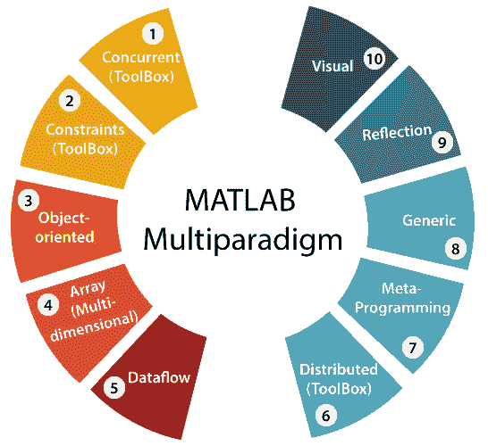
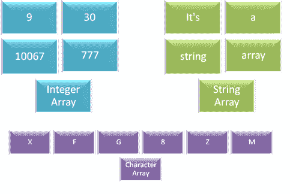
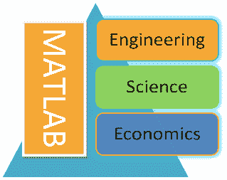
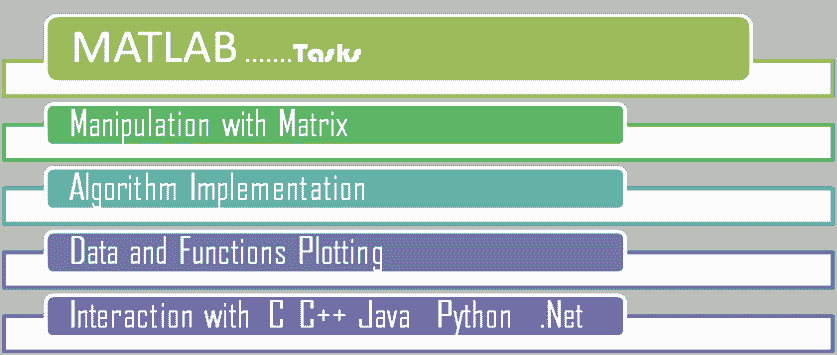
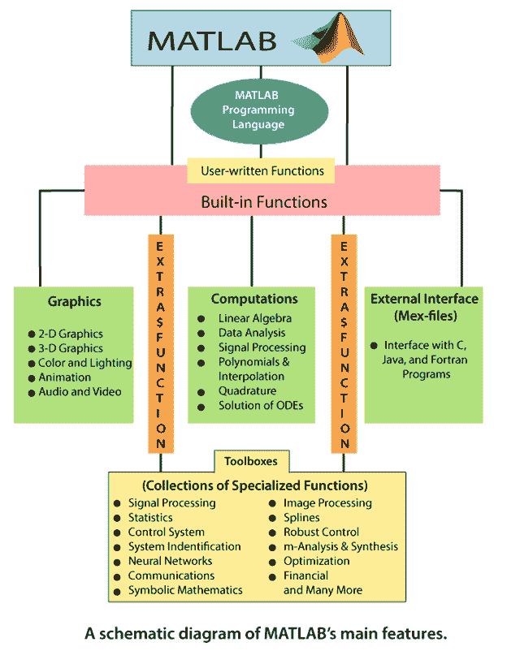
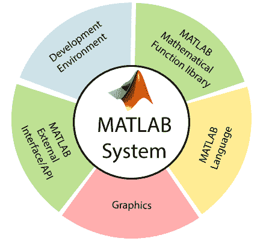

# MATLAB 是什么？

> 原文：<https://www.javatpoint.com/matlab-introduction>

MATLAB 是一个用于高性能数学计算、可视化和编程环境的软件包。它为技术计算、图形和动画提供了一个具有数百个内置功能的交互环境。

MATLAB 代表**矩阵实验室**。最初编写 MATLAB 是为了实现由 **LINPACK** (线性系统包)和**EISSPACK**(特征系统包)项目开发的矩阵软件的简单方法。

MATLAB 是一个现代化的编程语言环境，并且它有精炼的数据结构，包括内置的编辑和调试工具，支持面向对象编程。

MATLAB 是**多范式**。因此，它可以与多种类型的编程方法一起工作，例如函数式、面向对象和可视化。

除了环境，MATLAB 也是一种编程语言。

因为它的名字包含了矩阵这个词，所以 MATLAB 的所有计算都是基于数学矩阵和数组。MATLAB 的所有类型的变量只保存数组形式的数据，让它是整数类型、字符类型或字符串类型的变量。

MATLAB 用于工程、科学和经济的各个学科。

MATLAB 允许几种类型的任务，如矩阵操作、算法实现、数据和函数绘图，并且可以与用其他编程语言编写的程序交互。

MATLAB 是一种动态的弱类型编程语言。

MATLAB 环境处理变量数据类型的声明任务，并为变量提供适当的存储量。

## MATLAB 的历史

MATLAB 的开发始于 20 世纪 70 年代末，由新墨西哥大学计算机科学系主任克里夫·莫勒发起。克里夫想让他学生不用学习 FORTRAN 就能使用 LINPACK & EISPACK(数值计算软件库，用 FORTRAN 编写)。1984 年，克里夫·莫勒和杰克·利特尔&史蒂夫·班杰特一起用 C 语言重写了 MATLAB，创立了 MathWorks。这些库在当时被称为 JACKPAC，后来这些库在 2000 年被修改为矩阵操作，并被命名为 LAPACK。

## MATLAB 的主要特点和功能

图中的图表显示了 MATLAB 的主要特性和功能。

MATLAB 的内置函数为线性代数计算、数据分析、信号处理、优化、常微分方程的数值解**(微分方程组)**、二次曲线以及许多其他类型的科学计算提供了出色的工具。

这些函数大多使用最先进的算法。对于二维和三维图形以及动画来说，这些都是大量的功能。

MATLAB 支持外部接口从 MATLAB 内部运行这些程序。用户不限于内置功能；他可以用 MATLAB 语言编写他的函数。

还有各种可选的**工具箱**，可以从 MATLAB 的开发者那里获得。这些工具箱是为主要应用程序编写的函数集合，如符号计算、图像处理、统计、控制系统设计和神经网络。

MATLAB 必要的构建组件是**矩阵**。基本数据类型是数组。向量、标量、实矩阵和复矩阵都是作为主数据类型的特例自动处理的。MATLAB 热爱矩阵和矩阵函数。内置函数针对向量函数进行了优化。因此，矢量化的命令或代码在 MATLAB 中运行得更快。

## MATLAB 系统

MATLAB 系统由五个主要元素组成:

**开发环境**

这是帮助你使用 MATLAB 操作和文件的一套工具和设施。这些工具中有许多是图形用户界面。它包括 MATLAB 桌面和命令窗口、命令历史、编辑器和调试器，以及用于考虑帮助、工作空间、报告和搜索路径的浏览器。

**MATLAB 数学函数库**

这是一个庞大的计算设计汇编，从基本函数，如和、正弦、余弦和复杂数学，到更复杂的功能，如矩阵求逆、矩阵特征值、贝塞尔函数和快速傅立叶变换。

**MATLAB 语言**

这是一种高级矩阵/数组语言，具有控制流语句、函数、数据结构、输入/输出和面向对象的编程特性。它既允许“小程序”快速创建快速而肮脏的废弃程序，也允许“大程序”创建大型而复杂的应用程序功能。

**图形**

MATLAB 有广泛的设施来显示矢量和矩阵的图形，以及注释和打印这些图形。它包含二维和三维数据可视化、图像处理、动画和演示图形的高级结构。它还包括低级结构，允许我们完全定制图形的显示，并在我们的 MATLAB 应用程序上构建完整的图形用户界面。

**MATLAB 外部接口/API**

这是一个允许我们编写与 MATLAB 交互的 C 和 FORTRAN 程序的库。它包含从 MATLAB(动态链接)调用例程、调用 MATLAB 作为计算引擎以及读写 MAT 文件的工具。

* * *