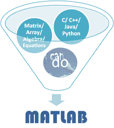
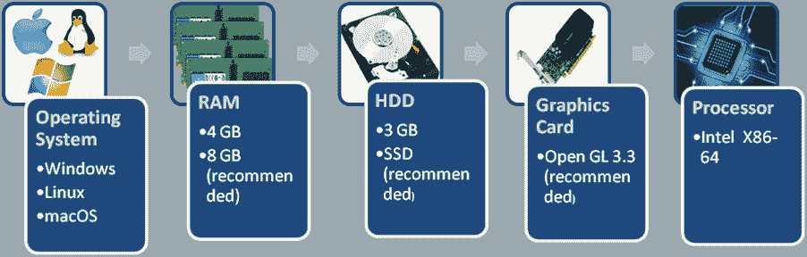

# MATLAB 先决条件和系统要求

> 原文：<https://www.javatpoint.com/matlab-prerequisites-and-system-requirements>

## MATLAB 先决条件

MATLAB 是一种高级编程语言，但在使用 MATLAB 构建和运行应用程序方面，它与其他编程语言有点不同。

*   因此，在继续使用 MATLAB 之前，建议熟悉任何其他高级或面向对象的编程语言，如 C 或 C++或 Java。

*   对你来说很容易，因为你不必担心编程语言元素，比如变量、数据类型、循环、函数、方法、条件语句、类、对象。
*   还建议学习者对数学术语有很好的了解，如矩阵、数组、代数、数字、多项式、微分方程。
*   第三，你应该有学习新事物的热情，并且已经决定用 MATLAB 工作。

## 系统要求

甚至不是每个计算机软件都运行在一个操作系统上。操作系统和其他组件在计算机系统的平稳运行中起着至关重要的作用。

这里我们提供了一个在下载和安装 MATLAB 之前需要满足的条件的综合表格。

### 最新版本-r2019 a-系统要求

| Windows -64 位 |
| 操作系统 | 随机存取存储 | 磁盘空间 | 制图法 | 处理器 |
| 

*   Windows 10 或
*   Windows 7 服务包 1 或
*   Windows Server 2019 或
*   Windows Server 2016

 | 

*   Minimum -4gb

 | 

*   The minimum -2.9 GB hard disk is only used by MATLAB.

 | 

*   No specific graphics card is required.
*   Recommended-Hardware accelerated graphics card supporting OpenGL 3.3 with 1GB GPU memory

 | 

*   Minimum-Any Intel or AMD x86-64 processor
*   Recommended-A processor that supports 4 logical cores and AVX2 instruction set

 |
| Linux -64 位 |
| 操作系统 | 随机存取存储 | 磁盘空间 | 制图法 | 处理器 |
| 

*   Ubuntu 18.10 或

*   Ubuntu 14.04 lt
*   Debian 9 或
*   红帽企业版 Linux 7(最低.7.3)或
*   Red hat enterprise Linux 6 (minutes. 6.7) or
*   SUSE Linux enterprise desktop 12 (minutes. SP2) or
*   SUSE Linux Enterprise Desktop 15 or
*   SUSE Linux enterprise server 12 (min. SP2)
*   SUSE Linux Enterprise Server 15

 | 

*   Minimum -4gb

 | 

*   The minimum -3.1 GB hard disk is only used by MATLAB.

 | 

*   No specific graphics card is required.
*   Recommended-Hardware accelerated graphics card supporting OpenGL 3.3 with 1GB GPU memory

 | 

*   Minimum-Any Intel or AMD x86-64 processor
*   Recommended-A processor that supports 4 logical cores and AVX2 instruction set

 |
| Mac -64 位 |
| 操作系统 | 随机存取存储 | 磁盘空间 | 制图法 | 处理器 |
| 

*   梅斯·莫哈韦(10.14)阿力
*   麦考高中(10.13)或
*   macOS Sierra(10.12)

 | 

*   Minimum -4gb

 | 

*   The minimum -3.3 GB hard disk is only used by MATLAB.

 | 

*   No specific graphics card is required.
*   Recommended-Hardware accelerated graphics card supporting OpenGL 3.3 with 1GB GPU memory

 | 

*   Minimum-Any Intel or AMD x86-64 processor
*   Recommended-A processor that supports 4 logical cores and AVX2 instruction set

 |

* * *