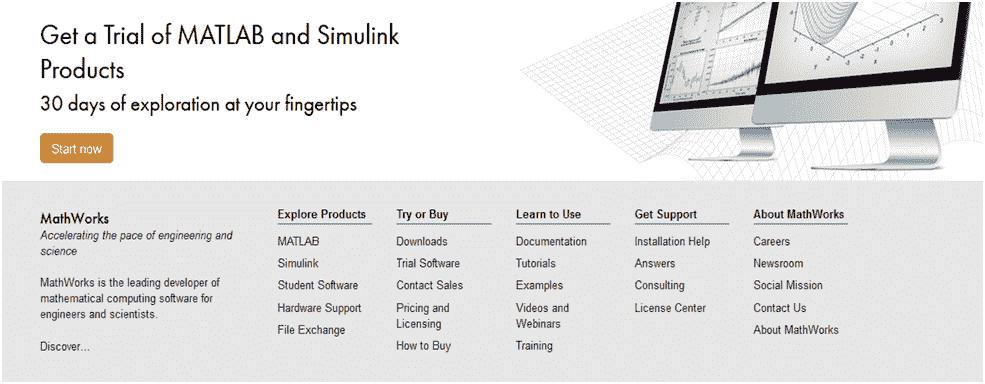
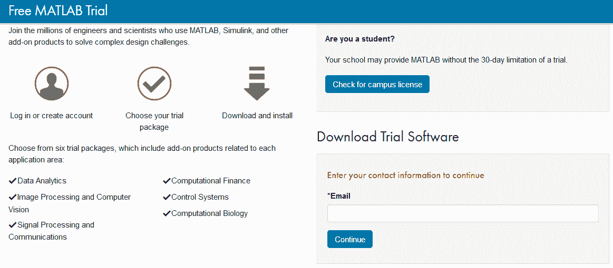
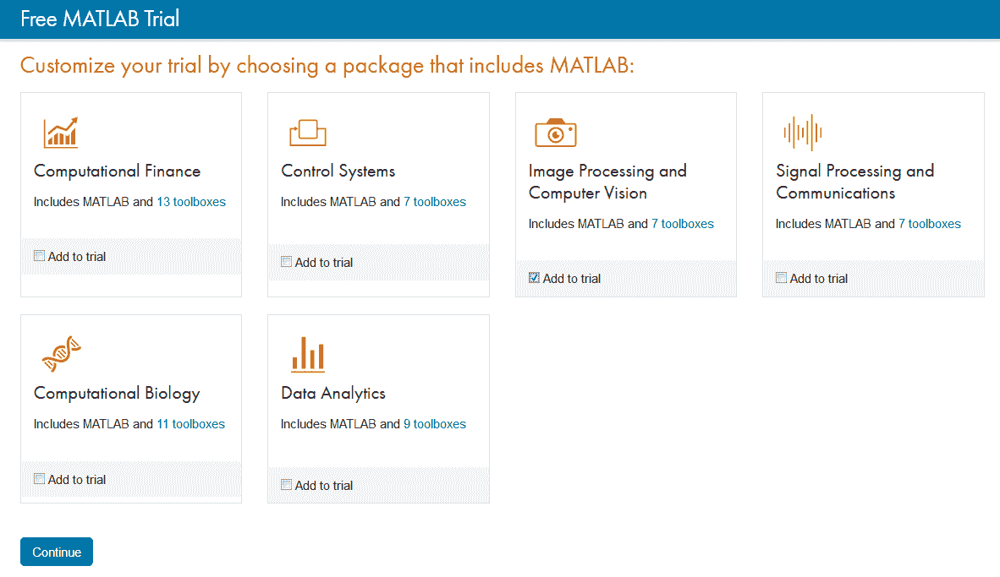
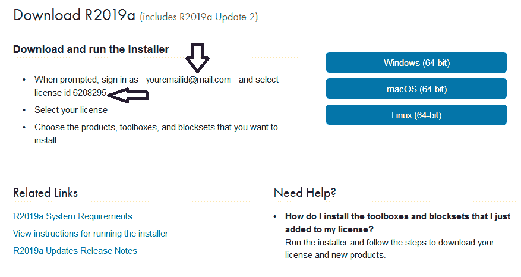

# MATLAB 的下载

> 原文：<https://www.javatpoint.com/how-to-download-matlab>

MATLAB 环境有不同的口味。不同的风格意味着不同的软件有不同的用途，例如——它可以单独提供给学生、初创公司、企业、个人使用，所有这些都是付费资源。但是我们可以在 30 天的试用期内获得它，而无需向 MathWorks 支付一分钱。

**第一步:**下载 MATLAB 需要访问官网[www.mathworks.com](https://in.mathworks.com/)；它可能会将您重定向到特定于国家/语言的网站，或者提示您根据您的本地位置进行点击。

**第二步:**进入网页底部/页脚区域，点击*试用或购买部分*下的*试用软件*链接。

**第三步:**点击试用软件链接后，会打开一个新的网页。在提供的空白处输入您的电子邮件 id。

**第 4 步:**点击继续后，它再次询问一些更多的信息，以创建您在 MathWorks 的帐户，从而获得产品的访问权限。除了电子邮件 id 和您之前输入的位置之外，它还会询问您获取 MATLAB 软件的目的-选择爱好者或个人使用选项，并选择“13 年以上是”选项，然后单击“创建”。

**第五步:**再次打开新网页，点击继续当前邮件选项继续。现在进入你的电子邮件收件箱，打开从 MathWorks 收到的电子邮件。现在通过点击验证您的电子邮件按钮来验证您的电子邮件地址。

**第六步:**你将被引导到一个新的网页，填写关于你的所有细节，接受协议，并点击创建按钮。

**第七步:**一个新的网页打开，这里会显示你验证过的邮件 id，在它下面有一个我同意的按钮，选择它并点击提交按钮。现在我们已经用 MathWorks 创建了一个帐户。

**第 8 步:**在这里你会发现不同类型的加载项选项，你必须选择其中一个并点击继续。

在下一页，将显示一些选项。这些都是可选的。因此，您可以通过选择或不选择这些选项来继续。

**第 9 步:**新页面打开，显示您的电子邮件 id &您的许可证 id，记下这些细节。

它将首先为 MATLAB 下载安装程序，然后安装程序为 MATLAB 环境设置条件。这里我们将继续使用 Windows (64 位)选项；你可以按照你的操作系统去做。

所以当我们点击 Windows 链接时，屏幕上会显示一个弹出窗口，点击保存文件选项，一个二进制可执行文件就会开始下载。

打开你的 Downloads 文件夹或者你所有下载文件存放的文件夹，会有一个像这样的图标，这是撒谎；这是安装程序的二进制可执行文件。

* * *