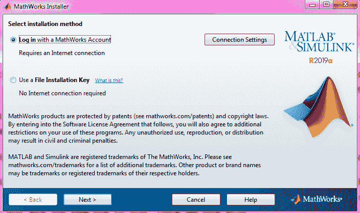
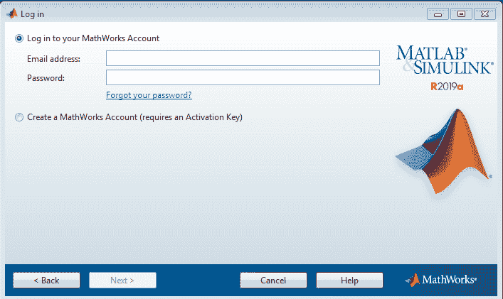
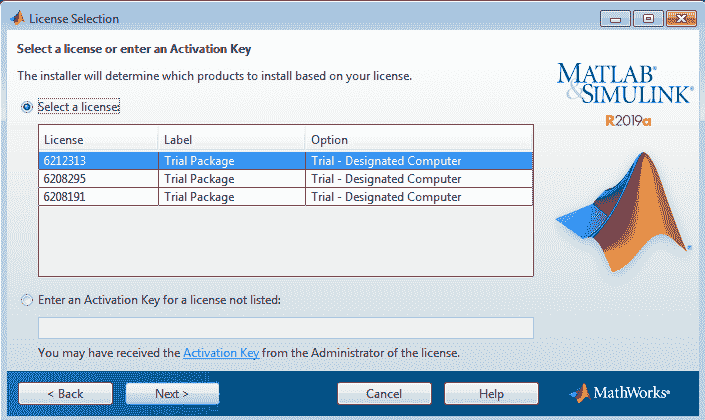
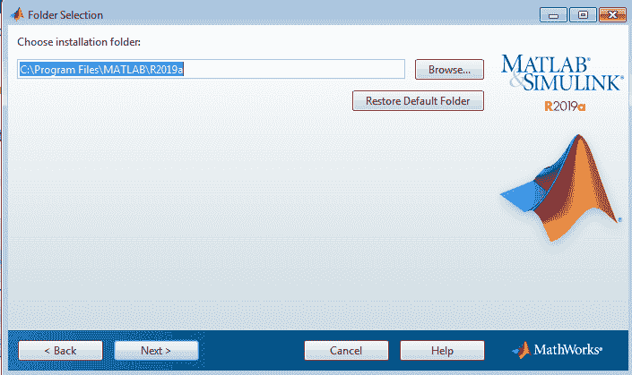
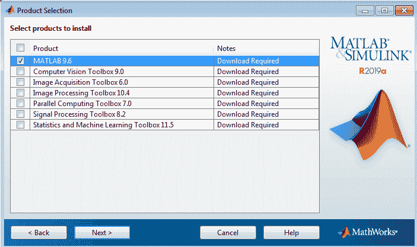
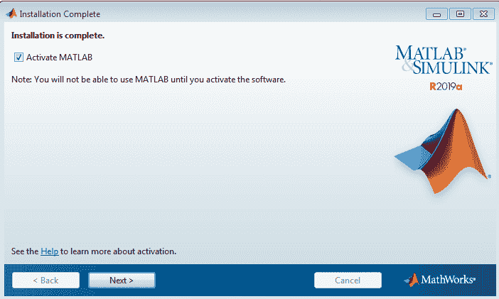
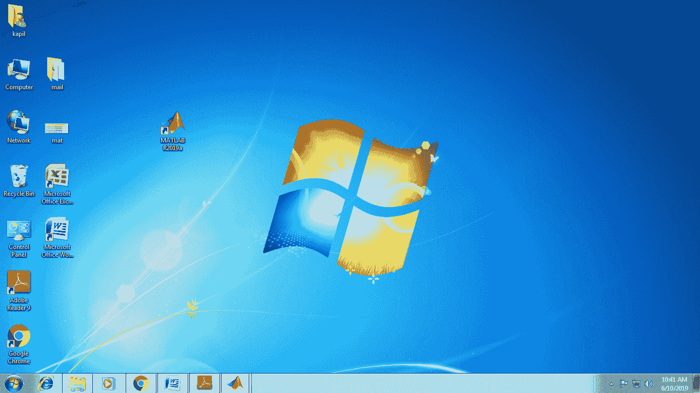
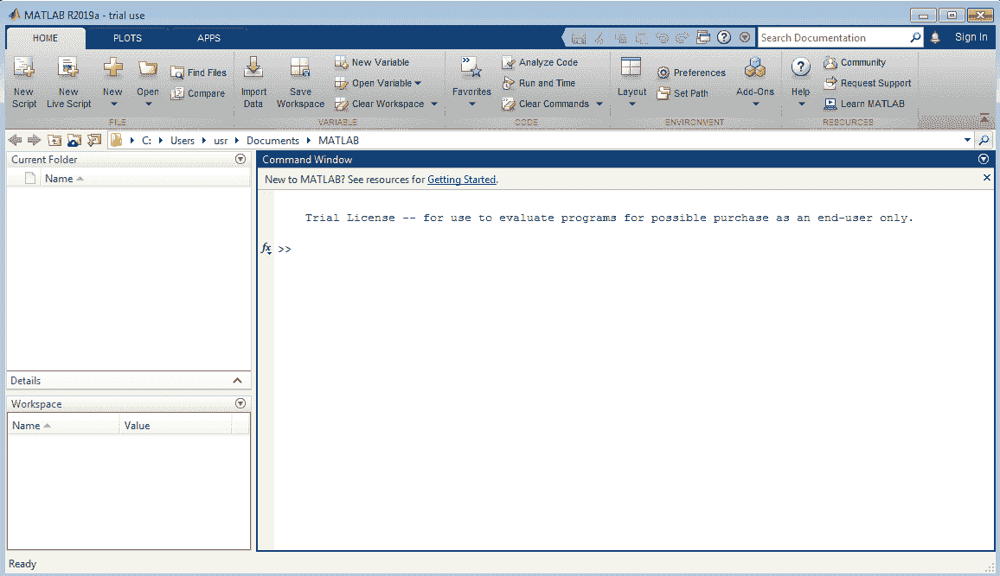

# MATLAB 安装

> 原文：<https://www.javatpoint.com/how-to-install-matlab>

**第一步:**双击 MATLAB 图标(我们之前下载的二进制文件)。点击图标后，会弹出要求安装程序运行，点击 ***运行*** 。屏幕上将弹出一个 MathWorks 安装程序窗口。

*   默认情况下，选择第一个选项，即使用 MathWorks 帐户登录，我们将继续使用该选项。并且一定要记得检查你的互联网连接是否正确安装了 MATLAB 环境。所以点击窗口底部的下一步。
*   在下一页选择“是”接受许可条款，然后再次单击“下一步”按钮。
*   默认情况下，会出现一个新页面，选择第一个选项，登录到您的 MathWorks 帐户。在此输入您的电子邮件 id 和密码，这是我们在 MathWorks 创建帐户时创建的。参考下图，点击下一步。

**第 2 步:**将出现许可证选择窗口，预选的许可证 id 将以蓝色背景突出显示。在这里，您必须选择您的许可证 id；这是我们在下载安装程序的步骤 9 中保存的 id(在此期间，我们强烈要求记下该 id)，然后再次单击下一步。

*   一个新的文件夹选择窗口出现，不需要改变安装 MATLAB 的文件夹位置，点击下一步。

**第三步:**下一步是产品选择窗口，第一个产品是 MATLAB 9.6，这是必须选择的，因为是 MATLAB 环境，从其他产品中，你可以选择尽可能多的选择，点击下一步。

*   接下来是*安装选项*窗口，根据您的选择选择选项。任何时候你觉得有什么地方需要改变，你可以点击后退按钮回到上一步。
*   接下来是确认窗口，在这里你不需要做任何事情，确认你在安装 MATLAB 的过程中要下载什么，它的其他附加产品，以及下载的大小；然后单击安装。
*   单击安装，将开始下载所有产品。这是一个大规模的下载，所以你必须等待一段时间来完成下载。

**第四步:**下载完所有产品并完成安装后，出现一个窗口，显示激活 MATLAB，无需做任何事情，点击下一步按钮。

*   单击“下一步”后，会出现一个新窗口，说明激活的含义。点击*继续下一步*。
*   再次出现一个新窗口，显示您的电子邮件 id 和您的产品许可证 id，点击*确认按钮*继续。
*   恭喜您，您已经完成了安装过程，并成功安装了 MATLAB 及其其他产品。现在点击*完成按钮*。

**第五步:**安装过程中会根据我们的选择在桌面上创建一个 MATLAB 快捷方式。现在我们可以通过点击桌面上的图标来使用 MATLAB。

## MATLAB 桌面

MATLAB 提供了基于桌面图形用户界面的环境。环境的“主页”选项卡包含三个面板:

1.  **当前文件夹:**位于左侧；在这里，你可以访问你的文件。
2.  **命令窗口:**位于右侧；它是命令提示符，在这里您可以输入命令来操作函数、分配变量和进行计算。
3.  **工作区:**位于当前文件夹的左侧右侧下方；在这里，您创建的所有变量都被存储，来自其他文件的数据也可以在这里导入。

* * *