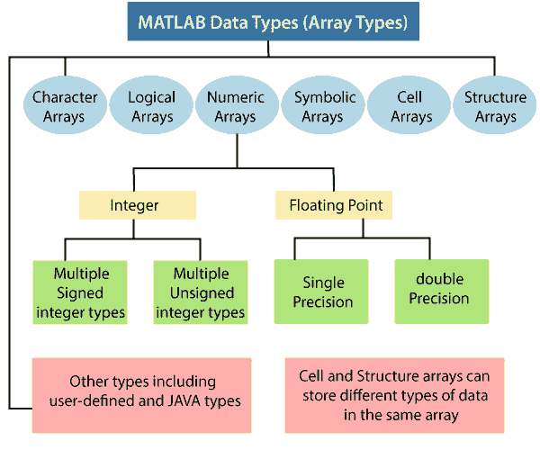

# 数据类型

> 原文：<https://www.javatpoint.com/matlab-data-types>

MATLAB 中的基本数据类型(也叫类)是数组或矩阵。MATLAB 中有 15 种基本数据类型。这些数据类型中的每一种都是以矩阵或数组的形式构建的。这个矩阵或数组的大小最小为 0 乘 0，可以增加到任何大小的 n 维数组。



下表描述了这些数据类型:

| 数据类型 | 例子 | 描述 |
| int8， uint8，
int16， uint16，
int32， uint32，
int64， uint64 | uint16(65000) | 有符号和无符号整数的数组。它比单人或双人需要更少的存储空间。除 int64 和 uint64 之外的所有整数数据类型都可以用于数学运算。 |
| 单一的 | 3 * 10^38 | 单精度数字数组。它需要的存储空间比双倍少，但精度更低，范围更小。 |
| 两倍 | 3 * 10^300
5 + 6i | 双精度数字数组。二维数组可以是稀疏的。MATLAB 中默认的数值类型。 |
| 逻辑学的 | 魔法(4) > 10 | 逻辑值为 1 或 0 的数组，分别表示真和假。二维数组可以是稀疏的。 |
| 茶 | 你好 | 字符数组。字符串表示为字符向量。对于包含多个字符串的数组，最好使用单元格数组。 |
| 单元阵列 | a{1，1 } = 12；
a{1，2} = '红色'；
a{1，3 } = magic(4)； | 索引单元格的数组，每个单元格都能够保存不同维度和数据类型的数组。 |
| 结构 | a.day = 12
a . color = ' Red '；
a.mat =魔法(3)； | 类 C 结构的数组，每个结构都有命名字段，能够存储不同维度和数据类型的数组。 |
| 功能手柄 | @sin | 指向函数的指针。您可以将函数句柄传递给其他函数。 |
| 用户级 | 多项式([0 -2 -5]) | 从用户定义的类构造的对象。 |
| Java 类 | java.awt.Frame | 从 Java 类构造的对象。 |

## 数字类型

MATLAB 中的数字数据类型包含有符号和无符号整数，以及单精度和双精度浮点数。整数和单精度阵列比双精度阵列提供更高的内存效率存储。

所有数值类型都提供基本的数组函数，如下标和整形。除了 int64 和 uint64 之外的所有数值类型都可以用于数值运算。

### 整数

MATLAB 有四个有符号整数和四个无符号整数的数据类型。

有符号类型既可以使用正整数，也可以使用负整数，但不能像无符号类型那样执行大范围的数字操作，因为一位用于指定数字的正负符号。

无符号类型给出的数字范围更广，但这些数字只能是零或正数。

MATLAB 为数字数据提供 1 字节、2 字节、4 字节和 8 字节存储。如果我们使用容纳您的数据的最小整数类型，我们可以为我们的程序节省内存和执行时间。例如，我们不需要 32 位整数来保存值 100。

以下是八种数值数据类型，每种类型可以保存的数值范围，以及创建该类型所需的 MATLAB 转换操作:

| 数据类型 | 数值范围 | 转换函数 |
| 有符号 8 位整数 | -2 <sup>7</sup> 至 2 <sup>7</sup> -1 | int8 |
| 有符号 16 位整数 | -2 <sup>15</sup> 至 2 <sup>15</sup> -1 | int16 |
| 有符号 32 位整数 | -2 <sup>31</sup> 至 2 <sup>31</sup> -1 | int32 |
| 有符号 64 位整数 | -2 <sup>63</sup> 至 2 <sup>63</sup> -1 | int64 |
| 无符号 8 位整数 | 0 至 2 <sup>8</sup> -1 | uint8 |
| 无符号 16 位整数 | 0 至 2 <sup>16</sup> -1 | uint16 |
| 无符号 32 位整数 | 0 至 2 <sup>32</sup> -1 | uint32 |
| 无符号 64 位整数 | 0 至 2 <sup>64</sup> -1 | uint64 |

### 创建整数数据

默认情况下，MATLAB 将数字数据保存为双精度浮点。要将数据保存为整数，请使用上表中显示的转换函数之一:

```

   x = int16 (32501);

```

我们可以使用 **whos** 函数来显示由变量表示的数组的维数、字节数和数据类型:

```

whos x 
        Name      Size      Bytes      Class 
         x        1x1        2        int16 array	

```

如果我们想要分配如下所示的输出，我们可以使用 class 函数:

```

xType = class(x) 
xType = 
         int16

```

如果只想验证 x 是否为整数，请使用 isinteger 函数:

```

isinteger(x) 
ans = 
    1	

```

### 整数函数

| 功能 | 描述 |
| int8，int16，
int32，int64 | 它转换为有符号的 1、2、4 或 8 字节整数。 |
| uint8， uint16，
uint32， uint64 | 它转换为无符号的 1、2、4 或 8 字节整数。 |
| 班级 | 它返回对象的数据类型。 |
| 工业标准结构 | 它确定输入值是否具有指定的数据类型。 |
| isinteger | 它确定输入值是否为整数数组。 |
| 若是数值数组则为真 | 它确定输入值是否为数字数组。 |

## 浮点数

MATLAB 以双精度或单精度格式显示浮点数。默认值是双精度，但我们可以用简单的转换函数进行任意数量的单精度转换。

### 双精度浮点

MATLAB 根据 IEEE 标准 754 组成双数据类型，实现双精度。任何存储为双需 64 位的值，格式如下表所示:

| 位 | 使用 |
| Sixty-three | 符号(0 =正，1 =负) |
| 62 至 52 岁 | 指数，偏 1023 |
| 51 比 0 | 1.f 数的分数 f |

### 单精度浮点

MATLAB 根据 IEEE 标准 754 为单精度构成单一数据类型。任何保存为单个的值都需要 32 位，格式如下表所示:

| 位 | 使用 |
| Thirty-one | 符号(0 =正，1 =负) |
| 30 至 23 岁 | 指数，偏 127 |
| 22 比 0 | 1.f 数的分数 f |

### 浮点函数

| 功能 | 描述 |
| 两倍 | 它转换为双精度。 |
| 单一的 | 它转换为单精度。 |
| 班级 | 它返回对象的数据类型。 |
| 工业标准结构 | 它确定输入值是否具有指定的数据类型。 |
| 漂浮 | 它确定输入值是否是浮点数组。 |
| 若是数值数组则为真 | 它确定输入值是否是数字数组 |
| 蓄电池 | 它返回浮点相对精度。该值是 MATLAB 在评估时使用的公差。 |
| realmax(真实世界) | 它返回计算机可以表示的最大浮点数。 |
| 真的吗 | 它返回我们的计算机能够表示的最小浮点数。 |

## 复数

复数由两部分组成:实数部分和虚数部分。主虚数单位等于-1 的平方根。这在 MATLAB 中通过两个字母显示:I 或 j。

### 创建复数

以下语句显示了在 MATLAB 中创建复数值的一种方法。变量 x 被赋予一个复数，其实部为 2，虚部为 3:

**x = 2+3i；**

### 复数函数

| 功能 | 描述 |
| 复杂的 | 它从实部和虚部构造复杂的数据。 |
| 我还是 j | 它返回用于构造复杂数据的虚单位。 |
| 真实的 | 它返回复数的实数部分 |
| 乳内动脉移植 | 它返回复数的虚部。 |
| 以色列 | 它决定一个数是实数还是虚数。 |

* * *