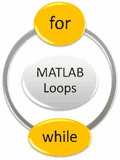

# MATLAB 循环

> 原文：<https://www.javatpoint.com/matlab-loops>

循环语句允许我们多次执行一条语句或一组语句。

MATLAB 提供了不同类型的循环来处理循环需求，包括 while 循环、for 循环和嵌套循环。如果我们试图声明或编写自己的循环，我们需要确保这些循环是作为脚本编写的，而不是直接在命令窗口中。

两个额外的命令**断开并继续**，可以用来创建第三种类型的循环，称为**中点断开循环**。对于循环中的命令必须至少执行一次，但退出循环的决定是基于某种标准的情况，中点中断循环非常有用。

## 循环的类型

MATLAB 中有两种类型的循环。

1.  为
2.  正在…



## for 循环

for 循环用于将一条语句或一组语句重复固定次数。

**语法**

```

for index = values
 <program statements>
 ...	
end 

```

## while 循环

while 循环用于无限次数地执行一条语句或一组语句，直到不再满足 while 指定的条件。

**语法**

```

 while <expression>
 <statements>
end 

```

* * *