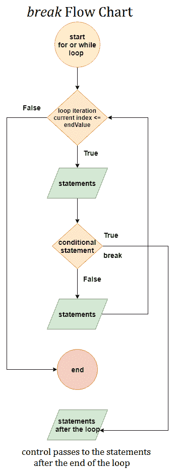

# MATLAB break

> 原文：<https://www.javatpoint.com/matlab-break>

break 语句终止 for 循环或 while 循环的执行。当遇到 break 语句时，执行将从循环外的下一条语句开始。在嵌套循环中，中断仅存在于最内部的循环。

## 语法:

```

break

```

## 以下是在 MATLAB 中使用 break 语句的要点:

*   **break** 关键字用于定义 break 语句。
*   **break** 语句终止或停止或**的**的执行，而**循环和在 **break** 语句之后的语句不执行。**
*   在执行**中断**语句后，控制转到跟随循环的**结束**的语句。
*   如果 **break** 语句出现在嵌套循环中，那么它只终止该特定循环，而不是外部循环，并且控制传递给该循环结束后的语句。
*   **中断**语句只影响或**的**执行，而**循环；因此，它没有在**之外定义**或**,而****

## 中断语句流程图



## 示例 1:

```

% program to break the flow at a specified point 

a = randi(100,6,6)
k = 1;
while k
    disp('program running smoothly')
    if a(k) == 27
        disp('program encounters the number 27, which is not useful for the current program;')
        disp(['at index no.:',num2str(k)])
        disp('so loop terminates now.....bye bye')
        break
    end
    k = k+1;
end

```

**输出:**

```
a = 66
    82    17    70    54    54    10
    27    18    70    66    33    27
    60    43    64    41    11    16
     3    10     4    82    62    29
    43    60     7    72    78    45
    32    48    32    97    43    53
program running smoothly
program running smoothly
program encounters the number 27, which is not useful for the current program;
at index no.:2
so loop terminates now.....bye bye

```

**示例 2:**

```

% program to terminate the execution on finding negative input
a = randn(4)
k = 1;
      while k < numel(a)
    if a(k) < 0
        break
    end
    k = k + 1;
end
disp(['negative number :', num2str(a(k)), ',found at index: ', num2str(k),',hence the program terminated'])

```

**输出:**

```
a = 44
    0.2398   -1.6118    0.8617    0.5812
   -0.6904   -0.0245    0.0012   -2.1924
   -0.6516   -1.9488   -0.0708   -2.3193
    1.1921    1.0205   -2.4863    0.0799
negative number :-0.69036,found at index: 2,hence the program terminated

```

**使用 break 语句终止执行流程的程序。**

**示例:**

假设我们有一个依靠温度变化运行的系统。环境的温度决定了系统的工作。如果环境温度超过危险极限，程序必须停止运行系统的应用程序的执行。

工作温度范围根据一些预定义的条件而变化。因此，在夏季，当热浪会破坏复杂的系统，或者在冬季温度下降到规定的极限以下时，我们需要保护系统，防止它下降。

温度范围从-100°c 到+600°c。

该系统安装在世界各地的不同地点。在某个地方，温度是用摄氏度测量的，在某个地方，温度是用华氏度测量的。所以我们也需要注意这些温度单位。

```

need to take care of these temperature units also.
% Program to break the flow of Execution
u = symunit;  % symunit returns symbolic unit
f = randi(200,4,4) % assume this function returns temperature in Fahrenheit
tf = {f,u.Fahrenheit};  % create cell array by adding Fahrenheit unit
tc = unitConvert(tf,u.Celsius,'Temperature','absolute'); % conversion to Celsius
vpan = vpa(tc,3) % conversion from equation to decimal form
min_t = -10; % minimum temperature
max_t = +60; % maximum temperature
tcd = double(separateUnits(vpan)); % convert to double by separating unit symbol
for k = 1:16
    if (tcd(k) <= min_t)
        disp(['application stopped, temperature dropped below the limit of -10 & current temp is : ',num2str(tcd(k)),'degree'])
        break
    else
        if (tcd(k) >= max_t)
            disp(['application stopped, temperature exceeds limit of +60 & current temp is : ',num2str(tcd(k)),'degree'])
        break
        end
    end
end

```

* * *