# 矩阵和数组

> 原文：<https://www.javatpoint.com/matrices-and-arrays-in-matlab>

*   MATLAB 一次对整个矩阵和数组进行运算。
*   所有类型的数据变量都存储为多维数组，可以是字符、字符串或数字。
*   二维数组被称为矩阵，常用于线性代数。

## MATLAB 中的数组创建

我们可以在 MATLAB 中用多种方法创建数组:

*   通过使用元素之间的空间:

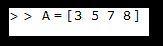

*   该命令创建一个有一行四列的数组变量“A”。
*   存储在工作区中的变量和输出将在命令窗口中显示为:

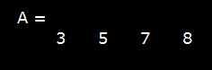

*   通过在元素之间使用逗号:

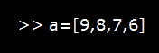

*   这个命令将创建一个有一行四列的数组变量“a”。
*   存储在工作区中的变量，输出将在命令窗口中显示为:

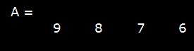

*   我们可以将两种方法结合成一种，但这不是一种好的做法。

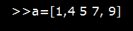

它将像以前一样工作，但是为了更好的语法，请避免使用它。

*   元素在单行中的数组称为行向量。或者我们可以说一维数组是向量。
*   二维数组称为矩阵。这意味着矩阵有多行多列。因此，在创建多行矩阵时，我们必须用分号分隔行。

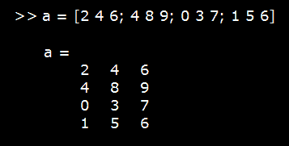

*   创建矩阵时要小心，每行应该有相同数量的列，每行应该用分号分隔。否则会显示错误，不会创建矩阵。

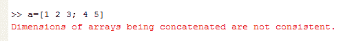

*   我们可以使用内置函数创建一个矩阵，如 1、0 或 rand。

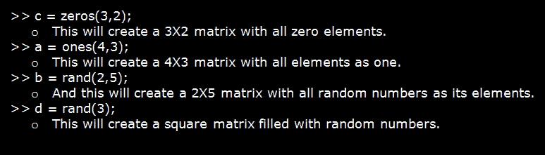

## MATLAB 中的矩阵和数组运算

MATLAB 支持数组之间的两类运算，称为**数组运算**和**矩阵运算**。

数组操作是在**逐个元素的基础上在数组之间实现的操作**。也就是说，操作是在两个数组中的对应元素上实现的。

例如，

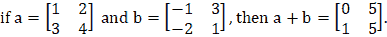

#### 注意:两个数组的行数和列数必须相同。如果没有，MATLAB 会生成一条错误消息。

下表总结了 MATLAB 中两个标量之间的算术运算。

## 两个标量之间的算术运算

| 操作 | 代数形式 | matlab 范数 |
| 添加 | a + b | a + b |
| 减法 | 美国罗克韦尔 | 美国罗克韦尔 |
| 增加 | a x b | a * b |
| 分开 |  | a / b |
| 幂运算 | 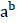 | 有 |

数组操作也可能出现在数组和标量之间。如果在数组和标量之间执行操作，标量的值将应用于数组的每个元素。

例如，

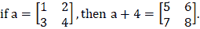

## 矩阵运算

矩阵运算遵循线性代数的标准规则，如矩阵乘法。在线性代数中，乘积 c=a x b 由下式定义。

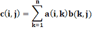

例如，

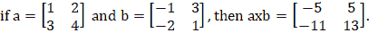

#### 注意:矩阵 a 的列数必须等于矩阵 b 的行数。

MATLAB 使用一个特殊的符号将矩阵运算和数组运算分类。在数组运算和矩阵运算有不同定义的方法中，MATLAB 在符号前使用一个句点来表示数组运算(例如。*).

表中给出了标准数组和矩阵运算的列表。

| 操作 | matlab 范数 | 评论 |
| 阵列添加/td > | a+b/td > | 数组加法和矩阵加法是相同的。 |
| 阵列减法/td > | a-b/td > | 数组减法和矩阵减法是一样的。 |
| 数组乘法/td > | a。* b/td > | a 和 b 的逐元素乘法。两个数组必须是相同的形状，并且其中一个必须是标量。 |
| 矩阵乘法/td > | a*b/td > | a 和 b 的矩阵乘法。a 中的列数必须等于 b 中的行数 |
| 阵列右分区/td > | a。/ b/td > | a 和 b 的逐元素划分:a (i，j) / b (i，j)。两个数组必须是相同的形状，并且其中一个必须是标量。 |
| 阵列左除法/td > | a。\ b/td > | a 和 b 的逐元素除法，但分子中有 b:b(I，j) / a(i，j)。两个数组必须是相同的形状，并且其中一个必须是标量。 |
| 矩阵右除法/td > | a/b/td > | 由 a * inv (b)定义的矩阵除法，其中 inv (b)是矩阵 b 的逆矩阵。 |
| 矩阵左除法/td > | a\b/td > | 由 inv(a) * b 定义的矩阵除法，其中 inv(a)是矩阵 a 的逆。 |
| 数组幂运算 | a。^ b/td > | a 和 b 的逐元素幂运算:a (i，j) ^ b (i，j)。两个数组必须是相同的形状，并且其中一个必须是标量。 |

## 矩阵和数组运算示例

*   我们可以用一个算术运算符处理矩阵中的所有值。

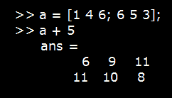

*   这里需要注意的一点是，当我们将命令输入为 a + 5 时，它不会改变原始变量“a ”,直到我们不再为它分配输出。
*   这就是为什么上面的输出分配给默认变量“ans”

*   我们也可以用一个函数来处理整个矩阵。

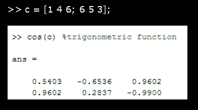

*   我们可以通过在注释行前使用“%”百分比符号来输入注释。

*   在变量后使用单引号(')来转置矩阵。

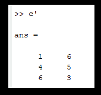

*   矩阵的移位将每行作为一列。

*   在 MATLAB 中，除了矩阵乘法，我们还可以进行元素乘法。
    我们来了解一下元素乘法和矩阵乘法的区别，举个例子:

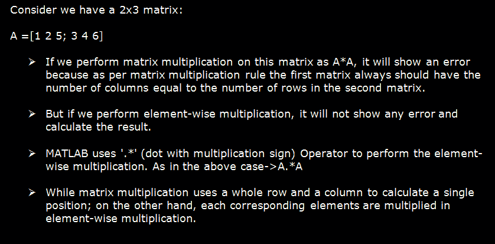

## MATLAB 中的格式命令

MATLAB 在内部将所有数字存储为浮点值，最多可存储 15 个小数点。但它通常最多显示 4 个小数点。我们来看一个例子。

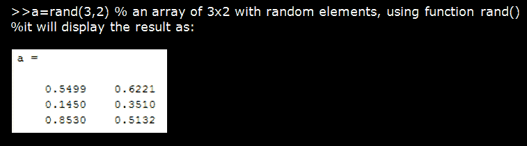

*   现在，我们将使用 format 命令在 MATLAB 中显示最大可能小数点的结果:

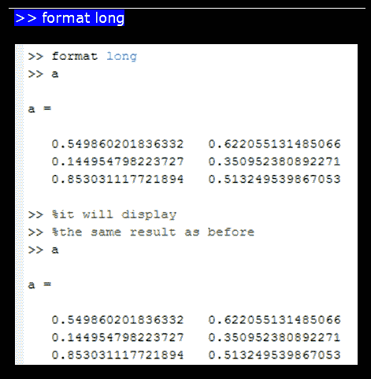

*   格式化命令语法:在命令行输入“format long”。
*   它将继续上述格式，直到我们更改格式命令。

*   现在我们将使用另一个格式命令来更改格式:

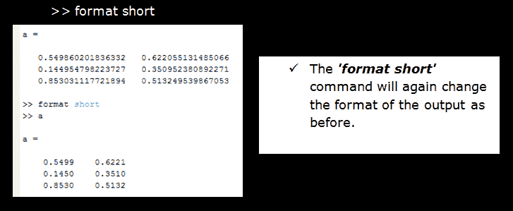

## MATLAB 中数组的拼接

当我们连接或连接字符串时，在 MATLAB 中，我们也可以连接数组。数组声明中使用的一对方括号[ ]本身就是一个串联运算符。

我们可以通过两种方式连接数组:

*   水平地
*   垂直地

### MATLAB 中数组的水平拼接

*   规则:所有数组应该有相同的行数。
*   语法:用逗号分隔的方括号将所有数组括起来，[a，b，c]。
*   示例:

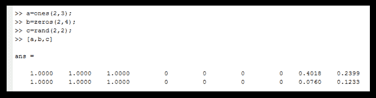

### MATLAB 中数组的垂直拼接

*   规则:所有数组应该有相同的列数。
*   语法:用分号分隔的方括号将所有数组括起来，[a；b；c]。
*   示例:

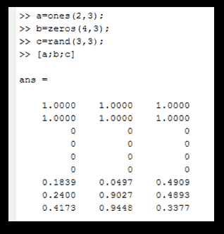

### 用 MATLAB 表示复数

*   复数既有实部也有虚部。
*   虚单位的值相当于-1 的平方根。
    sqrt (-1) = > 0.0000 + 1.0000i
*   用字母“I”或“j”表示复数的虚部。
*   示例:

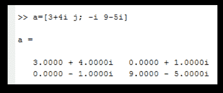

## MATLAB 中的数组索引

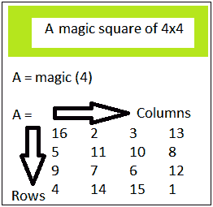

在 MATLAB 中每个变量都是一个数组。数组中的所有元素都按行和列进行索引。任何特定的元素都可以使用 MATLAB 中的索引来访问。MATLAB 中数组的索引和数学是一样的。它有不同的访问元素的语法。

MATLAB 中有几种索引元素的方法。

### 1.通过指定行和列下标:

*   引用数组特定组件的最常见方式是用数组变量在括号中指定行和列下标。
*   在指定为下标的行和列的交叉点上搜索的元素。

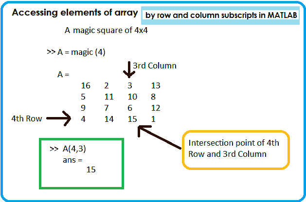

### 2.MATLAB 中的线性索引

*   使用单个下标而不管行下标和列下标在 MATLAB 中称为线性索引。
*   按顺序遍历每一列来搜索一个元素。

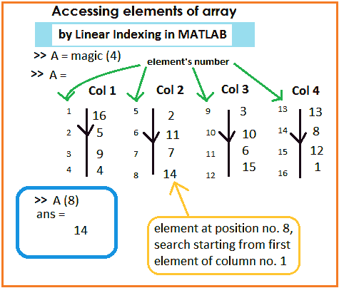

### 3.在 MATLAB 中引用数组的多个元素

*   MATLAB 中有一个冒号运算符(:)，用它来引用一个数组的多个元素。
*   **示例:**

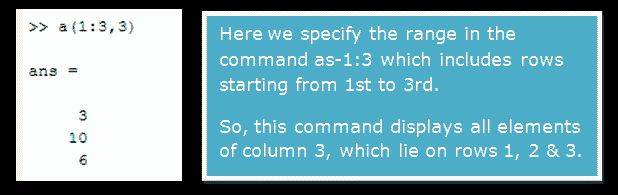
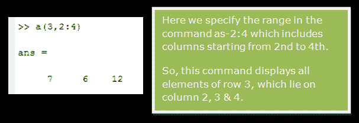
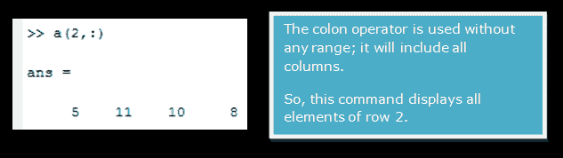

### 在 MATLAB 中使用冒号运算符创建向量

通过使用冒号运算符，我们可以创建等间距的值向量。我们可以指定步长值，以固定的时间间隔影响下一个值。

*   **语法:**开始:步骤:结束。
*   **示例:**
    让我们借助冒号运算符创建一个 13 的表。

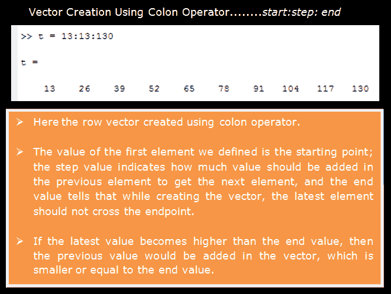

### 访问当前维度之外的数组元素

*   我们只能访问当前维度中的元素。这意味着，如果它是一个向量，包含九个元素，那么，我们不能访问位置 12 的元素。因为在矢量创建期间没有定义第 12 个位置。
*   如果我们输入一个命令来访问当前维度之外的元素，那么它会抛出一个错误，说索引超出了数组边界。

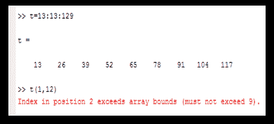

*   但是我们可以给当前不可用的位置赋值。
*   例如，我们有一个 9 个元素的向量；然后，我们可以为第 12 个元素或第 9 个元素之外的任何元素赋值。

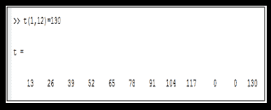

*   如果最后一个索引和新创建的索引之间有任何差距，那么差距索引将被自动分配一个 0 值。
*   一个值可以赋给所有数组中的索引。

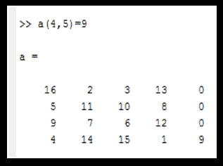

* * *