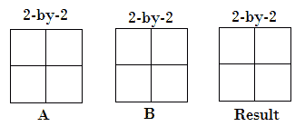
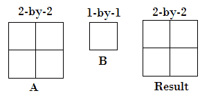
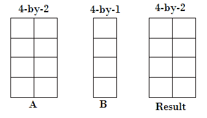
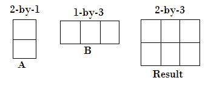
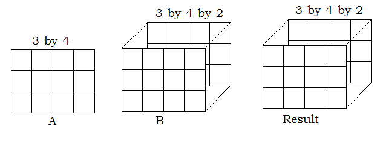
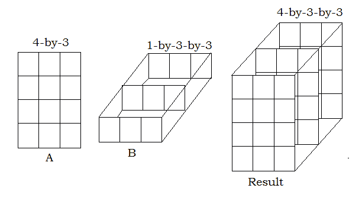

# MATLAB 中基本运算的兼容数组大小

> 原文：<https://www.javatpoint.com/compatible-array-sizes-for-basic-operations-in-matlab>

兼容的数组大小意味着对于每个维度，输入数组的维度大小要么相同，要么其中一个是标量。二进制运算符和函数在具有兼容大小的数组中运行良好。MATLAB 隐式扩展具有兼容大小的数组，以使它们在执行逐元素操作或函数时大小相同。

## 具有兼容尺寸的阵列输入

**二维阵列输入**

让我们通过一些具有兼容大小的标量、向量和矩阵的组合来理解:

*   两个阵列输入的大小完全相同。



*   一个数组输入是标量。



*   一个输入是矩阵，另一个是具有相似行数的列向量。



*   一个输入是列向量，另一个是行向量。



## 多维数组输入

*   一个输入是矩阵，另一个是具有相同行数和列数的三维数组。



*   一个输入是矩阵，另一个是三维阵列。所有输入的维度要么都相同，要么其中一个输入是一维的。



## 空数组输入

空数组是没有元素且维度大小为零的数组。空数组和非空数组的规则是相同的，不等于 1 的维度的大小决定了输出的大小。

**示例:**

```

>>% creating empty array
>> a = ones (1, 3, 0)

a =

  1?3?0 empty double array
>> % creating non-empty array
>> b = ones (3, 1);

```

**输出:**

```
>> a.*b

ans =

  3x3x0 empty double array

```

MATLAB 隐式扩展具有兼容大小的数组，但是不兼容的大小不能隐式扩展为相同的大小。

*   其中一个输入尺寸既不相等也不相等。

**示例:**

```

>> a = ones(4,3);
>> b = ones(3,3);

```

**输出:**

```
>> a+b
Matrix dimensions must agree.
>> a-b
Matrix dimensions must agree.
>> a.*b
Matrix dimensions must agree.

```

*   长度不等的两个非标量行向量。

**示例:**

```

>> a =ones(1,3);
>> b = ones(1,4);

```

**输出:**

```
>> a+b
Matrix dimensions must agree.

>> a-b
Matrix dimensions must agree.

>> a.*b
Matrix dimensions must agree

```

## 行和列向量兼容性

行和列向量总是具有兼容的大小，即使大小和长度不同。对这些向量进行算术运算会生成一个矩阵。

**示例:**

```

>>% creating a row vector
>> a = ones(1,3)
a =
     1     1     1

>>% creating a column vector
>> b = rand(4,1)
b =
    0.9058
    0.1270
    0.9134
    0.6324

```

**输出:**

```

>>% adding two row and column vectors
>> a + b
ans =
    1.9058    1.9058    1.9058
    1.1270    1.1270    1.1270
    1.9134    1.9134    1.9134
    1.6324    1.6324    1.6324

>>% subtraction of two row and column vectors
>> a - b
ans =
    0.0942    0.0942    0.0942
    0.8730    0.8730    0.8730
    0.0866    0.0866    0.0866
    0.3676    0.3676    0.3676

>>% array multiplication of two row and column vectors
>> a.*b
ans =
    0.9058    0.9058    0.9058
    0.1270    0.1270    0.1270
    0.9134    0.9134    0.9134
    0.6324    0.6324    0.6324

```

* * *