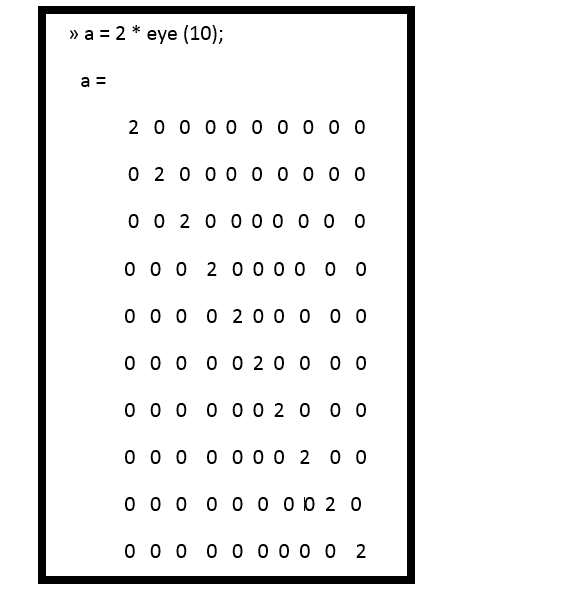
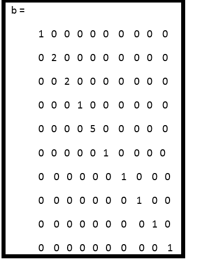
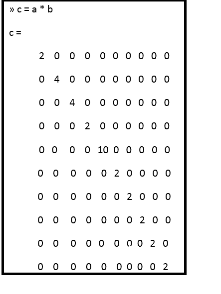
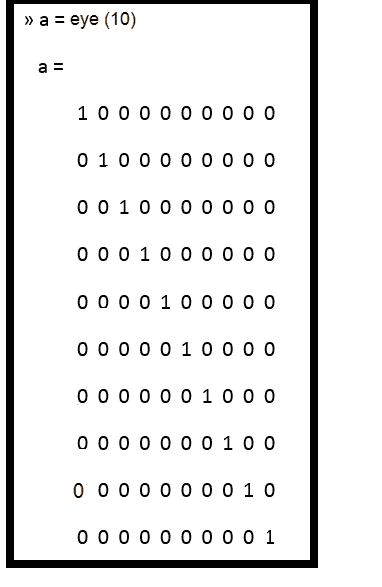
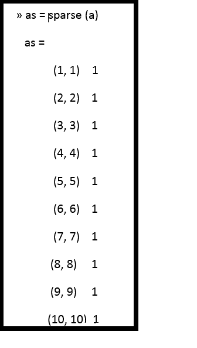

# MATLAB 中的稀疏阵列

> 原文：<https://www.javatpoint.com/sparse-arrays-in-matlab>

当一个普通的数组被声明时，MATLAB 为数组中的每个元素创建一个内存位置。例如，函数 a = eye (10)创建了 100 个元素，排列成 10×10 的结构。在这个数组中，90 个元素是零！

这个矩阵需要 100 个元素，但其中只有 10 个包含非零数据。这是一个**稀疏阵列**或**稀疏矩阵**的例子。

稀疏矩阵是绝大多数元素为零的大矩阵。



现在假设我们创建另一个 10×10 矩阵 b，定义如下:



如果这两个矩阵相乘，结果是



## 稀疏属性

MATLAB 有一个特殊版本的双数据类型，设计用于稀疏数组。

在双数据类型的这个特定版本中，只有数组的非零元素被分配了内存位置，并且该数组被称为具有“**稀疏**”属性。

具有稀疏属性的数组为每个非零元素保存三个值:元素本身的值以及元素所在的行号和列号。即使每个非零元素必须保存三个值，如果一个矩阵只有几个非零元素，这种方法比分配全数组更节省内存。

为了说明稀疏矩阵的使用，我们将创建一个 10×10 的单位矩阵:



如果使用函数稀疏将此矩阵转换为稀疏矩阵，结果如下



如果我们用 **whos** 命令将数组 **a** 和**作为**来检查，结果是

```

» whos 
Name            Size         Bytes     Class      Attributes 
   a                10x10         800    double 
  as               10x10         164    double       sparse

```

a 数组占用 800 字节，因为有 100 个元素，每个元素有 8 字节的存储空间。as 数组占用 164 个字节，因为有 10 个非零元素，每个元素有 8 个字节的存储空间，加上 20 个数组索引，每个索引占用 4 个字节，以及 4 个字节的开销。请注意，稀疏数组比完整数组占用的内存少得多。

函数 is parse 可用于确定给定数组是否稀疏。如果数组是稀疏的，则 is parse(数组)返回 true (1)。

通过考虑每行平均有 4 个非零元素的 1000 x 1000 矩阵 z，可以看出稀疏数据类型的威力。如果该矩阵存储为完整矩阵，将需要 8，000，000 字节的空间。另一方面，如果将其转换为稀疏矩阵，内存使用量将大幅下降。

```

» zs = sparse(z); 
» whos 
Name 		Size 		Bytes 		Class 
z              1000x1000      8000000      double array 
zs             1000x1000        51188         sparse array 
Grand total is 1003932 elements using 8051188 bytes.

```

## 生成稀疏矩阵

MATLAB 可以通过将全矩阵转换为具有稀疏函数的稀疏矩阵，或者通过直接用 MATLAB 函数 speye、sprand 和 sprandn 制作稀疏矩阵来生成稀疏矩阵，它们是 eye、rand 和 randn 的稀疏等价形式。

```

 For example, the expression a = speye(4) generates a 4 x 4 sparse matrix.

```

```

» a = speye(4) 
a = 
      (1, 1) 	1 
      (2, 2)         1 
      (3, 3)         1 
      (4, 4)         1

```

表达式 b = full (a)将稀疏矩阵转换为全矩阵。

```

» b = full (a) 
   b = 
            1   0    0   0 
           0    1   0    0 
           0    0   1   0
           0    0   0   1

```

## 使用稀疏矩阵

一旦矩阵变得稀疏，就可以使用简单的赋值语句向其中添加或删除单个元素。

例如，以下语句生成一个 4 x 4 稀疏矩阵，然后向其中添加另一个非零元素:

```

» a = speye (4) 
        a = 
           (1, 1)    1
           (2, 2)     1 
           (3, 3)     1 
           (4, 4)      1
» a (2,1) = -2 
        a = 
           (1, 1)    1 
           (2, 1)   -2 
           (2, 2)    1
           (3, 3)    1
           (4, 4)    1

```

## 稀疏矩阵函数

此表显示了处理稀疏矩阵时最常用的一些函数。

| 功能 | 描述 |
| 全部 | 它将稀疏矩阵转换为全矩阵。 |
| 这就对了 | 它确定矩阵是否稀疏。 |
| 矩阵的非零元素总数 | 它返回非零矩阵元素的数目。 |
| 非零 | 它返回矩阵的非零元素。 |
| nzmax | 它返回为非零元素分配的存储量。 |
| 斯波尔格 | 它为稀疏矩阵分配空间。 |
| 稀少的 | 它创建一个稀疏矩阵或将全矩阵转换为稀疏矩阵。 |
| 快去吧 | 它创建了一个稀疏的单位矩阵。 |
| 斯普拉特 | 它创建了一个稀疏均匀分布的随机矩阵。 |
| 斯潘迪 | 它创建了一个稀疏的正态分布随机矩阵。 |
| 发现 | 它查找矩阵中非零元素的索引和值。 |
| 斯波诺 | 它用 1 替换非零稀疏矩阵元素。 |
| SPF(全氟辛烷磺酸) | 它对非零矩阵元素应用函数 |
| 间谍 | 它将稀疏模式可视化为一个图。 |

* * *