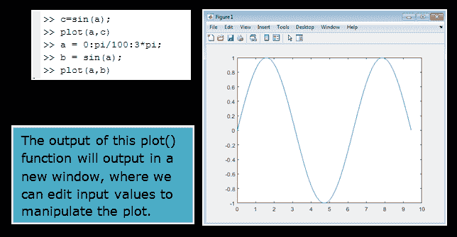
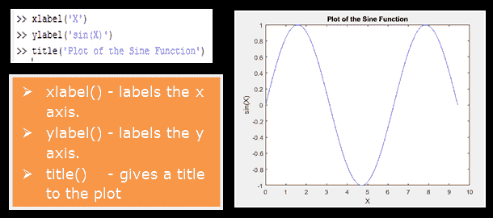
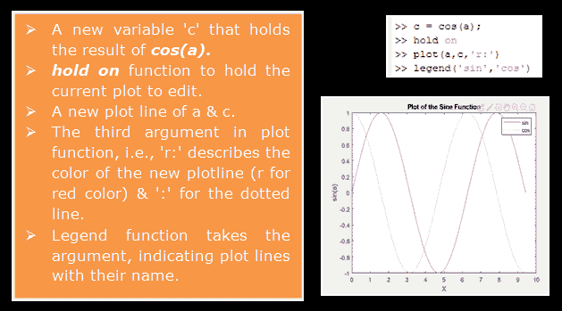
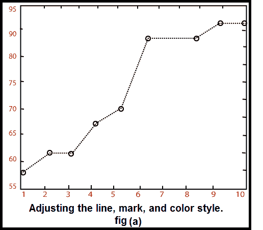
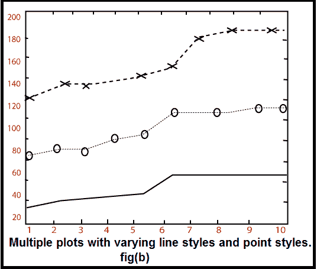
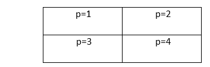
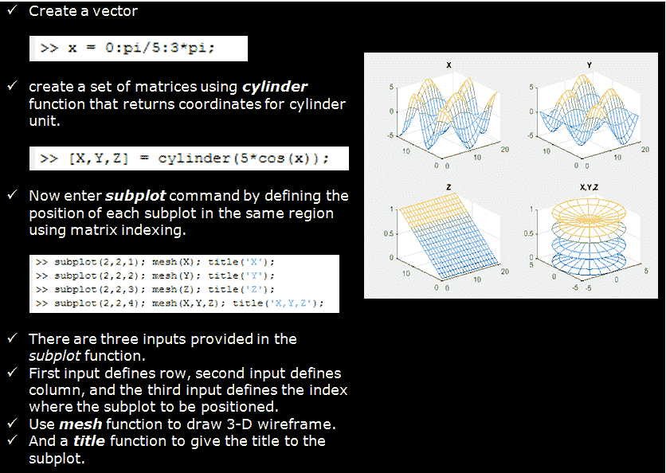

# MATLAB 绘图

> 原文：<https://www.javatpoint.com/matlab-plotting>

绘图是数据集的图形表示，显示两个或多个变量之间的关系。MATLAB 绘图在数学、科学、工程、技术和金融领域的统计和数据分析中发挥着至关重要的作用。

MATLAB 中有几个函数可以创建**二维**和**三维**图。

## 创建打印

MATLAB 使创建图变得容易。比如在 2D，就是取一个**的向量 a** -坐标， **a** = (a <sub>1</sub> ...a <sub>n</sub> ，a**b**坐标向量， **b** = (b <sub>1</sub> ...b <sub>n</sub> ，定位点(a <sub>i</sub> ...b <sub>i</sub> ，i = 1，2。。。然后用直线把它们连接起来。

绘制图形的 MATLAB 命令是(a，b)图。

向量 a = (0，1，2，3，4，5，6，7，8，9，10)和 b = (0，1，-1，1，0)产生如图所示的图像。

```

>> a = [1, 2, 3, 4, 5, 6, 7, 8, 9, 10];
>> b = [0, 1, -1, 1, 0];
>> plot(a, b)

```

**示例:**在区间【0，3π】上绘制函数 sin (a)，我们首先创建一个范围从 0 到 3π的 **a** 值的向量，然后计算这些值的正弦值，最后绘制结果:

```

>>a = 0:pi/100:3*pi; 	% range is same as used while creating vector
>>b = sin(a);
>>plot (a, b)

```



#### 注意 : 0:pi/100:3*pi 产生一个向量，该向量

*   从 0 开始，
*   采用π/100 的步长(或增量),
*   达到 3π时停止。
*   如果忽略增量，MATLAB 会自动递增 1。

## 添加标题、轴标签和注释

MATLAB 允许我们添加轴标签和标题。例如，使用上例中的图表，添加和 **a** 和 **b** 标签。现在标记轴并添加标题。字符\pi 生成符号π。图中显示了一个 2D 图的示例。



```

>> xlabel('x = 0:2\pi')
>> ylabel('Sine of x')
>> title('Plot of the Sine function')

```

默认情况下，单个曲线的颜色为**蓝色**，但也可能是其他颜色。所需的颜色由第三个参数表示。例如，红色是通过绘图(x，y，' r ')选取的。注意 r 周围的单引号。

## 创建多个地块

有多条线的图可以用几种方法创建。以下示例演示了这一概念:

**示例:**

```

a = 0: pi/100:2*pi;
 b=sin (a);
 c = cos (a);
plot (a, c, 'r:'), legend ('Sin(a)', 'Cos(a)')

```

一个曲线图中多个数据集的输出如图所示



## 线条、颜色和标记样式

“打印”命令中的样式选项是一个字符串，由一个、两个或三个指定颜色和线条样式的字符组成。有几种颜色、线条和标记样式选项:

| 颜色样式-选项 | 线条样式选项 | 标记样式-选项 |
| 黄色 | -固体 | +加号 |
| m 洋红色 | 虚线 | 0 圆 |
| c 青色 | :虚线 | *星号 |
| 红色 | -.点划线 | x x 标记 |
| 绿色 | 无无线路 | 。要点 |
| 蓝色 |  | ^三角 |
| w 白色 |  | s 广场 |
| k 黑色 |  | d 钻石等。 |

以下命令演示了线条、颜色和标记样式的使用:

```

x = [1:10];
y = [58.5, 63.8, 64.2, 67.3, 71.5, 88.3, 90.1, 90.6, 89.5, 90.4];
plot(x, y,':ok') 

```

结果图(a)由虚线和用圆圈标记的数据点组成。线、点和圆用黑色画出，如图(b)所示。




## 设置轴比例和注释图

**轴**命令允许我们设置轴刻度。我们可以使用以下方法中的 axis 命令提供 x 轴和 y 轴的最小值和最大值

```

axis ( [xmin xmax ymin ymax] )

```

**例**

```

axis ([-5 10 2 22]);		sets x-axis from -5 to 10, y-axis from 2 to 22
axy = [-5 10 2 22]; axis (axy);
ax=[-5 10]; ay=[2 22]; axis ([ax ay]);

```

对于**轴**命令，还有一些预定义的字符串参数:

| 轴('相等') | 在两个轴上设置相等的比例 |
| 轴('正方形') | 将默认矩形框架设置为正方形 |
| 轴(“法线”) | 将轴重置为默认值 |
| 轴(“轴”) | 冻结当前轴限制 |
| 轴(“关闭”) | 删除周围的框架和刻度线。 |

## 生成子图

我们可以使用**子图**功能在同一个窗口的不同子区域显示多个图。子图命令需要三个整数参数:

```

subplot (m, n, p)

```

将图形分割成 m×n 矩阵。变量 p 标识将绘制下一个图的窗口部分。例如，如果命令

```

subplot (2, 2, 1) 

```

使用时，窗口被拆分为两行两列，绘图绘制在左上角的窗口中。



**图:子图用于将图形窗口细分为 m×n 矩阵。**

**示例:**



* * *