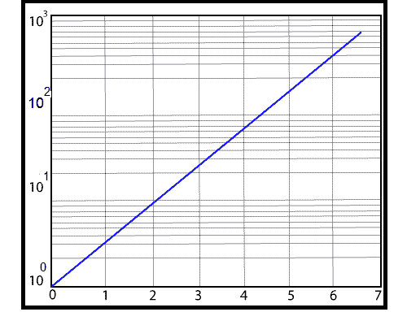

# MATLAB 半学()

> 原文：<https://www.javatpoint.com/matlab-2d-semilogy>

它使用 x 的线性标度和 y 的对数标度生成 x 和 y 值的曲线图。

### 句法

```

semilogy(Y) //	It generates a plot using a base 10 logarithmic scales for the y-axis and linear scales for the x-axis. It plots the column of Y versus their index.
semilogy(X1,Y1,...)//	     It plots all Yn versus Xn pairs.
semilogy(X1,Y1,LineSpec,...)// It plots all the lines described by the Xn,Yn,LineSpec triples. LineSpec determine line style, marker symbol, and color of the plotted lines.
semilogy(...,'PropertyName',PropertyValue,...)//  It sets property values for all the charting lines created by semilogy. 
semilogy(ax,...)//     It generates the line in the axes specified by ax instead of in the current axes (gca). The option ax precedes any of the input argument combinations in the previous syntaxes.
h = semilogy(...)//   It returns a vector of chart line objects.

```

### 例子

为 y 轴创建对数刻度图，为 x 轴创建线性刻度图。

```

x=t,y=e^t,0≤t≤2π
t=linspace (0, 2*pi,200);
semilogy(t, exp(t))
grid

```

**输出:**



* * *