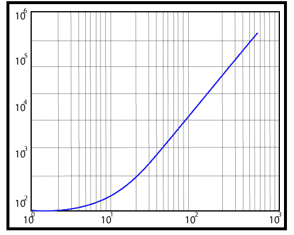

# MATLAB 日志()

> 原文：<https://www.javatpoint.com/matlab-2d-loglog>

它使用 x 轴和 y 轴的对数标度生成向量 x 和 y 的曲线图。

### 句法

```

loglog(Y)// It should plot the columns of Y versus their index if Y includes real numbers. If Y includes complex numbers, loglog(Y) and loglog(real(Y),imag(Y)) are equivalent. 
loglog(X1,Y1,...)// It plots all Yn versus Xn pairs.
loglog(X1,Y1,LineSpec,...)// It plots all the lines described by the Xn,Yn,LineSpec triples, where LineSpec determine line type, marker symbol, and color of the plotted lines. 
loglog(...,'PropertyName',PropertyValue,...)// It sets line property values for all the charting lines created.
loglog(ax,...)// It generates the line in the axes specified by ax instead of in the current axes (gca). The option ax precedes any of the input argument combinations in the previous syntaxes.
h = loglog(...)// It returns a column vector of chart line objects.

```

### 例子

使用 x 轴和 y 轴的对数刻度创建绘图。

```

x=e^t,y=100+e^2t,0≤t≤2π
t=linspace(0, 2*pi,200);
x=exp(t)
y=100+exp(2*t);
loglog(x, y), grid

```

**输出:**



* * *