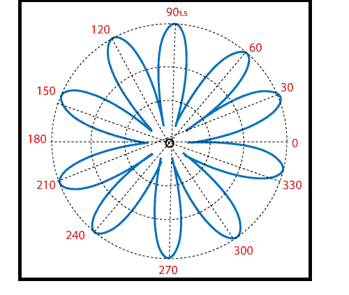

# MATLAB 极坐标图()

> 原文：<https://www.javatpoint.com/matlab-2d-polar-plots>

MATLAB 提供极坐标绘图功能:

极坐标(θ，r)

创建角度θ(弧度)和径向距离 r 的极坐标图。

### 例子

创建极坐标图

```

r^2=2sin5t,0≤t≤2π
t=linspace(0, 2*pi,200);
r=sqrt(abs(2*sin(5*t)))
polar(t, r)

```

**输出:**



* * *