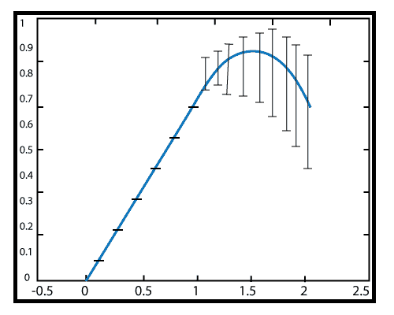

# MATLAB 误差线（）

> 原文：<https://www.javatpoint.com/matlab-2d-errorbar>

沿着曲线绘制误差线

### 句法

```

errorbar(y,err)// It generates a line plot of the data in y and draw a vertical error bar at each data point. The values in err determines the lengths of each error bar above and below the data point, so the total error bar lengths are double the err values.
errorbar(x,y,err)// It plots y versus x and draws a vertical error bar at each data point.
errorbar(x,y,neg,pos)// It draws a vertical error bar at each data point, where neg determine the length below the data point, and pos determines the length above the data point, respectively.
errorbar(...,LineSpec)//  It sets the line style, marker symbol, and color. 
h = errorbar(...)// It returns handles to the errorbarseries objects created. errorbar develops one object for vector input arguments and one object per column for matrix input arguments.

```

### 例子

```

fapproax=x-x^3/3!,0≤x≤2
error=f approax-sin?x
x=0:.1:2;
apprx2=x-x.^3/6;
er=apprx2-sin(x);
errorbar(x,apprx2,er)

```

**输出:**



* * *