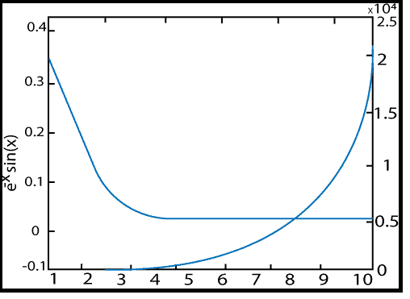

# MATLAB 打印 yy()

> 原文：<https://www.javatpoint.com/matlab-2d-plotyy>

它创建左右两边都有 y 轴的图形。

### 句法

```

plotyy(X1,Y1,X2,Y2) //   It plots X1 versus Y1 with y-axis label on the left and plot X2 versus Y2 with y-axis labeling on the right.
plotyy(X1,Y1,X2,Y2,'function') // It uses the plotting function specified by the string 'function' instead of plot to produce each graph. 'function' can be plot, semilogx, semilogy,stem,loglog etc.
plotyy(X1, Y1,X2,Y2,'function1','function2') // It uses function1(X1, Y1) to plot the information for the left-axis and function2(X2,Y2) to plot the information for the right axis.
[AX, H1, H2] = plotyy(...) // It returns the handles of the two axes generated in AX and the handle of the graphics objects from each plots in H1 and H2\. AX (1) is a left axes and AX (2) is a right axes.

```

### 例子

```

y_1=e^-x sinx,0≤t≤10
y_2=e^x
x= 1:1:10;
y1=exp(-x).*sin(x);
y2=exp(x);
Ax=plotyy(x, y1, x, y2);
hy1=get(Ax(1),'ylabel');
hy2= get(Ax(2),'ylabel');
set(hy1,'string','e^-x sin(x)');
set(hy2,'string',' e^ x');

```

**输出:**



* * *