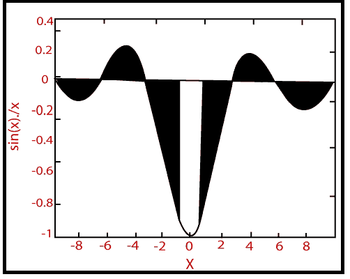

# MATLAB 区域()

> 原文：<https://www.javatpoint.com/matlab-2d-area>

面积图将 Y 中的项目显示为一条或多条曲线，并填充每条曲线下的区域。当 Y 是矩阵时，曲线被堆叠，呈现每一行项目在每个 x 间隔对曲线总高度的相对贡献。

### 句法

```

area(Y) //  It plot the vector Y or the sum of the each column in a matrix Y. The x-axis automatically scales depending on the length(Y) when Y is the vector and on size(Y,1)when Y is the matrix.
area(X,Y) // It plot Y at the corresponding values of X. If X is a vector, length(X) must be the same length(Y), and X must be the monotonic. If X is the matrix, size(X) must similar size(Y), and each column in X must be monotonic. 
area(...,ymin) // It specifies the lower limit in the y-direction for the area fill. The default ymin is 0.
area(...,'PropertyName',PropertyValue,...) // It specifies property name and property value pairs for the patch graphics object developed by area.
h = area(...) // It returns handles of patch graphics objects. area generates one patch object per column in Y.

```

### 例子

```

y=sinx/x,-3π≤x≤3π
x=linspace (-3*pi, 3*pi, 100);
y=-sin(x)./x;
area(x, y)
xlabel('x'),ylabel('sin(x)./x')
hold on
x1=x(46:55);y1=y(46:55);
area(x1,y1,'facecolor','y')

```

**输出:**



* * *