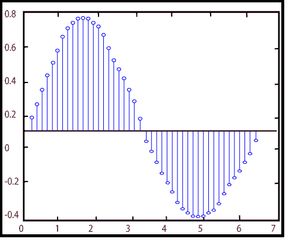

# MATLAB 词干()

> 原文：<https://www.javatpoint.com/matlab-2d-stem>

二维主干图将数据显示为从基线沿 x 轴延伸的直线。y 位置代表数据值的圆圈(默认)或其他标记终止每个词干。

### 句法

```

stem(Y) // It plots the data sequence Y as stems that extends from equally spaced and automatically created values along the x-axis. When Y is a matrix, stem plot, all items in a row against the same x value.
stem(X,Y) // It plot X versus the column of Y. X and Y are vectors or matrices of a similar size. X can be the row or a column vector, and Y is a matrix with length(X) rows.
stem(...,'fill') // It specifies whether to color the circle at the end of the stem.
stem(...,LineSpec) // It specifies the line style, marker symbol, and color. 
h = stem(...) // It returns a vector of Stem objects in h.

```

### 例子

```

f=e^-t/5 sint,0≤t≤2π
t=linspace (0, 2*pi, 200);
f=exp (-.2*t).*sin(t);
stem(t, f)

```

**输出:**



* * *