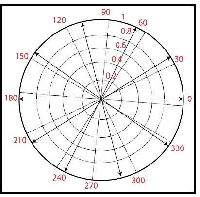

# MATLAB 罗盘()

> 原文：<https://www.javatpoint.com/matlab-2d-compass>

罗盘图显示箭头从原点出现时的方向或速度矢量。x、Y 和 Z 位于笛卡尔坐标中，并绘制在圆形网格上。

### 句法

```

compass(X,Y) // It shows the compass plot having n arrows, where n is the number of components in X or Y. The area of the base of each arrow is the origin. 
compass(Z) // It displays a compass plot having n arrows, where n is the number of elements in Z.
compass(...,LineSpec) // It draws a compass plot using the line type, marker symbol, and color specified by LineSpec.
h = compass(...)// It returns handles to line objects.

```

### 例子

```

z=cosθ+isinθ,-π≤θ≤π
th=-pi:pi/5:pi;
zx=cos(th);
zy=sin(th);
z=zx+i*zy;
compass(z)

```

**输出:**



* * *