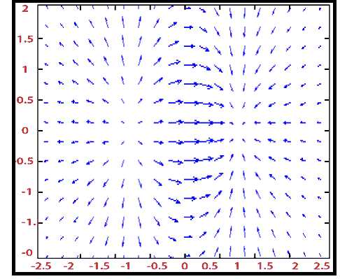

# MATLAB 颤颤()

> 原文：<https://www.javatpoint.com/matlab-2d-quiver>

颤图将速度矢量表示为箭头，并在点(X，Y)处有分量(U，V)。

### 句法

```

quiver(U,V,U,V)
quiver(X,Y)
quiver(...,scale)
quiver(...,LineSpec)
quiver(...,LineSpec,'filled')
h = quiver(...)

```

### 例子

```

z=x^2+y^2-5sin?(xy)
|x|≤2,|y|≤2.
r=-2: .2:2;
[X, Y]= meshgrid (r, r);
Z=X.^2- 5*sin(X.*Y)+Y.^2;
[dx, dy]=gradient (Z,.2,.2);
quiver (X, Y, dx, dy, 2);

```

**输出:**



* * *