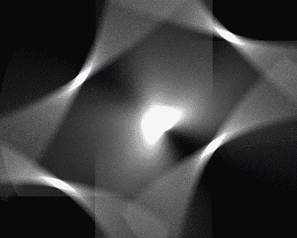

# MATLAB pcolor()

> 哎哎哎:# t0]https://www . javatpoint . com/MATLAB-2d-pcolor

A **伪彩色**图是一个矩形的细胞阵列，颜色由 c 保持。

### 句法

```

pcolor(C) // It draw a pseudocolor plot. The items of C are linearly mapped to an index into the current colormap.
pcolor(X,Y,C) // It draw a pseudocolor plot of the items of C at the locations stated by X and Y. The plot is the logically rectangular, two-dimensional grid with vertices at the points [X(i,j), Y(i,j)]. 
h = pcolor(...) // It returns a handle to a surface graphic object.

```

### 例子

```

z^2=x^2+y^2-5 sin?(xy)
|x|≤2,|y|≤2.
r=-2: .2:2;
[X, Y]= meshgrid (r, r);
Z=X.^2- 5*sin(X.*Y)+Y.^2;
pcolor(Z), axis('off')
shading interp

```

**输出:**



* * *