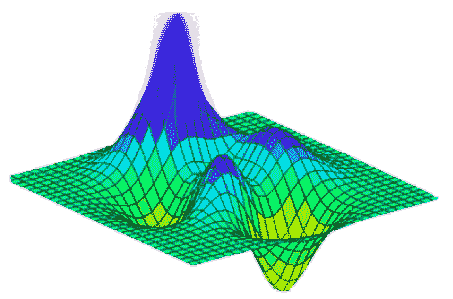

# MATLAB surfc()

> 原文：<https://www.javatpoint.com/matlab-3d-surfc>

surfc 开发由 X、Y 和 Z 指定的彩色参数曲面，颜色由 Z 或 c 指定。

### 句法

```

surf(Z)
surf(X,Y,Z)
surf(X,Y,Z,C)
surf(...,'PropertyName',PropertyValue)
surf(axes_handle,...)
surfc(...)
h = surf(...)
h = surfc(...)
hsurface = surf('v6',...), hsurface = surfc('v6',...)

```

### 例子

在曲面图下显示等高线图。

```

[X,Y] = meshgrid(1:0.5:10,1:20);
Z = sin(X) + cos(Y);
surfc(X,Y,Z)

```

**输出:**



* * *