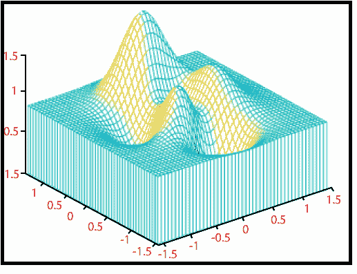

# MATLAB meshz()

> 原文：<https://www.javatpoint.com/matlab-3d-meshz>

它创建一个周围有窗帘的网格图。

### 句法

```

mesh(X,Y,Z)
mesh(Z)
mesh(...,C)
mesh(...,'PropertyName',PropertyValue,...)
mesh(axes_handles,...)
meshc(...)	
meshz(...)
h = mesh(...)
h = meshc(...)
h = meshz(...)
hsurface = mesh('v6'...), = meshc('v6'...), = meshz('v6'...)

```

### 例子

```

z=sin^2 x+sin^2 y
|x|≤π/2,|y|≤π/2
x= linspace(-pi/2,pi/2,50)
y=x;
[x, y]=meshgrid(x, y);
z= sin(x.^2)+sin(y.^2);
meshz(x, y,z), axis tight
view (-37 .5, 50)

```

**输出:**



* * *