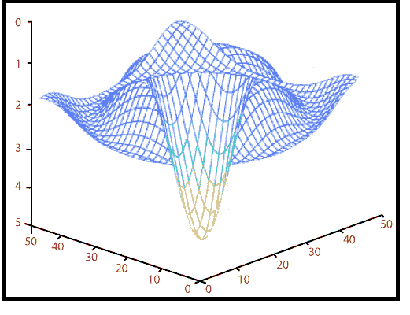

# MATLAB 瀑布()

> 原文：<https://www.javatpoint.com/matlab-3d-waterfall>

瀑布函数绘制了一个与**网格**函数相同的网格，但是它不会从矩阵的列中生成线。

### 句法

```

waterfall(Z) // It creates a waterfall plot using x = 1:size(Z,1) and y = 1:size(Z,1). Z determines the color, so the color is proportional to surface height.
waterfall(X,Y,Z) // It generates a waterfall plot using the values specified in X, Y, and Z. Z also defining the color, so the color is proportional to the surface height. If X and Y are vector, X corresponds to the columns of Z, and Y correspond to the rows, where the length(x) = n, length(y) = m, and [m, n] = size(Z). 
waterfall(...,C) // It uses scaled color values to obtain colors from a current colormap. Color scaling is defined by the range of C, which must be the same size as Z. 
h = waterfall(...) // It returns the handle of the patch graphics object used to draw the plot.

```

### 例子

```

z=-5/(1+x^2+y^2 )
|x|≤3,|y|≤3
x=linspace (-3, 3, 50);
y=x;
[x, y] = meshgrid(x, y);
z=-5\. / (1+x. ^2+y. ^2);
waterfall(z)
hidden off

```

**输出:**



* * *