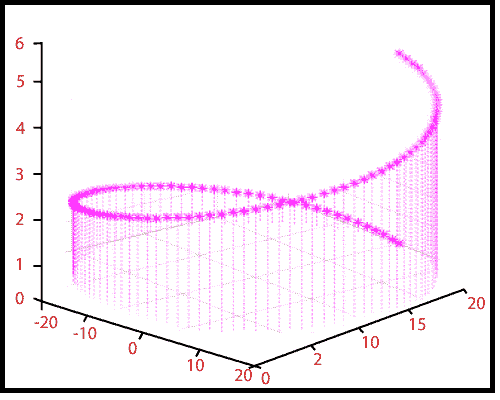

# MATLAB stem3()

> 原文：<https://www.javatpoint.com/matlab-3d-stem3>

三维主干图显示了从 xy 平面延伸的线。z 位置描述数据值的圆圈(默认)或其他标记符号终止每个词干。

### 句法

```

stem3(Z) // It plots the data sequence Z as stems that extend from the xy-plane.
stem3(X, Y, Z) // It plots the data sequence Z at the value specified by X and Y. X, Y, and Z must be all be vectors or matrices of the same size.
stem3(...,'fill')  // It specifies whether to color the interior of the circle at the end of the stem.
stem3(...,LineSpec) // It specifies the line style, marker symbol, and color for the stems.
h = stem3(...) // It returns handles to line graphics objects.

```

### 例子

创建一个三维主干图，以可视化两个变量的函数。

```

x=t, y=tsin(t)
z=e^t/10-1
for 0≤t≤6π
t=linspace(0,6*pi,200);
x=t; y=t.*sin(t);
z=exp(t/10)-1;
stem3(x, y, z,'filled')

```

**输出:**



* * *