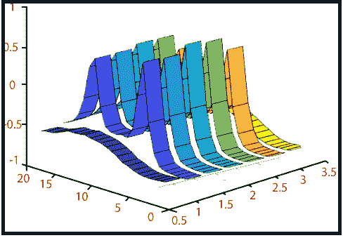

# MATLAB 功能区()

> 原文：<https://www.javatpoint.com/matlab-3d-ribbon>

它创建一个带状图。

### 句法

```

ribbon(Y) // It plots the columns of Y as separate three-dimensional ribbons using
X = 1:size(Y,1).
ribbon(X,Y) // It plots X versus the columns of Y as three-dimensional strips. X and Y are vectors of a similar size or matrices of the same size. X can be the row or a column vector, and Y a matrix with length(X) rows.
ribbon(X,Y,width) // It specifies the width of the ribbons. The default is 0.75.
ribbon(axes_handle,...) // It plots into the axes with handle axes_handle instead of the current axes (gca).
h = ribbon(...) // It returns a vector of handles to surface graphics objects. ribbon returns one handle per strip.

```

### 例子

创建带状图

二维曲线是三维的丝带

```

y_1=sin?(t),y_2=e^(-.15t) sin?(t)
y_3=e^(-.8t) sin?(t)
for 0≤t≤5π
t=linspace (0, 5*pi, 100);
y1=sin(t);
y2=exp(-.15*t).*sin(t);
y3=exp(-.8*t).*sin(t);
y=[y1;y2;y3];
rib_width=0.2;
ribbon(t',y',rib_width)

```

**输出:**



* * *