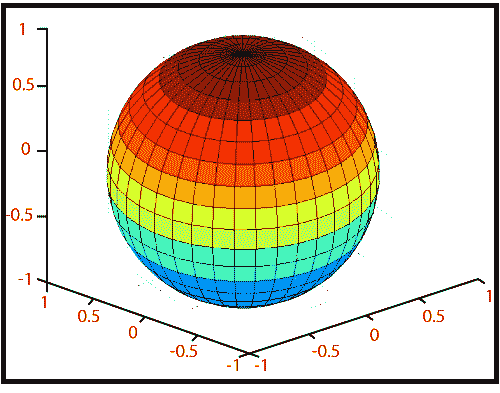

# MATLAB 球体()

> 原文：<https://www.javatpoint.com/matlab-3d-sphere>

球体功能开发单位球体的 x、y 和 z 坐标，用于**冲浪**和**网格**。

### 句法

```

sphere // It generates a sphere consisting of 20-by-20 faces.
sphere(n) // It draws a surf plot of an n-by-n sphere in the current figure.
[X,Y, Z] = sphere(...) // It returns the coordinates of a sphere in three matrices that are (n+1)-by-(n+1) in size.

```

### 例子

生成并绘制一个球体。

```

sphere(20)
axis('square')
or
[x,y,z]=sphere(20);
surf(x, y, z)
axis('square')

```

**输出:**



* * *