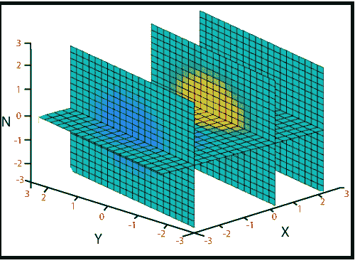

# MATLAB 切片()

> 原文：<https://www.javatpoint.com/matlab-3d-slice>

切片通过体积数据显示正交切片平面。

### 句法

```

slice(V,sx,sy,sz)
slice(X,Y,Z,V,sx,sy,sz)
slice(V,XI,YI,ZI)
slice(X,Y,Z,V,XI,YI,ZI)
slice(...,'method')
slice(axes_handle,...)
h = slice(...)

```

### 例子

体积函数切片

```

f(x, y, z)=cos^2 x+cos^2 y-z^2
|x|≤3,|y|≤3,|z|≤3 at x=-2  and 2,y=2,and z=-2.5 and 0.
v=[-3: .2: 3];
[x, y, z]=meshgrid (v, v, v);
f= (cos(x).^2+sin(y). ^2-z. ^2);
xv= [-2 2\. 5];	yv=2;
zv = [-2.5 0];
slice (x, y, z, f, xv, yv, zv);

```

**输出:**



* * *