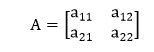
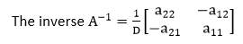
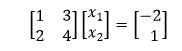
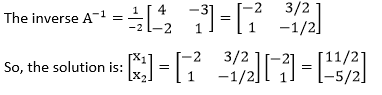

# 线性代数

> 原文：<https://www.javatpoint.com/matlab-linear-algebra>

## 求解线性系统

线性代数方程是系统的方程

a<sub>1</sub>x<sub>1</sub>+a<sub>2</sub>x<sub>2</sub>+a<sub>3</sub>x<sub>3</sub>+⋯+a<sub>n</sub>x<sub>n</sub>= b

其中 a 是**常数系数**，x 是**未知数**，b 是**常数。**一个解是满足方程的一系列数字 s <sub>1</sub> ，s <sub>2</sub> ，s <sub>3</sub> 。

**例**

4x<sub>1</sub>+5x<sub>2</sub>-2x<sub>3</sub>= 16

就是这样一个方程，其中有三个未知数:x <sub>1</sub> ，x <sub>2</sub> ，以及 x <sub>3</sub> 。这个方程的一种解法是 x <sub>1</sub> =3，x <sub>2</sub> =4，x <sub>3</sub> =8，因为 4*3+5*4-2*8 等于 16。

一个线性代数方程的**系统**是以下形式的一组方程:

a11x<sub>1</sub>+a<sub>12</sub>x<sub>2</sub>+a<sub>13</sub>x3【t11 }+】 a<sub>32</sub>x<sub>2</sub>+a<sub>33</sub>x<sub>3</sub>++a<sub>3n</sub>x

这叫做 **m*n** 方程组；有 m 个方程和 n 个未知数。

### 矩阵形式

由于矩阵乘法的工作方法，这些方程可以矩阵形式定义为 Ax = b，其中 A 是系数矩阵，x 是未知的列向量，b 是方程右侧的常数的列向量:

a x = b
a<sub>11</sub>a<sub>12</sub>a<sub>13</sub>-我...。a<sub>1n</sub>x<sub>1</sub>b<sub>T12
a<sub>21</sub>a<sub>22</sub>a<sub>23</sub>-我...。a<sub>2n</sub>x<sub>2</sub>b<sub>2</sub>a<sub>31</sub>a<sub>32</sub>a<sub>33</sub>-我...。a【t33 n】</sub>x<sub><sub>【b37】 <sub>……………………………….........我...
a<sub>m1</sub>a<sub>m2</sub>a<sub>m3</sub>-我...。a<sub>Mn</sub>x<sub>n</sub>b<sub>m</sub></sub></sub></sub>

一个**解集**是方程组所有可能解的集合(解方程的未知数的所有值的集合)。所有线性方程组都有:

*   没有解决办法
*   一个解决方案
*   无限多的解决方案

### 使用矩阵求逆的解决方案

也许求解这个方程组的简单方法是用矩阵求逆。

A <sup>-1</sup> A=1

我们可以将矩阵方程 AX= B 的两边乘以 A <sup>-1</sup> 得到

a<sup>1</sup>ax = a<sup>1</sup>b

或者

X=A <sup>-1</sup> B

所以，解可以是 A 的倒数和列向量 b 的乘积。

在 MATLAB 中，有两种方法可以做到这一点，使用内置的 **inv** 函数和矩阵乘法，以及使用“\”运算符:

```

>> A = [3 4 1; -2 0 3; 1 2 4]	
A =
        3     4      1
      -2      0      3
       1      2      4	
>> b = [2 1 0]'	
     b =
          2
         1
         0  
 >> x = inv(A) * b
x =
       -1.1818
        1.5000
       -0.4545
>> A\b
ans =
      -1.1818
       1.5000
       -0.4545

```

### 求解 2x2 方程组

最简单的系统是 2×2 系统，只有两个方程和两个未知数。对于这些系统，矩阵的逆有一个简单的定义，它使用矩阵的行列式 D。

对于系数矩阵，通常定义为



行列式 D 定义为 a<sub>11</sub>a<sub>22</sub>-a<sub>12</sub>a<sub>21</sub>



**例**

x<sub>1</sub>+3x<sub>2</sub>=-2
2x<sub>1</sub>+4x<sub>2</sub>= 1

这将以矩阵形式写成



行列式 D = 1*4 -3*2 = -2。



MATLAB 内置函数 **det** 求矩阵的行列式。

```

>> A = [1 3; 2 4]
A =
         1      3
         2      4
>> b = [-2;1]
b =
        -2
         1
>> det(A)
ans =
          -2
>> inv(A)
ans =
         -2.0000     1.5000
          1.0000     -0.5000
>> x = inv(A) * b
x =
      5.5000
    -2.5000

```

* * *