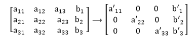
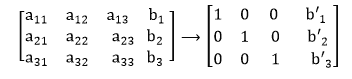
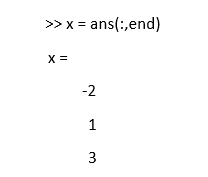

# MATLAB rref

> 原文：<https://www.javatpoint.com/matlab-rref>

简化行梯队形式(rref)通过在所有行上操作缩放 EROs，使得对角线上的 a <sub>ii</sub> 系数都变为 1，从而将高斯-乔丹消去法向前推进了一步。



简化的行梯队形式更进一步，得到所有的 1，而不是 a’，因此 b 的列就是解决方案:



MATLAB 有内置函数可以做到这一点，称为 **rref** 。例如，对于前面的示例:

```

	>> a = [1 3 0; 2 1 3; 4 2 3];
            >> b = [1 6 3]';
            >> ab = [a b];
           >> rref(ab)
           ans =
		1   0   0   ?2
                        0   1   0     1
                        0   0   1     3

```

解决方案从最后一列开始找，所以 x <sub>1</sub> = -2，x <sub>2</sub> = 1，x <sub>3</sub> = 3。要在 MATLAB 的列向量中得到这个:



## 通过约简增广矩阵求矩阵逆

对于大于 2×2 系统的方程组，求矩阵 A 逆的一种方法是用一个相似大小的单位矩阵来扩充矩阵，然后再进行约简。

算法是:

*   用 I 扩充矩阵
*   将其简化为方法[I X]；x 将是 A <sup>-1</sup> 。

例如，在 MATLAB 中，我们可以从一个矩阵开始，用一个单位矩阵对其进行增广，然后使用 **rref** 函数对其进行约简。

```

>> a = [1 3 0; 2 1 3; 4 2 3];
>> rref([a eye(size(a))])
ans = 
      1.0000      0              0             ?0.2000      ?0.6000       0.6000
           0       1.0000        0               0.4000        0.2000      ?0.2000
          0            0        1.0000                0             0.6667      ?0.3333
In MATLAB, the inv functions can be used to check the result.
>> inv(a)
         ans =
            ?0.2000   ?0.6000      0.6000
              0.4000     0.2000    ?0.2000
                   0          0.6667   ?0.3333

```

* * *