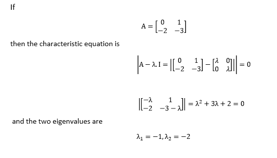
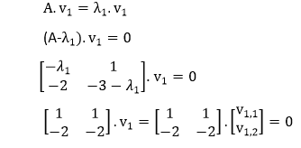
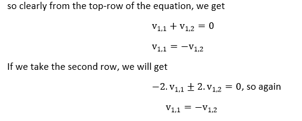
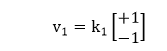
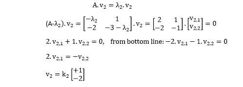
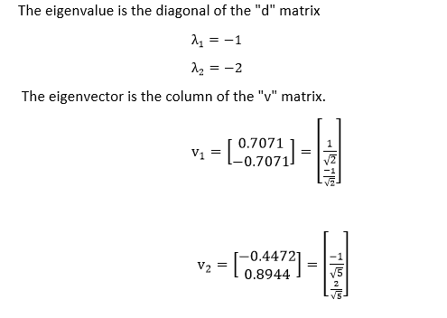

# 特征值和特征向量

> 原文：<https://www.javatpoint.com/matlab-eigenvalues-and-eigenvectors>

方阵 A 的特征值和特征向量是满足以下条件的标量λ和非零向量 v

**关闭 = λv**

在这个方程中， **A** 是一个 n 乘 n 矩阵， **v** 是非零的 n 乘 1 向量，λ是标量(可能是实数也可能是复数)。这个方程有解的λ的任何值称为矩阵的特征值 **A** 。也叫**特征值。**对应于这个方程的向量 **v** 称为特征向量**。**特征值问题可以写成

**a****【v】**【λ】**【v】**= 0
**a v**【λ】**【I】**【v】****

如果 **v** 是非零值，这个方程只有在下列情况下才有解

**和**和**= 0**

这个方程叫做 **A** 的特征方程，是λ中 n <sup>次</sup>次多项式，有 n 个根。这些根被称为**的特征值。我们将只处理 n 个不同根的情况；通过它它们可以被重复。对于每个特征值，将有特征值方程为真的特征向量。**

### 示例:查找 2x2 矩阵的特征值和特征向量



剩下的就是找到两个特征向量。先求特征向量 v <sub>1</sub> ，与特征值λ <sub>1</sub> =-1 相连。




在这种情况下，我们发现第一个特征向量是任意两个分量的列向量，其中两个项的大小相等，符号相反。



其中 k <sub>1</sub> 是任意常数。如果我们不必使用+1 和-1，我们可以使用任意两个大小相等、符号相反的量。

对第二特征值进行同样的处理:



同样，特征向量的+1 和-2 的选择是任意的；只有它们的比例是必要的。这是在下面的 MATLAB 代码中演示的。

```

	>> A=[0 1;-2 -3]
A =
       0   1
      -2  -3
>> [v,d]=eig(A)
v =
     0.7071  -0.4472
    -0.7071   0.8944
d =
     -1   0
      0  -2

```



#### 注:MATLAB 为特征向量选择的方程与我们选择的方程不同。v <sub>1，1</sub> 与 v <sub>1，2</sub> 的比值，v <sub>2，1</sub> 与 v <sub>2，2</sub> 的比值与我们的解决方案相似；选择的系统特征向量不是唯一的，但是它们的分量比是唯一的。MATLAB 选择这些值，使得每个特征向量的分量的平方和等于 1。

* * *