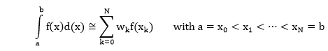
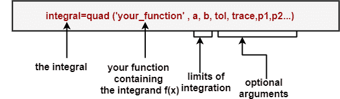
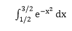
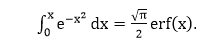

# 数值积分(求积)

> 原文：<https://www.javatpoint.com/matlab-numerical-integration>

积分∫ f(x)dx 的数值计算称为求积。

函数 f (x)在某个区间[a，b]上的数值积分的一般形式是有限数量(N + 1)个样本点(节点)上函数值的加权总和，表示为“求积”:



MATLAB 为数值积分提供了内置函数:

## 四胞胎之一

它在指定的极限上集成了指定的功能，建立在**自适应辛普森规则**上。自适应规则通过在积分范围内自适应地选择子区间的估计值，同时评估组成积分的和，来提高精度。

## 四边形

它在指定的极限内集成了指定的功能，建立在**自适应洛巴托求积**的基础上。这个比**四元**更准确，但它也使用了更多的功能评估。

quad 和 quad1 的语法如下:



要使用**四边形 1** ，您可以在语法中将**四边形**替换为**四边形 1** 。如语法所示，这两个函数都要求我们将被积函数作为用户编写的函数提供。

可选输入参数 **tol** 指定绝对公差(默认值为 10 <sup>-6</sup> )。另一个可选参数**轨迹**的非零值显示了每一步的一些中间计算。

可选参数 **p1、p2、**等。，作为 x 之外的输入参数传递给用户定义的函数。

使用这些内置函数进行数值积分的步骤包括:

**步骤 1:** 给定 x 的值，写一个返回被积函数 f(x)的值的函数，我们的函数应该能够接受输入值 x 为向量，产生被积函数的值(输出)为向量。

**第二步:**决定使用**四元还是四元**(四元比四元快但精度低)。默认公差值为 10 <sup>-6</sup> 求积分。

### 例子

让我们计算下面的积分



这种集成与误差函数 erf 密切相关。



MATLAB 还提供了误差函数 **erf** ，作为一个内置函数，我们可以以封闭的形式(根据误差函数)评估我们的积分，并比较数值积分的结果。让我们遵循前面概述的步骤。

**Step1:** 这里是在给定的 x (x 允许是向量)下求被积函数的函数。

```

function y = erfcousin(x);
% ERFCOUSIN function to evaluate exp(-x^2)
y= exp(-x.^2);		% the array operator .^ is used for vector x.

```

**步骤 2:** 让我们用最简单的语法来使用 quad:

```

>> y=quad ('erfcousin', 1/2, 3/2)			% here a=1/2, b=3/2
y=
	0.3949

```

积分的精确结果是 0.3949073872，精确到小数点后 10 位。在前面的例子中，我们使用了默认容差。这是一张表格，显示了一些积分实验的结果。我们使用**四边形**和**四边形 1** 进行集成。对于四边形，我们将不同容差的结果制成表格。在表中，我们列出了积分的值、%误差和函数求值的次数。对于 quad1 给出了相当精确的解决方案，只有默认的公差。

| 功能 | 生命之树 | 回答 | %错误 | F-evals |
| 四胞胎之一 | 系统默认值 | 0.3949073927 | 1.3907 x 10 <sup>-6</sup> | Seventeen |
|  | 10 <sup>-7</sup> | 0.3949073894 | 5.5506 x 10 <sup>-7</sup> | Twenty-five |
|  | 10 <sup>-8</sup> | 0.3949073873 | 2.4369 x 10 <sup>-8</sup> | Thirty-three |
| quad1 | 系统默认值 | 0.3949073875 | 8.0616 x 10 <sup>-8</sup> | Eighteen |

* * *