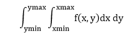
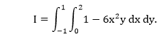

# MATLAB 二重积分

> 原文：<https://www.javatpoint.com/matlab-double-integral>

计算形式的积分



MATLAB 提供了一个函数 dblquad。dblquad 的调用语法是

I=dblquad ('fxy-fun '，xmin，xmax，ymin，ymax，tol，@method)

其中 tol 和 method 是可选的输入参数。可选参数 tol 指定容差(默认值为 10 <sup>-6</sup> )，如前所述用于一维积分，方法确定用户对所用积分目的的选择，例如四元和四元 1。默认方法是四元法。用户定义的被积函数 fxy-fun，必须写成在计算被积函数时，它可以接受一个向量 x 和一个标量 y。

### 例子

让我们计算下面的积分



这只是为了分析验证 I=4。让我们看看 **dblquad** 如何在这个积分上执行。

```

>> F = Inline ('1-6*x.^2*y^' );                      // Create the integrand as Inline function.
>> I = dblquad (F, 0, 2, -1, 1)
I =
       4.0000

```

#### 注 1: x 是一个向量参数。接下来，使用默认 tol 和方法运行 dblquad。

#### 注 2:我们使用默认容差和默认低阶方法 quad 得到精确的结果。我们可以通过执行命令来验证高阶方法 quad1 给出了相同的结果。

I=dblquad (F，0，2，-1，1，[ ]，@quad1)

* * *