# MATLAB 梯形法则

> 原文：<https://www.javatpoint.com/matlab-trapezoidal-rule>

考虑区间 a≤x≤b 的函数 y=f(x)，如图所示:

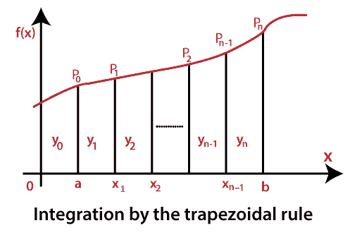

为了计算定积分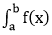 dx，我们将区间 a≤x≤b 分成长度为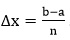的子区间。那么，x  0  =a，x  n  =b 之间的点数为 x1= a+∏x，x2= a+2∏x，…xn-1= a+(n-1)∏x，因此，从 a 到 b 的积分就是从 a 到 x 1 ，从 x  1 的积分之和

总面积为:

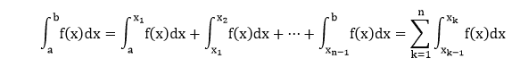 <pthe integral="" over="" the="" first="" subinterval="" can="" now="" be="" approximated="" by="" area="" of="" trapezoid="" ap="">0 P1 x1that is equal to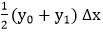 plus the area of the trapezoid x1 P1 P2 x2 that is equal to 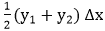, and so on. Then, the trapezoidal approximation becomes 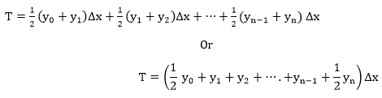

### 例子

利用 n=4 的梯形法则，估算定积分的成本

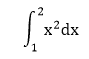

与精确值进行比较，并评估百分比误差。

**解决方案:**

这个积分的精确值是

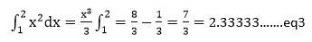

对于梯形规则近似，我们有

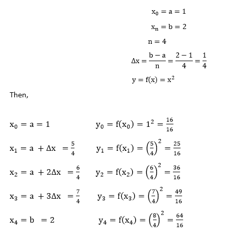

通过代入方程

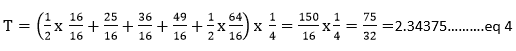

从等式 3 和等式 4，我们发现百分比误差为

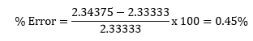

* * *</pthe>