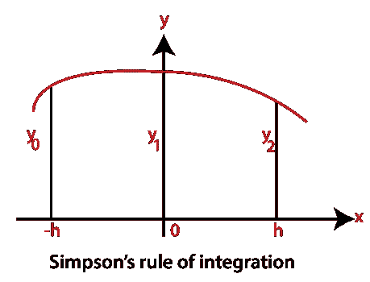
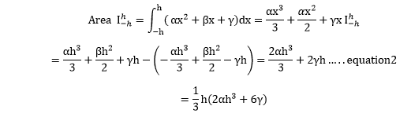
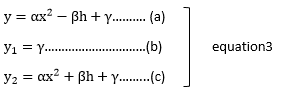
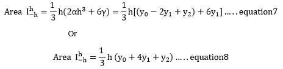
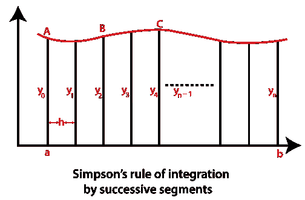
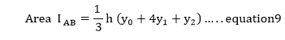
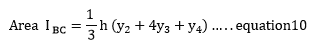
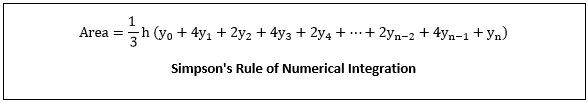
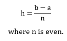

# MATLAB 辛普森法则

> 原文：<https://www.javatpoint.com/matlab-simpsons-rule>

梯形规则和辛普森规则是牛顿-科特规则的特例，牛顿-科特规则使用高阶函数进行数值积分。

让抛物线代表图形的曲线。

y=αx 2 +βx+γ………..等式 1

该方法下区间-h≤x≤h 的面积为

曲线经过三个点(-h，y 0 )、(0，y 1 )和(h，y 2 )。然后，通过一个等式，我们有:

我们现在可以计算系数α、β、γ，并用 h、y 0 、y 1 和 y 2 表示方程 2。

This is done with the following procedure.

通过将等式 3 的(b)代入(a)和(c)并重新排列，我们得到

αx2-βh = y0-y1…..等式 4

αx2+βh = y2-y1…..等式 5

等式 4 和等式 5 相加得到

2αh2= y0-2y1+y2…...等式 6

通过代入方程 2，我们得到

现在，我们可以将等式 8 应用于任意曲线 y=f(x)在区间 a≤x≤b 中的连续线段，如图中曲线所示。

我们观察到抛物线可以通过它的端点和中点逼近曲线宽度 2h 的每一段。因此，线段 AB 下的面积为

同样，BC 段下的面积为

等等。当每个部分下面的区域相加时，我们得到

由于每个线段都有 2h 的宽度，为了应用辛普森的数值积分规则，细分数 n 必须是偶数。这个限制不适用于数值积分的梯形规则。

等式 11 的值可以从

* * *