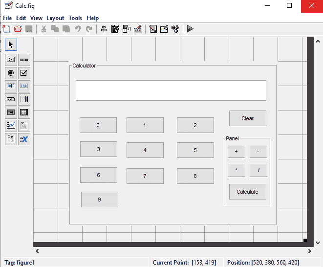
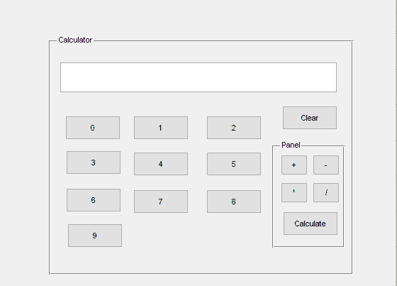
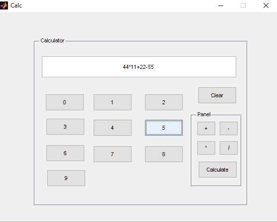
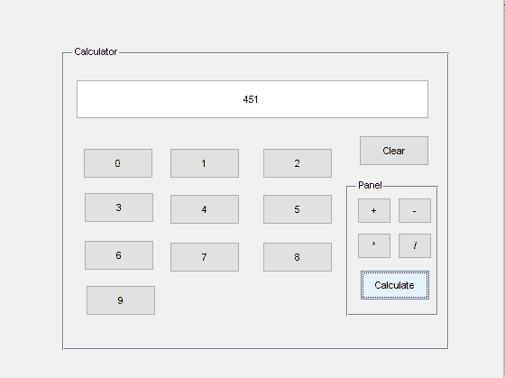
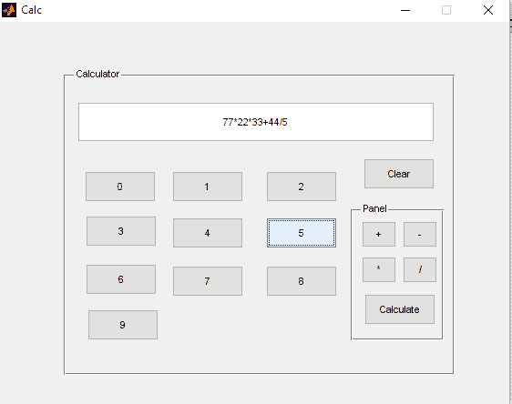
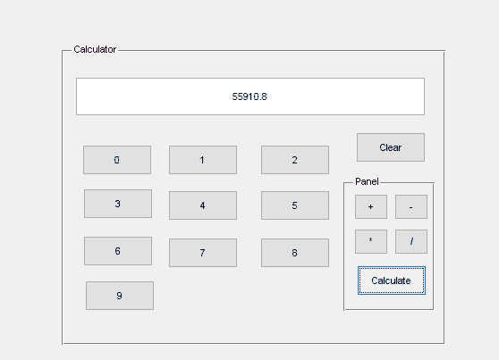

# 图形用户界面

> 原文：<https://www.javatpoint.com/matlab-graphical-user-interface>

图形用户界面是程序的可视界面。一个好的图形用户界面可以为应用程序提供一致的外观和直观的控件，如按钮、编辑框、列表框、滑块和菜单，从而使应用程序使用起来更加舒适。

## 图形用户界面是如何工作的？

图形用户界面为客户提供了一个熟悉的工作环境。它包含按钮、切换按钮、列表、菜单、文本框等。图形用户界面对程序员来说更难，因为基于图形用户界面的应用程序必须随时为任何图形用户界面项目的鼠标点击(或可能的键盘输入)做好准备。这样的数据被称为事件，一个响应事件的程序被称为事件驱动的。

**创建 MATLAB 图形用户界面所需的三个主要组件是:**

### 成分

MATLAB 图形用户界面上的每个元素(按钮、标签、编辑框等)。)是一个图形组件。组件的方法包括图形控件(按钮、切换按钮、编辑框、文件、滑块等)。)静态组件(文本框)、菜单、工具栏和轴。函数 uicontrol 创建图形控件和文本框，菜单由函数 uimenu 和 uicontextmenu 创建。工具栏由函数 uitoolbar 组织。用于显示图形数据的轴由函数轴创建。

### 容器

图形用户界面的组件必须组织在一个容器中，容器是计算机屏幕上的一个窗口。最常见的容器是一个数字。图形是笔记本电脑屏幕上的一个窗口，顶部有一个标题栏，可以有选择地连接菜单。过去，每当我们绘制数据时，就会自动创建图片。

空图形可以用函数图形生成，它们可以用来影响组件和其他容器的任何组合。不同类型的容器是面板(由函数 uipanel 创建)和按钮组(由函数 uibuttongroup 创建)。面板可以包含组件或其他容器，但它们没有标题栏，也不能有菜单连接。按钮组是特殊的面板，可以处理单选按钮组或切换按钮组，以确保组中任何时候都不会有一个以上的按钮处于打开状态。

### 回收

最后，如果用户在按钮上点击鼠标或在键盘上键入信息，必须有某种方式来采取行动。鼠标点击或按键是一个事件，如果程序要执行其功能，MATLAB 程序必须响应每个事件。例如，如果用户点击一个按钮，那么该事件必须导致实现该按钮角色的 MATLAB 代码被执行。响应事件而执行的代码称为回调。必须有一个回调来实现图形用户界面上每个图形元素的角色。

## 图形用户界面组件

| 成分 | 由…创造 | 描述 |
|  |  | **容器** |
| 数字 | 数字 | 它创建了一个图形，这是一个可以容纳组件和其他容器的容器。图形是有标题栏和菜单的独立窗口。 |
| 面板 | 画板 | 它创建了一个面板，这是一个可以容纳组件和其他容器的容器。与图像不同，面板没有标题栏或菜单。面板可以放在图片或其他面板内。 |
| 按钮组 | uibuttongroup | 它创建了一个按钮组，这是一种特殊的面板。按钮组自动处理单选按钮组或切换按钮组，以确保在任何给定时间组中只有一个组件处于打开状态。 |
|  |  | **图形控件** |
| 按钮 | uicontrol(控制系统) | 实现按钮的图形元素。当用鼠标点击时，它触发回调。 |
| 开关按钮 | uicontrol(控制系统) | 执行切换按钮图形组件。切换按钮可以是“开”也可以是“关”，每次单击它时都会改变状态。每次单击鼠标按钮也会触发回调。 |
| 单选按钮 | uicontrol(控制系统) | 单选按钮是一种切换按钮，当它“打开”时，显示为中间有一个点的小圆圈单选按钮组用于执行互斥选择。鼠标每次点击单选按钮都会触发回调。 |
| 检验盒 | uicontrol(控制系统) | 复选框是一种切换按钮，当它“打开”时，会显示为一个带有复选标记的小方块每次鼠标点击复选框都会触发回调。 |
| 编辑框 | uicontrol(控制系统) | 编辑框显示一个文本字符串，并允许用户修改显示的信息。当用户按下回车键时，或者当用户用鼠标单击不同的对象时，会触发回调。 |
| 列表框 | uicontrol(控制系统) | 列表框是显示一系列文本字符串的图形控件。客户可以通过单击或双击选择其中一个文本字符串。当客户选择一个字符串时，会触发回调。 |
| 弹出菜单 | uicontrol(控制系统) | 弹出式菜单是一种图形控件，它显示一系列响应鼠标单击的文本字符串。当弹出菜单没有被点击时，只有当前选择的字符串被清除。 |
| 滑块 | uicontrol(控制系统) | 滑块是一种图形控件，通过用鼠标拖动控件，以平滑、规则的方式调整值。每次滑块修改都会触发回调。 |
| 基本框架 | uicontrol(控制系统) | 它创建了一个框架，这是一个图形中的矩形框。框架用于将控件集关联在一起。框架从不触发回调。 |
| 文本字段 | uicontrol(控制系统) | **它创建一个标签，它是一个位于图上某个点的文本字符串。文本字段从不触发回调。** |
|  |  | **菜单、工具栏、轴** |
| 菜单项 | uimenu | 它创建一个菜单项。当鼠标按钮放在菜单项上时，菜单项会触发回调 |
| 上下文菜单 | 创建现场菜单对象 | 它创建了一个上下文菜单，当用户在图形对象上右键单击鼠标时，该菜单会出现在该对象上。 |
| 工具栏 | 工具条 | 它创建了一个工具栏，这是一个横跨图形顶部的栏，包含快速访问按钮。 |
| 工具栏 | unipushtool | 它在工具栏中创建一个按钮。 |
| 工具栏切换 | uitoggletool | 它创建一个切换按钮进入工具栏。 |
| 轴线 | 轴线 | 它会创建一组新的轴来显示数据。Axes 从不触发回调。 |

### 例子

实现一个简单的计算器作为图形用户界面。

```

% --- Executes on button press in BtnZero.
function BtnZero_Callback (hObject, eventdata, handles)
% hObject    handle to BtnZero (see GCBO)
% eventdata reserved - to be described in a future version of MATLAB
% handles    structure with manage and user data (see GUIDATA)
textString=get (handles. edit1,'string');
textString=strcat(textString,'0');
set (handles. edit1,'string', textString);

% --- Executes on button press in BtnOne.
function BtnOne_Callback (hObject, eventdata, handles)
textString=get (handles. edit1,'string');
textString=strcat(textString,'1');
set (handles. edit1,'string', textString);

 % --- Executes on button press in BtnTwo.
function BtnTwo_Callback (hObject, eventdata, handles)
textString=get (handles. edit1,'string');
textString=strcat(textString,'2');
set (handles. edit1,'string', textString);

% --- Executes on button press in BtnThree.
function BtnThree_Callback (hObject, eventdata, handles)
textString=get (handles. edit1,'string');
textString=strcat(textString,'3');
set(handles. edit1,'string', textString);

% --- Executes on button press in BtnFour.
function BtnFour_Callback (hObject, eventdata, handles)
textString=get (handles. edit1,'string');
textString=strcat(textString,'4');
set (handles. edit1,'string',textString);

% --- Executes on button press in BtnFive.
function BtnFive_Callback(hObject, eventdata, handles)
textString=get (handles. edit1,'string');
textString=strcat(textString,'5');
set (handles. edit1,'string', textString);

% --- Executes on button press in BtnSix.
function BtnSix_Callback (hObject, eventdata, handles)
textString=get (handles. edit1,'string');
textString=strcat(textString,'6');
set (handles. edit1,'string', textString);

% --- Executes on button press in BtnSeven.
function BtnSeven_Callback (hObject, eventdata, handles)
textString=get (handles. edit1,'string');
textString=strcat(textString,'7');
set (handles. edit1,'string', textString);

% --- Executes on button press in BtnEight.
function BtnEight_Callback (hObject, eventdata, handles)
textString=get (handles. edit1,'string');
textString=strcat(textString,'8');
set (handles. edit1,'string', textString);

% --- Executes on button press in BtnNine.
function BtnNine_Callback (hObject, eventdata, handles)
textString=get (handles. edit1,'string');
textString=strcat(textString,'9');
set (handles. edit1,'string', textString);

% --- Executes on button press in BtnPlus.
function BtnPlus_Callback (hObject, eventdata, handles)
textString=get (handles. edit1,'string');
textString=strcat(textString,'+');
set(handles. edit1,'string', textString);

% --- Executes on button press in BtnMinus.
function BtnMinus_Callback (hObject, eventdata, handles)
textString=get (handles. edit1,'string');
textString=strcat(textString,'-');
set (handles. edit1,'string', textString);

% --- Executes on button press in BtnMul.
function BtnMul_Callback (hObject, eventdata, handles)
textString=strcat(textString,'*');
set (handles. edit1,'string', textString);

% --- Executes on button press in BtnDivide.
function BtnDivide_Callback (hObject, eventdata, handles)
textString=get (handles. edit1,'string');
textString=strcat(textString,'/');
set (handles. edit1,'string', textString);

% --- Executes on button press in BtnCalc.
function BtnCalc_Callback (hObject, eventdata, handles)
textString=get (handles. edit1,'string');
textString=eval(textString);
set (handles. edit1,'string', textString);

% --- Executes on button press in BtnClear.
function BtnClear_Callback (hObject, eventdata, handles)
textString=get (handles. edit1,'string');
set (handles. edit1,'string','');

```

**输出:**








* * *