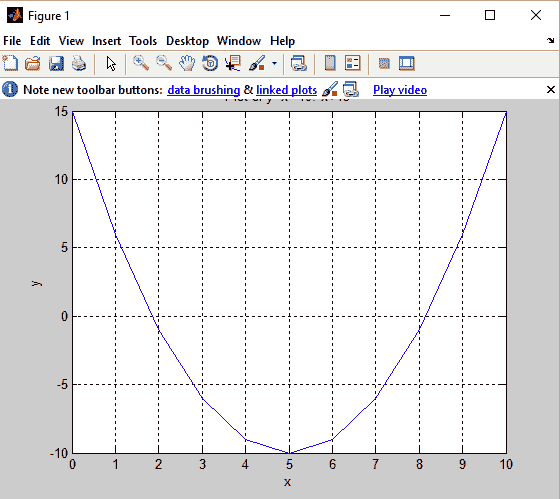
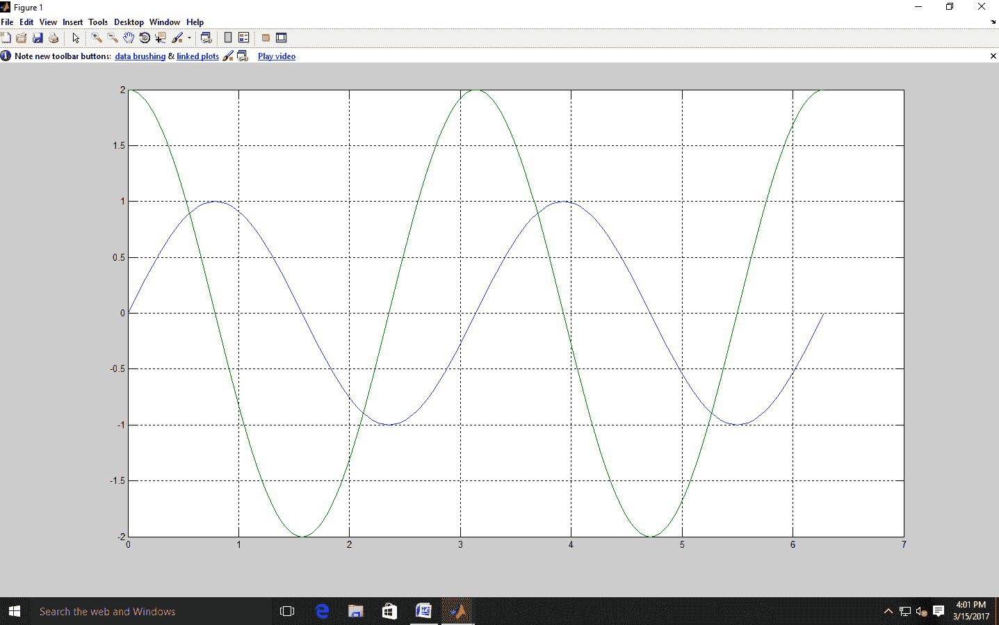
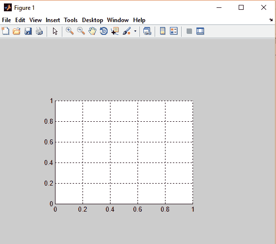
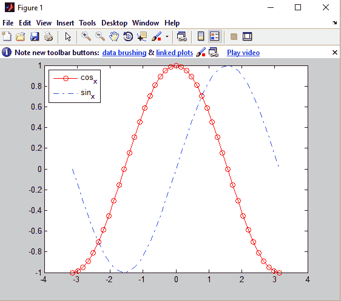
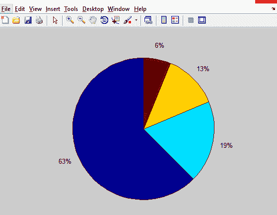
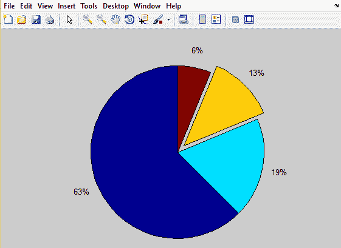
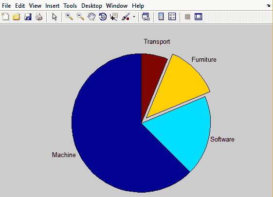
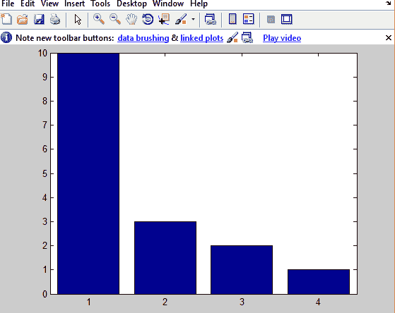
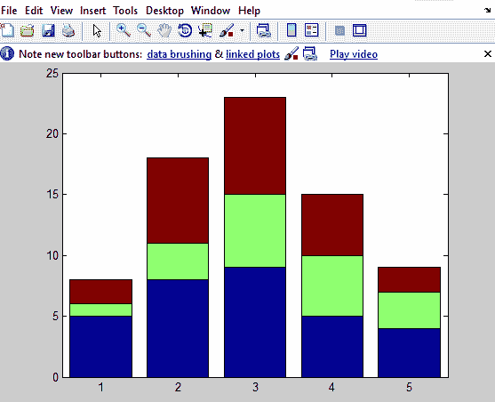

# 二维图

> 原文：<https://www.javatpoint.com/matlab-2-d-plots>

**目的:**研究图形，即二维图、打印标签、网格和轴框、图中文本、条形图和饼图。

### 例子

```

y=x^2-10x+15
x=0:1:10;
y=x.^2-10.*x+15;
plot(x,y);
title('Plot of y=x^2-10.*x+15');
xlabel('x');
ylabel('y');
grid on;

```

**输出:**



### 多个图:

### 例子

```

f(x)=sin2x
d/dx f(x)=2cos2x
x=0:pi/100:2*pi;
y1=sin(2*x);
y2=2*cos(2*x);
plot(x,y1,x,y2);
grid on;

```

**输出:**



## 线条颜色、线条样式、标记样式和图例:

*   **线条颜色:**

```
y
m
c
r
g
b
w
k
```

*   **标记样式:**

```
.  → point                                                             
o → circle
x → x-mark
+ → plus
*→ star
s → square
d → diamond
v → triangle(left)
^ → triangle(up)
< → triangle(left)
>→ triangle(right)
p → pentagon
h → hexagon
            <none> → no marker
```

*   **线条风格:**

```
-  → solid 
-. → dashed dot
-- →dashed
.. → dotted
<none> → no line
```

**标题：**

标题(' title_string '，'字体名称'，Helvetica '，'字体大小'，20 '颜色'，'绿色'，'字体粗细'，'浅/粗/正'，'字体角度'，'正/斜体字')；

**轴:**

轴('位置'，[左侧，底部，宽度，高度])

例如:要在(0.2，0.2)处创建轴，请调整图形窗口的一半大小。

轴('位置'，[. 2 . 2 . 5 . 5])；



**文本:**

将文本字符串添加到绘图区域中的指定位置。

文本(r，c，' string ')；

**GTEXT:** 不需要指定文字位置。

gtext(“字符串”)；

我们单击的地方，文本将显示在那里。

**图例:**

**图例位置:**

```
top left		top center		top right

medium left		medium center           medium right

bottom left		bottom center           bottom right
```

### 例子

```

x = -pi:pi/20:pi;
plot(x,cos(x),'-ro',x,sin(x),'-.b')
h = legend('cos_x','sin_x',2);

```

**输出:**



## 统计图:

### 饼图(x):

**例**

```

M=10L, S=3L, F=2L, T=1L
x= [10       3	    2           1]
pie(x);

```

**输出:**



**拉出 3 <sup>路</sup>滑梯:**

**例**

```

x= [10 3 2 1]
 pie(x);
 y= [0 0 1 0]
 pie (x, y);

```

**输出:**



**拉文字标签:**

**例**

```

      x= [10 3 2 1]
     pie(x);
     y= [0 0 1 0]
     pie (x, y, {'Machine','Software','Furniture','Transport'});

```

**输出:**



## 条形图:

**条形图(x):** 绘制条形图。绘制 x 值与时间指数的关系图。

**bar(t，x):** 如果我们想自己给 t。

**例**

```

x= [10     3       2       1];
bar(x);

```

**输出:**



**条(x，‘堆叠’):**

```

Y= [5 1 2
       8 3 7
       9 6 8
       5 5 5
       4 3 2];
 bar(Y,'stack')

```

**输出:**



**打印命令:**

打印<option><filename></filename></option>

**选项:**

*   **-deps:** 它创建单色封装后记图像。
*   **-depsc:** 它创建一个彩色的封装后记图像。
*   **-djpeg:** 其联合摄影专家组。
*   **-dpng:** 其便携网络显卡。

例如:print -djpeg myimg.jpeg

* * *