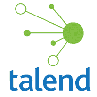
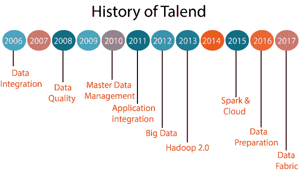

# Talend 教程

> 原文：<https://www.javatpoint.com/talend>

Talend 教程提供了 Talend 的基本和高级概念。本教程是为学生和职场人士设计的。

Talend 是一个 ETL 工具，包含数据质量、应用集成、数据管理、数据集成、数据准备和大数据等不同的产品。这些产品用于软件解决方案。

Talend Studio 最受欢迎的产品是数据集成和大数据。

在本教程中，您将了解用于大数据和数据集成的 Talend Open Studio 的所有基础知识。

## 什么是 Talend？

*   Talend 是一个开源软件集成平台，允许各种解决方案，如数据集成、数据管理解决方案、大数据、数据质量和数据准备。
*   Talend 于 2005 年引入市场，是数据集成软件的第一家商业开源软件供应商。
*   Talend 是一个工具，它使 ETL 过程变得容易和有利可图。
*   Talend 是市场上最强大的数据集成 ETL 工具、云计算和大数据集成工具之一。
*   它专门研究大数据，因为它拥有所有插件，可以高效地与大数据集成。
*   Talend 用于统一存储和重用元数据的存储库。
*   Talend 既有开源版本，也有高级版本。
*   Talend 的数据集成有一种能力，可以将来自不同来源的数据组合成一个单一的视图，这种视图非常先进，非常实用。
*   Talend 最早的产品是 **Talend 开放工作室**，于 2006 年推出。
*   如今被称为 **Talend 数据集成开放工作室**。
*   从那以后，它发布了广泛的产品，这些产品在市场上普遍使用。
*   实时地，Talend 帮助组织做出决策，变得更加数据驱动。
*   Talend 被公认为云和大数据集成软件的下一代领导者，因为使用 Talend 后，数据变得更容易访问，质量得到提高，并且可以快速移动到目标系统。
*   Talend 提供了更快的开发和部署来自动化任务。
*   Talend 更便宜，因为它是开源的，可以免费下载。
*   Talend 提供了一个统一的平台，可以在一个共同的基础上满足我们的所有需求。
*   Talend 由一个庞大的社区备份，因为它是一个开源工具，也是所有 Talend 用户和社区成员的首选位置，他们可以在这里分享他们的疑虑、查询、经验等。

## 塔尔端的历史:

Talend 工具由 **Fabrice Bonan** 和 **Bertrand Diard** 创建，用于识别企业信息世界中的差距。

Talend 推出的产品列表如下:

*   **开放工作室 1.0 版**于 **2006** 推出。
*   **整合套件**或**封闭式第二轮融资**于 **2007** 推出。
*   **数据质量**或**开放式轮廓仪**于 **2008** 上市。
*   集成套件 **RTx** (实时) **MPx** (海量并行) **MDM** (主数据管理)于 **2009** 推出。
*   **IDM** (身份管理)社区版或 **MDM 企业**版于 **2010** 推出。
*   **应用集成**于 **2011** 上线。
*   **2012 年**推出 Talend **大数据**从多元数据源收集数据，集中治理大数据项目。
*   Talend 在 **2013** 推出了 **Hadoop 2.0** 版本。
*   在 **2015** 中， **Talend Cloud** 的推出是为了服务于业务和 IT 方面的需求。
*   2016 年，Talend 在**纳斯达克(TLND** )和**数据准备上市。**
*   **数据面料**于 **2017** 推出。

让我们看看 Talend 产品的简介，

### 数据集成:

数据集成是一个开源的测试工具，它方便了 **ETL(提取、传输和加载)**测试，其中包括了 ELT 测试的所有特性。

### 数据质量:

数据质量是第一个开源的数据质量工具，具有企业级的特征和技术支持。

### 主数据管理:

MDM 已经将所有的主数据统一成一个单一的、可操作的真相版本。它用于将实时数据、应用程序和集成流程与嵌入式数据质量相结合，以便在内部、云和移动应用程序之间共享。

### 应用集成:

Talend 应用程序集成解决方案提供了一个易于使用的图形界面，允许我们开发、构建、测试和发布 web 服务、数据服务、rest 应用程序和中介路由。

### 大数据集成:

Talend 大数据提供了一个具有生成本机代码的图形工具的环境，这有助于我们与 Apache Hadoop、Apache Spark 和 Spark Streaming 一起工作。对于大数据应用，Talend open studio 拥有开源平台。

### 云集成:

Talend 云集成用于从我们的数据、应用程序及其 API 中获取价值，借助高度安全且可扩展的 iPaaS[集成平台即服务]，速度更快。

### 数据准备:

Talend 数据准备是一个开源环境，允许我们快速准备数据，并帮助我们将结果导出到整个组织中值得信赖的见解中。

### 数据结构:

Talend 数据结构用于在内部或云中处理我们所有的数据集成和完整性挑战。

该工具易于跨大数据、云环境和传统系统实时使用，使他们能够开发组织中业务和客户的统一视图。

它将 Talend 产品的平台版组合成一个通用集。

## Talend 专业人士的职业机会:

随着云和大数据应用的增加，Talend 的职业机会不断增加。

有塔伦德经验的人可以担任这些角色，

*   云客户主管
*   Salesforce 业务分析师
*   高级数据质量分析师
*   数据完整性专家
*   营销总监数据集成

## 观众

我们的 Talend 教程是为想成为 ETL 专家的初学者和专业人士设计的。

## 先决条件

在继续学习本教程之前，我们必须具备以下基本知识，以便更清楚地理解 Talend 的概念:

*   提取、转换、加载
*   数据仓库概念

## 问题

我们向您保证，您不会发现我们的 Talend 教程有任何问题。但是，如果你发现任何错误，你可以在我们的评论区发布。

* * *