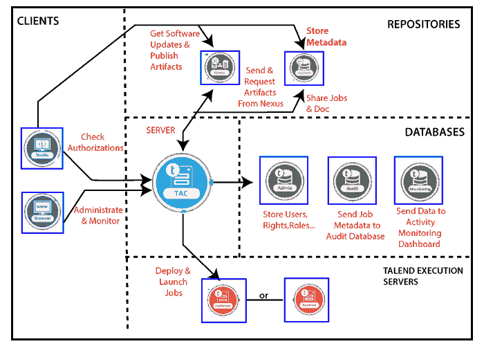

# Talend数据集成架构

> 原文：<https://www.javatpoint.com/talend-data-integration-architecture>

在本节中，我们将了解面向数据集成平台的 Talend 开放工作室的体系结构。

Talend 开放工作室的架构模型确定了 Talend 数据集成功能、交互以及相应的 IT 需求。

下图显示了数据集成体系结构的体系结构功能块:

让我们了解数据集成架构的各种功能块:

*   客户
*   服务器
*   数据库ˌ资料库
*   仓库
*   执行服务器

### 客户端:

*   客户端块用于构建和监控 Talend 作业。
*   客户端块可以有一个或多个 Talend studio，以及可以在相同或不同机器上的网络浏览器。
*   如果我们获得授权，Talend 工作室允许我们从事任何项目。
*   我们可以在网络浏览器的帮助下，通过安全的 HTTP 协议连接到远程的 Talend 管理中心。
*   我们还可以执行数据集成过程，而不考虑数据量的级别，并从工作室处理复杂性。

### 服务器:

*   服务器块用于管理、管理和监控。
*   服务器块包含基于网络的应用服务器，而**终端管理中心**用于启用所有项目的管理和行政
*   管理元数据存储在管理数据库中。
    **例如:**用户账号、访问权限、项目授权。
*   像**作业、商业模式、**和**例程**这样的项目项数据存储在 **SVN** 或 **Git 服务器**中。

### 数据库:

*   数据库用于存储元数据和配置信息。
*   数据库的管理、审计和监控属于数据库块。
*   **管理数据库**用于管理用户账户、访问权限、项目授权等。
*   一个**审计数据库**用于检查作业的不同情况，并在一个项目中实现，在 Talend studio 中开发。

### 存储库:

*   在存储库块中，我们将托管**项目元数据和二进制文件**。
*   **SVN 或 Git 服务器**和 **Nexus 存储库**属于存储库块。
    **SVN 或 Git 服务器:**用于集中所有项目项，如**作业和业务模型，**在不同最终用户之间共享，也可从 Talend studio 访问，以开发项目项。
*   而 **Talend 管理中心**用于**发布、部署和监控项目**
*   **nexus 存储库**用于检查软件更新是否可供下载。从 Talend 工作室发布的作业已经可以部署和执行了。

### 执行服务器:

*   执行服务器用于**部署和启动作业**。
*   Talend **执行服务器块是**有一个或多个执行服务器，部署在我们的信息系统内部。
*   Talend 作业通过管理中心的作业指挥器部署到作业服务器，作业指挥器将在计划的时间、日期或事件上执行。

* * *