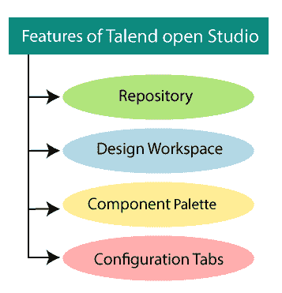
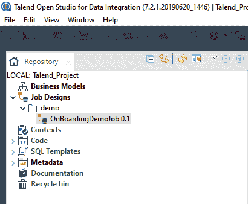
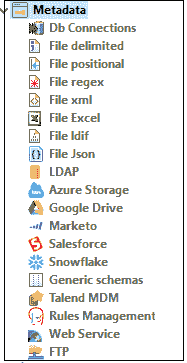
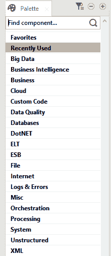
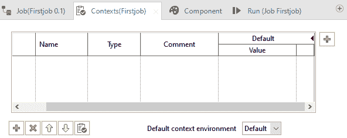
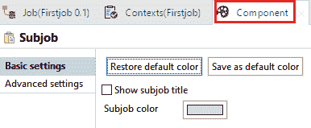
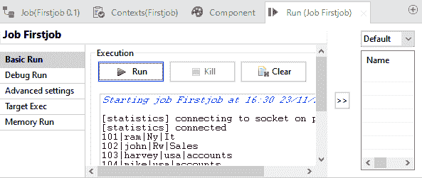

# 人才数据集成功能

> 原文：<https://www.javatpoint.com/talend-data-integration-features>

Talend open studio 分为不同的部分，每个部分都有自己的功能。我们有四个不同的 Talend open Studio 组件，如下所示:

*   贮藏室ˌ仓库
*   设计工作区
*   组件调色板
*   配置选项卡

## 存储库:

资源库是 Talend open studio 与技术项相关的地方用来**设计作业**、**创建作业**或**管理元数据**如下图截图所示，

**元数据:**

*   元数据是存储库必不可少的一部分，因为它有关于数据的完整信息，这些信息可以在 Talend studio 中找到。
*   如果我们想要开发任何项目，我们可以通过将对象从存储库中拖放到设计工作区窗口来使用工作中的元数据。
*   元数据包含很多来源，例如 **DB 连接**、不同种类的文件如 **Azure、LDAP、Marketo、Salesforce、web 服务、Hadoop 集群、FTP** 等等选项在 Talend 元数据存储库下都是可用的，如下图所示，

## 设计工作区:

Talend studio 的下一个功能是**设计工作区窗口，**我们可以在其中布局和设计作业，因为我们可以访问以图形方式显示作业的**设计器选项卡**，以及用于生成和识别可能错误的**代码选项卡**。

设计工作区包含两个字段，如下所示:

*   设计器选项卡
*   代码选项卡

**设计师标签:**

默认情况下，当创建作业时，设计器选项卡是打开的，它以图形模式显示作业。

**代码标签:**

代码选项卡帮助我们可视化代码，并突出显示可能的语言错误。

## 组件面板:

Talend Studio 中的下一个可用特性是**调色板**，它用于包含构建作业的不同技术组件，并分组到族中。

组件面板用于执行特定的数据集成操作，因为它是一个预配置的连接器。

此外，它还可以最大限度地减少手工编码的数量，这是处理来自多个异构数据源的数据所必需的。

下图表示 Talend 工作室中的调色板面板，

## 配置选项卡:

**配置选项卡**用于显示和编辑设计工作区内特定组件的属性。

可以编辑这些属性来更改或设置与特定组件或整个作业相关的参数，运行选项卡用于执行我们的作业。

配置选项卡包含四个部分，如下所示:

*   作业选项卡
*   上下文变量
*   组件选项卡
*   运行选项卡

**作业标签:**

“作业”选项卡用于提供设计工作区窗口中当前作业的信息，包括名称、版本、创建、目的、描述、状态等。

**上下文变量:**

我们将使用上下文变量来设置不同平台中的不同值，我们还可以创建一个上下文组，在其中我们可以保存多个上下文变量。

它也用于将代码移入开发中。

对于任何作业，我们都可以转到上下文选项卡，并添加上下文变量，如下图所示，

**组件标签:**

组件选项卡显示配置组件所需的所有参数。

**运行标签:**

run 选项卡显示作业的执行进度，log 窗格显示错误消息的开始和结束，如下图所示，

* * *