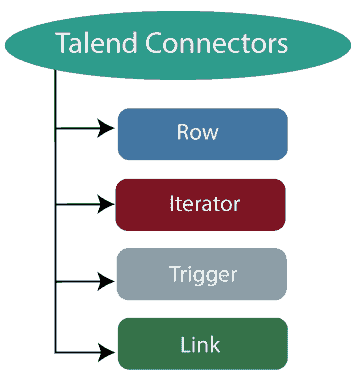
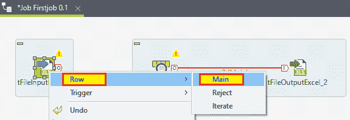
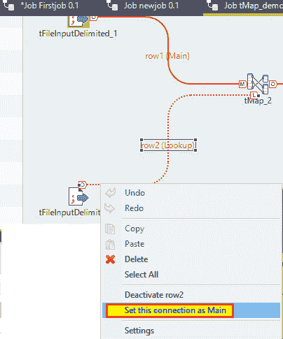
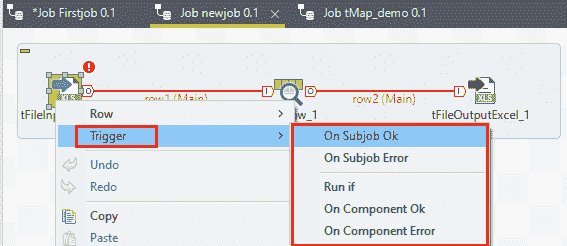

# Talend 数据集成组件和连接器:

> 原文：<https://www.javatpoint.com/talend-data-integration-components-and-connectors>

在本节中，我们将学习数据集成组件和连接器，它们在创建作业时使用。

连接器和组件执行 Talend 中的所有操作，它提供了 800 多个连接器和组件来执行多个操作。

组件在**调色板**面板中提供，有 21 个主要类别，属于组件。

通过在设计器面板中进行拖放，我们可以选择连接器，它会自动创建 java 代码。

之后，保存 Talend 代码并执行。

我们在下图的调色板面板中显示了可用组件的列表，

以上列表被广泛用作 Talend 数据集成的**连接器和组件**。

让我们看看 Talend studio 中数据集成的一些常用组件，

| 数据集成组件 | 描述 |
| **tMysqlConnection** | 它用于连接组件中定义的 MySQL 数据库。 |
| **tMysqlInput** | 它用于运行数据库查询来读取数据库并提取字段(表、视图等)。)取决于查询。 |
| **tMysqlOutput** | 它用于编写、更新和修改 MySQL 数据库中的数据。 |
| **tFileInputDelimiated** | 它一行一行地读取一个分隔的文件，并将它们分成单独的字段，并将其传递给下一个组件。 |
| **tFileOutputDelimiated** | 它用于根据定义的模式从分隔文件中的输入数据获取输出。 |
| tfileinput excel | 它一行一行地读取一个 excel 文件，并将它们分成单独的字段，并将其传递给下一个组件。 |
| **tFileOutputExcel** | 它用于根据定义的模式编写具有不同数据值的微软 Excel 文件。 |
| **列表** | 它用于从给定的文件掩码模式中获取所有文件和目录。 |
| **tFileArchive** | 它用于将一组文件或文件夹压缩成 zip、gzip 或 tar.gz 存档文件。 |
| **tRowGenerator** | 它提供了一个编辑器，我们可以在其中编写函数或选择表达式来生成示例数据。 |
| **tMsgBox** | 它返回一个带有指定消息和确定按钮的对话框。 |
| **tLogRow** | 它用于监控正在处理的数据。并且它总是在运行控制台中显示数据/输出。 |
| **tPreJob** | 它定义了将在实际作业开始之前运行的子作业。 |
| **tMap** | tMap 用于将数据从单个或多个源转换和路由到单个和多个目的地。 |
| **奇文** | 它通过在主流和查找流之间执行内部和外部连接来连接两个表。 |
| **好的** | 它使您能够在 Talend 程序中使用个性化的 java 代码。 |
| **tRunJob** | 它通过一个接一个地运行 Talend 作业来管理复杂的作业系统。 |
| **tCloudStart** | 它用于启动亚马逊 2(亚马逊弹性计算云)上的实例 |
| **千变万化停止** | 它用于更改亚马逊 EC2(亚马逊弹性计算云)上已启动实例的状态 |
| **tdotnetinstance** | 它用于调用. NET 对象的构造函数，以便以后重用。 |
| **tDotNETRow** | 它帮助我们通过使用自定义或 built-in.NET 类来转换数据。 |
| **tDB2Connection** | 它用于打开指定数据库中的连接，可以在后续子作业或子作业中重复使用。 |
| tfilefetch | 它用于通过给定的协议(HTTP、HTTPS、FTP 或 SMB)检索文件。 |
| tftpclose | 它帮助我们关闭一个活动的 FTP 连接来释放占用的资源。 |
| **tFTPConnection** | 它用于打开 FTP 连接，在单个事务中传输文件。 |
| tftpdelete | 它用于删除文件传输协议服务器上指定目录中的文件或文件夹。 |
| tfileinput JSON | 它用于从文件中提取 JSON 数据，并将数据传输到文件、数据库表等。 |
| **tFileOutputJSON** | 它帮助我们接收数据，并将其重写为输出文件中的 JSON 结构化数据块。 |
| tfileinput XML | 它逐行读取与 XML 结构相关的文件，并将它们分解成字段并发送这些字段，这些字段是在下一个组件的模式中定义的。 |
| **tFileOutputXML** | 它根据定义的模式编写一个带有独立数据值的 XML 文件。 |
| **套料** | 它用于将传入的模式复制成两个相同的输出流。 |

## 连接器:

*   **行**
*   **迭代**
*   **触发**
*   **链接**

### 行:

行连接器用于维护实际的数据流，下面的一些行连接器如下:

*   主要的
*   检查
*   过滤器
*   拒绝
*   错误拒绝
*   输出
*   唯一/重复
*   多重输入/输出

**主:**

最常用的行连接是 Main，因为它有助于将数据流从一个组件传递到另一个组件，并根据组件属性设置迭代每行或读取输入数据。

#### 注意:
我们无法借助 Main 行连接来连接两个输入组件。
每个组件可以有一个传入的行连接，因为我们无法使用主行连接链接两次同一个目标组件。

第二行连接将被称为**查找**。

为了借助于主行连接来连接两个部件，

右键点击输入组件，在连接列表中选择**行→主**，如下图所示，

或者，

我们可以点击组件使其高亮显示，然后右键单击或点击其侧面可见的 O 图标，然后将光标向目标组件拖动，这将自动创建一个 **Row → Main** 类型的连接。

**查找:**

当我们想要连接多个输入流时，使用查找行连接。

它是主流组件的子流组件，这意味着它可以接收多个输入流。

要连接查找行连接，右键点击需要更改的行，会弹出一个菜单，然后点击**将此连接**设置为 Main，将查找行变成主行，如下图所示，

**过滤器:**

过滤器行连接用于将**过滤器箭头**组件专门连接到输出组件。它用于收集符合过滤标准的数据。

**不合格品:**

“拒绝”行连接用于将处理组件连接到输出组件。

它用于收集与过滤器不匹配或对预期输出无效的数据。

它还允许我们跟踪由于错误类型、未定义的空值等原因而无法处理的数据。在某些组件上。

当芯片上错误选项被停用时，拒绝连接被启用。

**错误剔除:**

错误拒绝连接用于将 tMap 组件连接到输出组件。

当我们在 tMap 编辑器中清除“出错时芯片”复选框时，它被启用，并且它收集数据，这些数据在某些组件上无法处理。

**输出:**

输出行连接用于将 tMap 组件连接到一个或多个输出组件。

**唯一/重复:**

唯一/重复行连接用于将 tUniqRow 连接到输出组件。

**唯一**行连接用于收集首先在输入流中找到的行，并且该唯一数据流被导向相关的输出组件或另一个处理子作业。

**重复**行连接用于收集第一个相关行的可能重复。

**多输入多输出:**

这种类型的行连接用于通过各种输入和输出来处理数据。

**合并:**

组合行连接用于将一个 CombinedSQL 组件连接到另一个组件。

**迭代:**

要对目录中包含的文件、文件中可用的行或数据库条目执行循环，可以通过迭代连接器来完成。

它主要用于连接流的星形组件(在子作业中)。

**触发器:**

触发器连接器用于在作业和子作业之间创建依赖关系，这些作业和子作业根据触发器的性质一个接一个地被触发。

Talend 中有两种类型的触发器可用:

*   子作业触发器
*   组件触发器

| 子作业触发器 | 描述 |
| onsubjobok | 它用于在子作业完成且没有任何错误的情况下触发下一个子作业。 |
| **OnSubjobError** | 它用于在第一个(主)子作业没有正确完成时触发下一个子作业。 |
| **如果**运行 | 当条件满足时，它会触发子作业或组件。 |

| 组件触发器 | 描述 |
| **OnComponentOk** | 一旦源组件的执行没有任何错误地完成，这种类型的连接就用来触发目标组件。 |
| **组件错误** | 一旦在主作业中遇到错误，它将触发子作业或组件。 |

**链接:**

链接连接器仅用于 ETL 组件。这种类型的连接不处理实际数据，而只处理元数据，这与操作表有关。

* * *