# Talend数据整合工作设计

> 原文：<https://www.javatpoint.com/talend-data-integration-job-designing>

在这一部分，我们准备在塔尔端工作室创建我们的第一份工作。

业务模型的可运行层是作业设计。当一个或多个组件连接时，它代表图形设计，允许我们设置和运行数据流管理过程。

工作设计有助于将业务需求转化为代码、例程和程序，基本上是用来实现我们的数据流。

我们设计的工作可以将我们需要的所有不同来源和目标联系起来，用于数据集成和任何其他相关过程。

在设计作业时，我们可以执行许多操作，例如:

*   我们可以设置组件之间的连接和关系，以定义动作的顺序和性质。
*   我们可以更改组件的默认设置，也可以创建符合我们确切需求的新组件。
*   为了编辑组件，我们可以随时访问代码。
*   我们可以设计项目并将其添加到存储库中，以便重用和共享。

#### 注意:我们需要安装一个 Oracle JVM 1.8(不支持 IBM JVM)，来执行我们的作业。
参考以下链接下载甲骨文 JVM:
[https://www . Oracle . com/technetwork/Java/javase/downloads/index . html](https://www.oracle.com/technetwork/java/javase/downloads/index.html)

按照以下流程在 Talend studio 中为数据集成平台设计作业:

*   **创建新作业**
*   **添加组件**
*   **连接组件**
*   **配置组件**
*   **执行作业**

## 创建新作业

**第一步:**

*   打开 Talend 开放工作室进行数据集成平台。
*   进入**资源库窗格**，右键点击**作业设计**，选择**创建作业**，如下图截图所示:

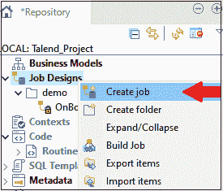

**第二步:**

*   新的作业窗口将会打开，在这里我们将填写详细信息，如**名称、目的**和**描述**，并点击**完成**按钮，如下图所示:

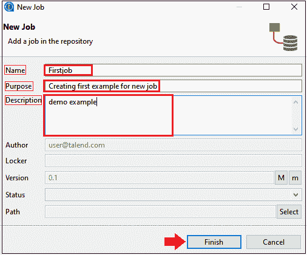

*   作业已在**作业设计**部分下创建，如下图所示，

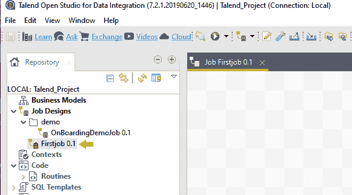

## 添加组件:

作业设计的下一个阶段是添加组件，我们将在其中添加组件、连接和配置它们。

**第三步:**

对于**添加一个作业的组件**，我们将直接进入**调色板面板**，在那里我们有几个可用的组件。

或者，我们也可以使用搜索字段输入组件的名称并选择它。

例如，我们将从**文件**组件中选择**输入**中的 **tFileInputExcel** 。

**调色盘→档案→输入→ tFileInputExcel**

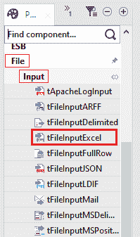

**第四步:**

*   由于我们将 Excel 文件作为输入，我们将从调色板面板中拖动**tfileinputxcel**组件，并将其拖放到设计工作区窗口，如下图所示:

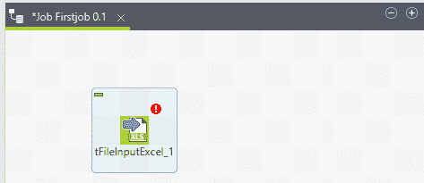

**第五步:**

*   现在在下一步中，我们将单击设计工作区窗口中的任意位置。
*   将出现一个搜索框，然后键入**t 增长**并从给定列表中选择它，所选组件将显示在设计工作区窗口上，如下图所示:

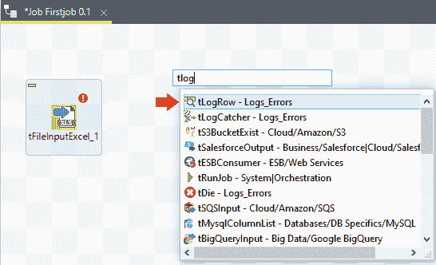

#### 注意:
tlow grow 用于在正在运行的作业控制台上显示流内容(行)。

**步骤 6:**

*   在下一步中，我们将最终从**调色板窗格**中拖动**tfileoutputxcel**组件，并将其放入设计工作区窗口，如下图所示:

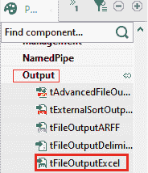

到目前为止，我们已经完成了作业组件的添加，我们的设计工作区将如下所示:

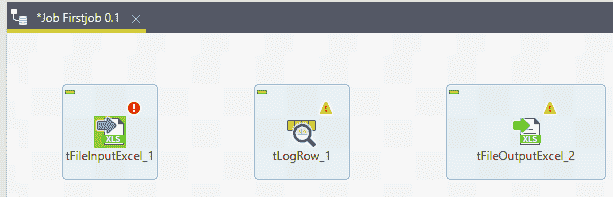

## 连接组件

成功添加组件后，我们将连接组件。

要连接组件，请遵循以下流程:

**步骤 7:**

*   右键单击第一个组件 tFileInputExcel，并使用行连接将它们连接起来，如下所示，
    **行→主**

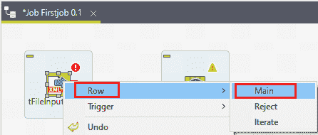

*   **row1 (main)** 连接完成，如下图截图所示:

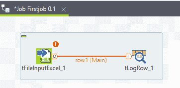

**第八步:**

*   然后，右键单击**t 增长**，借助行连接绘制一条主线到**tfileoutputxcel**组件，如下图所示:

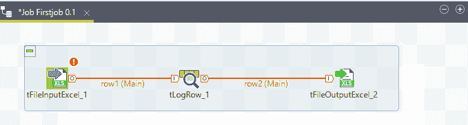

到目前为止，我们已经成功地连接了乔布斯的组件。

## 配置组件

添加和连接组件后，我们将进入下一阶段，即配置组件。

**步骤 9:**

*   要配置组件，双击第一个组件 **tFileInputExcel，**，在**文件名/流**中给出我们的**输入文件**的路径，如果 Excel 文件的第一行有列名，那么在**表头**列放一个，如下图:

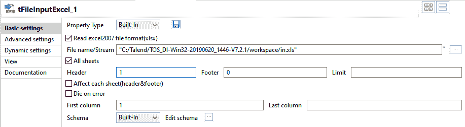

**步骤 10:**

*   之后，点击**编辑模式，**我们可以在这里添加列，并根据我们输入的 Excel 文件输入它的类型。
*   添加模式后，点击**确定**按钮，如下图所示:

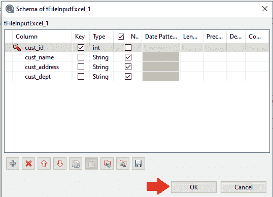

**步骤 11:**

*   然后，点击**是**按钮，传播上述更改。

**步骤 12:**

现在，转到 **tLogRow_1** 组件，单击**同步列**，并选择**模式**，在该模式下，我们希望根据输入生成行。

为此，我们将选择**模式**作为基本模式，并给出**“|”**作为字段分隔符，如下图所示:

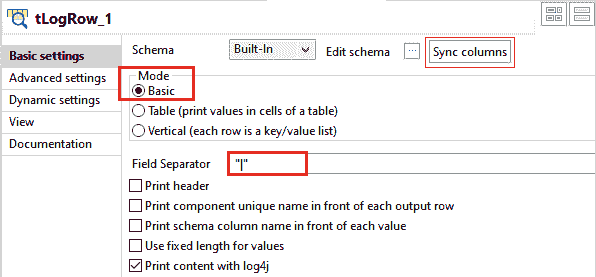

**步骤 13:**

之后，转到**tfileoutputxcel**组件，通过给定路径进行存储。

并且，在**工作表名称**字段中，提供输出 Excel 文件工作表名称为**“工作表 1”**，然后点击**同步栏。**

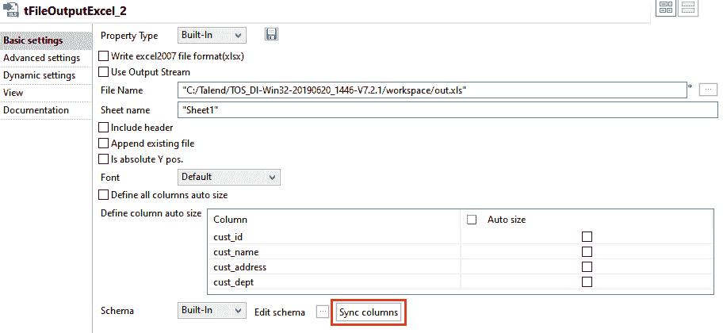

## 执行作业

在完成添加、连接和配置组件后，我们将准备好执行我们的第一个 Talend 作业。

**步骤 14:**

要执行作业，点击**运行**按钮，如下图所示:

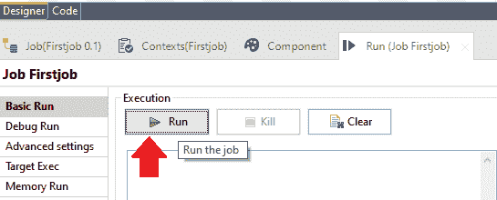

我们可以看到**第一个作业**的执行正在开始，如下图截图所示:

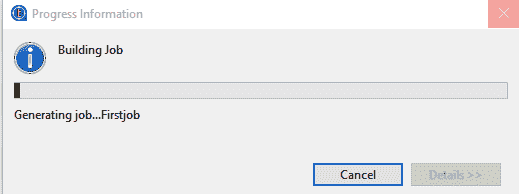

而且，我们还可以看到，输出是在基本模式**“|”**内分开来的。

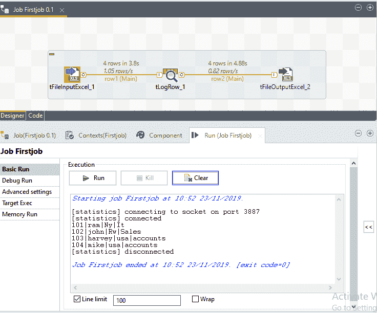

我们的输出文件以 Excel 格式保存在给定的输出路径中，如下图所示:

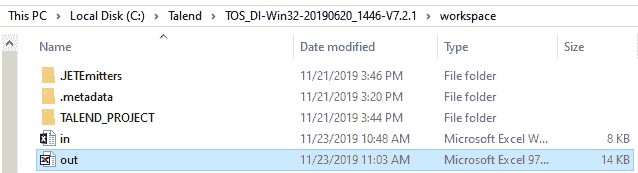

## 终端处理作业执行:

在本节中，我们将学习如何处理作业执行。

*   为了控制作业执行的实现，我们将考虑上面的例子。
*   右键单击**存储库窗格中的作业**，并选择**构建作业**选项卡，如下图所示:

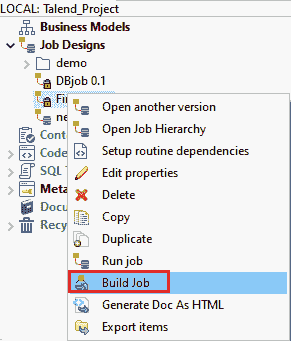

*   之后，构建作业窗口将会打开，我们可以在**中为该作业提供存档文件**字段中的路径，在**作业版本**部分中更改该作业的版本，我们还可以在**构建类型**中选择构建类型
*   然后，点击**完成**

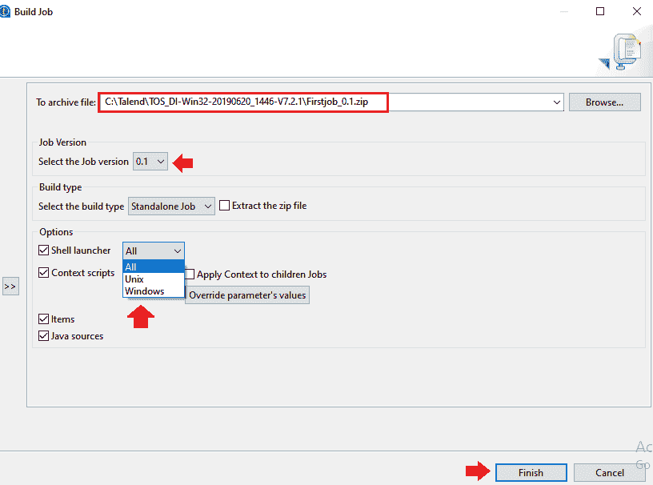

## 在正常模式下运行作业

要在正常模式下运行作业，请执行以下过程:

从**运行(作业优先作业)**中选择**基本运行**选项，点击**运行按钮**开始执行，如下图截图所示:

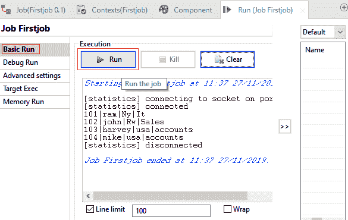

### 在调试模式下运行作业

为了识别作业执行中可能存在的错误，我们将在调试模式下运行作业。

对于在调试模式下运行作业，我们在 Talend studio 中有两个选项可用:

*   **跟踪调试**
*   **Java 调试**

### 跟踪调试

跟踪功能允许我们在数据集成平台的 Talend 工作室中运行作业时监控数据处理。

它为我们提供了组件行为的逐行视图，并将动态结果显示到设计工作区窗口上的行链接。

要访问跟踪调试模式，请执行以下过程:

*   点击**运行视图**进入。
*   点击**调试运行**选项卡进入调试执行模式，选择**跟踪调试**在跟踪模式下执行作业。

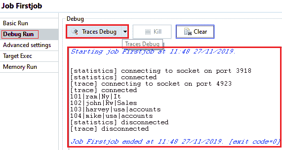

调试作业后，我们的设计工作区窗口将如下所示:

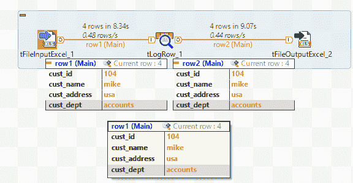

### Java 调试

在 java 调试模式下运行我们的作业之前，首要步骤是添加断点。

对于**在我们要调试的组件中添加断点**，按照下面的过程进行。

*   在设计工作区中右键单击组件，在弹出菜单中选择**添加断点**。

这将允许我们让作业自动停止每个断点。

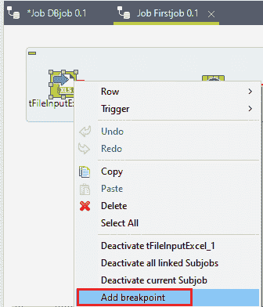

*   我们可以一步一步地运行作业，并检查每个断点组件的预期行为及其变量值。
*   并且看到我们已经在 **tFileInputExcel** 和 **tLogRow** 中添加了断点

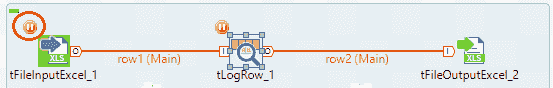

*   添加断点后，进入**运行面板**的**调试按钮**，选择 **Java 调试**

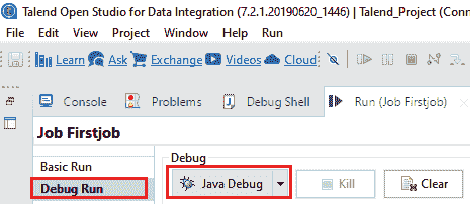

*   从下面的截图中我们可以注意到**第一个作业**根据断点**正在调试模式下执行。**

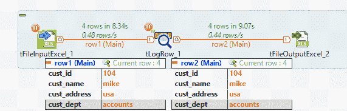

## 高级设置

**运行**视图上的**高级设置**选项卡有各种高级执行设置，可用于执行作业处理程序。

高级设置包含几个特性，如**统计、执行时间、执行前保存作业、运行前清除和 JVM 设置**。每个都有如下功能，

*   **统计:**统计用于显示加工速度。
*   **执行时间:**这些特性显示了执行结束时控制台中的执行时间。
*   **执行前保存作业:**执行开始前自动保存作业。
*   **运行前清除:**该功能将在重新执行作业前清除上一次执行的所有结果。
*   **JVM 设置:**JVM 设置帮助我们配置 java 参数。

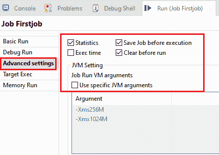

* * *