# talend-管理作业

> 原文：<https://www.javatpoint.com/talend-managing-job>

在本课程中，我们将学习如何在数据集成平台的 Talend 开放工作室中管理工作。

Talend 提供了多种管理作业的方法，如下所示:

*   **激活或停用组件**
*   **激活或停用所有链接的子作业**
*   **激活或停用当前子作业**
*   **进口或出口物品**

## 激活或停用组件

要激活和停用 Talend studio 中的组件，请遵循以下过程:

*   选择我们要激活或停用的组件。
*   然后，右键单击所选组件**【tFileInputExcel _ 1】**，并从弹出菜单中选择**停用的 tFileInputExcel_1** 选项，如下图所示:

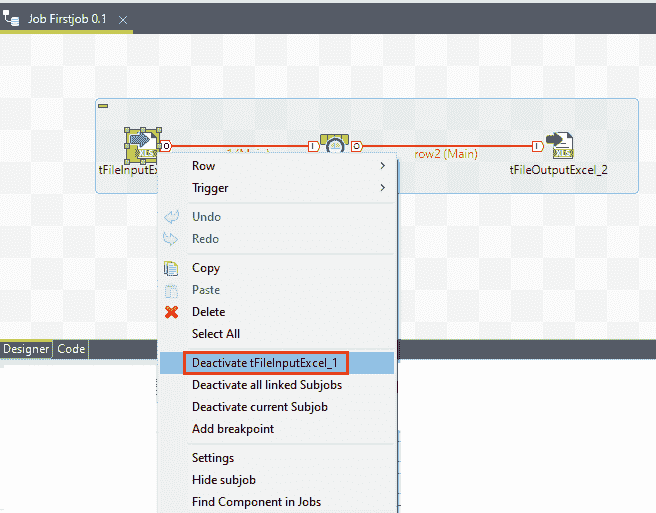

*   一旦我们停用该组件，我们就不能执行任何操作，如创建或修改链接。
*   并且，如果组件被停用，代码将不会在运行时生成，如下图所示:

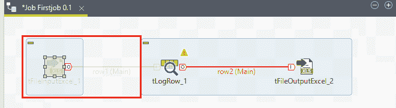

*   或者，如果我们想激活同一个组件，右键单击停用的组件。
*   从弹出菜单中选择激活 **tFileInputExcel_1** 选项，如下图所示:

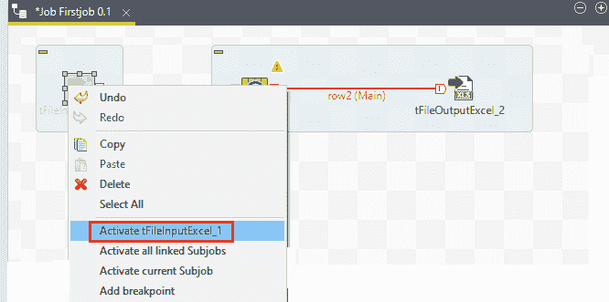

*   选择激活 **tFileInputExcel_1** 选项后，我们的设计工作区窗口将如下所示:

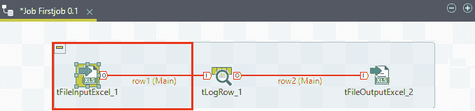

## 激活或停用所有链接的子作业

要激活或停用所有链接的子作业，请执行以下过程:

*   选择所有子作业都链接到的组件，我们要激活或停用该组件。
*   然后，右键单击所选组件，并从给定列表中选择**停用所有链接子作业**选项，如下图所示:

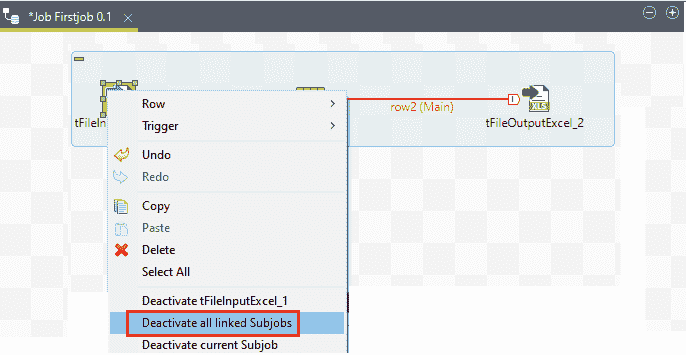

*   一旦我们停用所有链接的子作业，我们将无法执行任何操作，如创建和修改，如下图所示:

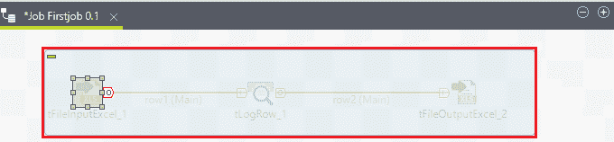

*   如果我们想激活所有链接的子作业，右键单击停用的组件。
*   并且，从弹出菜单中选择**激活所有链接子作业**选项，如下图所示:

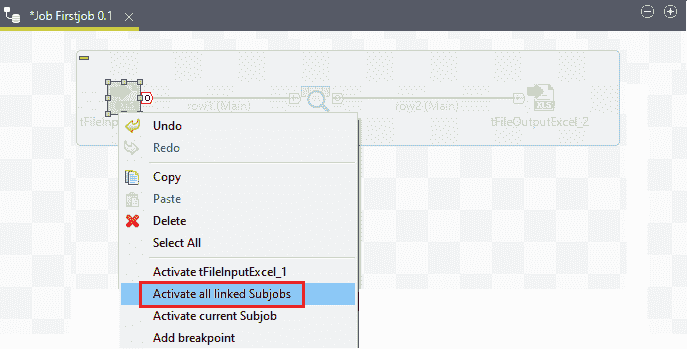

*   选择**激活所有链接子作业**选项后，我们的设计工作区窗口将如下所示:

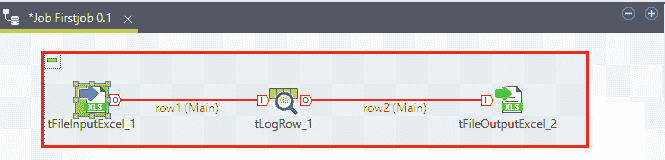

## 激活或停用当前子作业

要激活或停用当前子作业，请执行以下步骤:

*   首先，右键单击连接到子作业的组件。
*   然后，选择相关选项，帮助我们对组件执行操作，如激活或停用当前子作业。
*   如果我们想要停用子作业，则在给定列表中选择**停用当前子作业**选项。

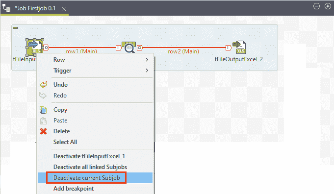

*   或者，如果我们想激活子作业，那么在弹出菜单中选择**激活当前子作业**选项。

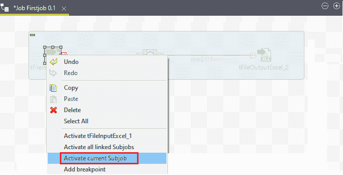

## 导入或导出项目

在 Talend 工作室中，我们可以从多个项目或工作室的不同版本中导入或导出工作中的项目。

在这里，我们将学习如何为作业导入和导出项目。

我们可以在 Talend studio 中导入多个项目，如下所示:

*   **商业模式**
*   **作业设计**
*   **套路**
*   **文件**
*   **元数据**

*   要导入项目，请右键单击“存储库”面板中的“作业设计”或“业务模型”。
*   然后，从弹出菜单中选择**导入项目**，如下图所示:

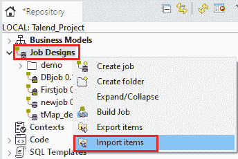

*   或者，我们可以直接单击工具栏上的导入项目图标，如下图所示:

*   点击导入项目后，将出现**导入项目**窗口，我们将选择**选择根目录**选项，如下图所示:

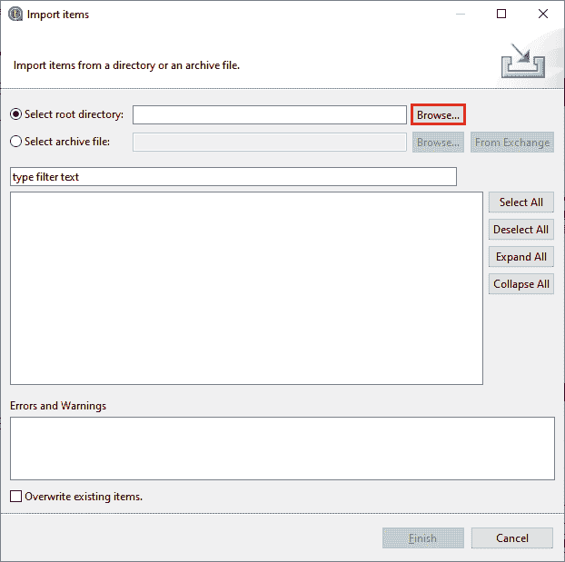

*   并且，点击**浏览器**按钮，在工作区目录中浏览相关的项目文件夹。
*   它应该与我们选择的项目名称相关，如下图所示:

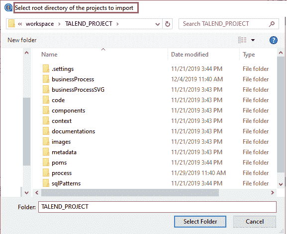

*   如果我们只想从作业设计中导入项目，我们可以选择特定的文件夹。
*   或者，如果我们想从业务模型导入，那么选择一个特定的模型。
*   但是，如果我们的项目有多种类型的项目，如**业务模型、工作设计、元数据和例程，**那么我们会建议您选择项目文件夹，以便同时导入所有项目。

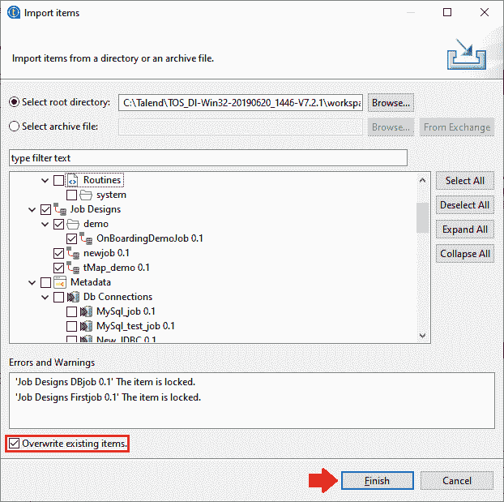

*   要覆盖现有项目，我们可以选择**覆盖现有项目**复选框，如果存在同名项目，它将刷新项目列表。
*   并且，项目列表显示所有可以导入的有效项目。
*   为此，请通过选择相关复选框来选择导入项目。
*   之后，点击**完成**按钮。

## 导出项目

要从作业中导出项目，请执行以下步骤:

*   展开**作业设计**部分，选择一个或多个作业，例如**第一个作业**
*   然后，右键单击第一个作业，并在弹出菜单中选择**导出项目**选项，如下图所示:

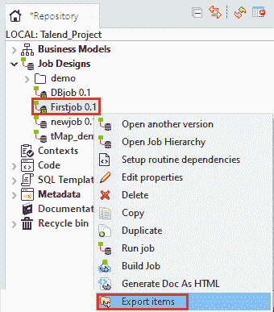

#### 注意:如果我们想要导出数据库表元数据条目，请确保我们选择了完整的数据库连接。

*   点击导出项目后，将出现**导出项目**窗口。
*   然后，点击**浏览**按钮，加载选中的导出项目。
*   如果我们想要设置和导出与正在导出的作业的例程依赖关系，那么选择**导出依赖关系**复选框。
*   并且，点击**完成**按钮导出项目，如下图所示:

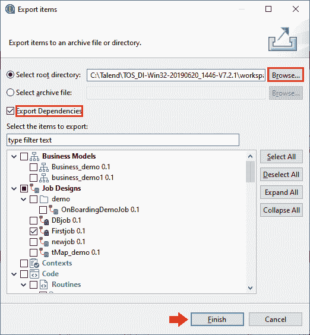

* * *