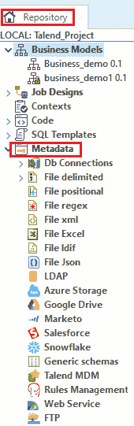

# 管理元数据

> 原文：<https://www.javatpoint.com/talend-managing-metadata>

在本节中，我们将了解如何在数据集成平台的 Talend 工作室中管理元数据。

**元数据**文件夹用于存储文件、数据库或系统上的可重用信息，这是我们在数据集成 Talend studio 中创建工作所需要的。

本节包括在**存储库面板**中创建和管理多个元数据项目的过程，该面板可用于我们所有的工作设计。

进入**资源库面板，**点击**元数据**，如下图所示:

在元数据中，我们可以在数据集成 Talend Studio 中设置以下连接:

*   **数据库连接**
    *   **MySQL DB 连接**
    *   **JDBC 数据库连接**
*   **文件模式**
    *   **文件定界**
    *   **文件位置**
    *   **文件 Regex**
    *   **文件 XML**
    *   **文件 Excel**
    *   **文件 ldif**
    *   **文件 JSON**
*   **LDAP**
*   **天青储**
*   **谷歌驱动**
*   **市场**
*   **Salesforce**
*   **雪花**
*   **通用模式**
*   **语言 MDM**
*   **规则管理**
*   **网络服务**
*   FTP

我们将学习主要使用的元数据连接和模式，让您全面了解如何在数据集成平台的 Talend studio 中管理元数据。

### Db 连接

我们必须在数据库的帮助下读写数据或两者兼而有之。Talend studio 提供了一个数据库组件来完成这些任务。

在 Talend studio 的元数据部分，我们可以连接各种类型的数据库，如 **MySQL、JDBC、SAS、Oracle、SAP Hana、Hive、Teradata、红移、亚马逊极光、微软 SQL Server** 等等。

### 文件模式

为了将数据读写到分隔文件中，我们有不同的文件模式，如**文件分隔、Excel、XML、Positional、Regex、LDIF 和 JSON** ，在存储库的元数据中有不同的组件，我们可以在 Talend studio 中创建作业时使用这些组件。

| 文件模式 | 描述 |
| **文件定界** | 它是一个文本文件，用于存储数据，其中每行都有由分隔符分隔的字段。 |
| **超越** | 为了将数据读写到可靠的 Excel 电子表格文件中，我们将集中连接到该文件及其数据结构。 |
| **XML** | 它是一种可扩展标记语言，用于存储和传输数据。在集中了 XML 输入和输出文件的元数据之后，我们可以在我们的工作中直接使用元数据。 |
| **位置** | 它是一个具有固定最大长度和记录的文件。
文件位置元数据用于定义不同组件的属性，如 tFileInputPositional、tFileOutputPositional 和 tFileInputMSPositional 组件。 |
| **Regex** | 这种文件模式由正则表达式组成，就像日志文件一样。 |
| **LDIF** | LDIF 文件是用属性表示的目录文件。 |
| JSON | 它被称为 JavaScript 对象符号，用于通过网络连接序列化和传输结构化数据。它还在服务器和 web 应用程序之间传输数据。 |

### 轻量级目录访问协议

LDAP 代表轻量级目录访问协议，用于访问和管理目录信息，并通过 IP 网络读取和编辑目录。

### 蔚蓝存储

Azure Storage 是一项服务，它允许我们在磁盘存储中为虚拟机创建一个磁盘。只能从一个虚拟机访问磁盘。

### 市场

这是一款基于 SaaS 的营销自动化软件。它旨在帮助公司自动化和衡量营销活动、任务和工作流程。

我们还可以在 Talend Studio 的 Repository 的 Metadata 中连接多个数据源，我们可以探索数据源的许多特性。

Talend 允许我们在工作中使用这些数据源，方法是将对象从“存储库”面板拖到设计工作区窗口。

### 雪花

雪花用于在基于云的硬件和软件的帮助下存储和分析数据。它是唯一一个为云构建的数据平台，我们可以在其中存储所有数据。

### 通用模式

如果没有一个特定的元数据符合我们的需要，或者如果我们没有任何源文件来采用模式形式，我们可以在 Talend studio 中创建一个通用模式。

它用在我们不想限制模式使用的地方，模式与任何文件类型或数据库相关。

### 会说话的 MDM

Talend MDM 用于将实时数据、应用程序和集成流程与嵌入式数据质量相结合，以便在内部、云和移动应用程序之间共享。

### 网络服务

数据集成的 Talend studio 允许许多组件调用多种类型的网络服务，如 **tWebServiceInput、**T2【TWeB service】【基于 tWebServiceInput 的高级组件】****Tsap**【针对 SOAP 网络服务】和 **tREST** 【针对 REST 网络服务】。**

 **### 文件传送协议

FTP 代表**文件传输协议**，用于在计算机网络上的客户端和服务器之间传输计算机文件。

* * ***