# 集中 XML 文件元数据

> 原文：<https://www.javatpoint.com/talend-centralizing-xml-file-metadata>

在本节中，我们将学习如何在 Talend Studio 数据集成平台中集中 XML 文件元数据。

在本章继续之前，我们将首先了解为什么我们将使用 XML 文件。

它可以用来定义**输入**和**输出**连接的属性，就像**tfileinputtxml**和 **tExtractXMLField** 组件一样，用于创建读取 XML 文件的输入连接。

**组件用于在输出模式中创建、写入或更新 XML 文件。**

如果我们想要连接到一个 XML 文件，我们将在存储库中集中连接和模式信息，以实现可重用性。

要从头开始创建 XML 文件连接:

*   转到**存储库面板。**
*   然后展开**元数据**，右键点击**文件 XML** ，在弹出菜单中选择**创建文件 XML** 选项，如下图所示:

**存储库→元数据→文件 XML →创建文件 XML**

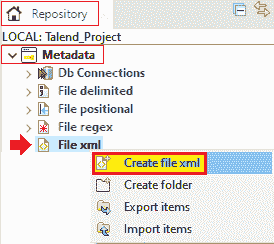

#### 注意:要在我们的工作中使用集中的 XML 文件，请转到必要组件的基本设置视图，其属性类型设置为打开文件元数据设置窗口的内置项。

## 为输入文件设置 XML 元数据:

在本节中，我们将了解如何描述文件连接和上传输入文件的 XML 模式。

然后**新的 XML 文件**窗口将打开，文件连接和模式定义分五步完成:

*   **定义常规属性**
*   **设置元数据类型(输入)**
*   **上传 XML 文件**
*   **定义模式**
*   **最终确定结束模式**

**步骤 1:定义常规属性**

在第一步中，我们将定义模式的一般属性。

在“新建 Xml 文件”窗口中，填写所有必要的详细信息，如**名称、目的和描述。**

我们还可以在**项目设置**对话框中管理**版本**和**状态**字段。

点击路径字段旁边的**选择**按钮，选择**文件 XML** 节点下的文件夹，保存我们新创建的文件连接。

填写完所有通用属性的详细信息后，点击**下一步**按钮选择元数据的类型。

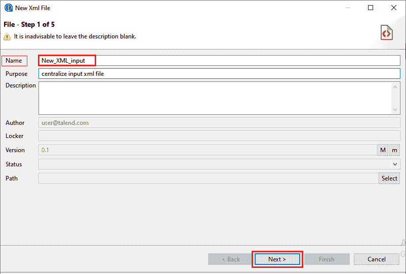

**第二步:设置元数据类型(输入)**

现在，在这一步中，我们将元数据设置为输入或输出。

在下面的对话框中，选择**输入 XML** 创建一个 XML 元数据。

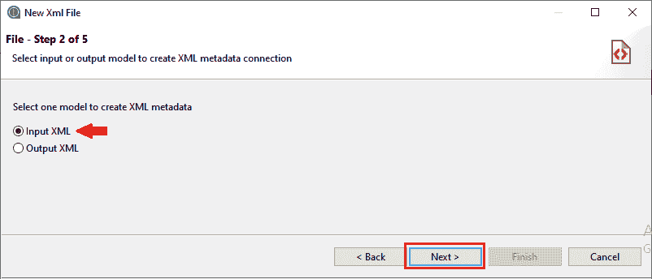

然后，点击**下一步**按钮继续。

**第三步:上传 XML 文件**

在下一步中，我们将上传 XML 文件。

要上传 XML 文件，请执行以下过程:

*   点击**浏览**按钮，浏览我们的目录，从我们的本地系统上传 XML 文件。
*   例如，我们将从系统中选择 **xml** 文件。

<employeeDeatils>  <employee>  <empid>101</empid>  <firstName>Naina</firstName>  <lastName>Rai</lastName>  <company>Talend</company>  <city>Mumbai</city>  <phone>5554</phone>  </employee>  <employee>  <empid>102</empid>  <firstName>Kapil</firstName>  <lastName>Singh</lastName>  <company>Talend</company>  <city>Kanpur</city>  <phone>9900</phone>  </employee>  …... </employeeDeatils>

*   如果系统没有自动找到，我们也可以根据我们的文件格式更改**编码**类型。
*   **Limit** 字段用于输入将要执行 XPath 查询的列数，或者我们可以将 0 放在所有列上运行。
*   **模式查看器**部分用于显示 XML 结构的预览。我们可以展开并看到文件的 XML 树结构的每一层，如下图所示:

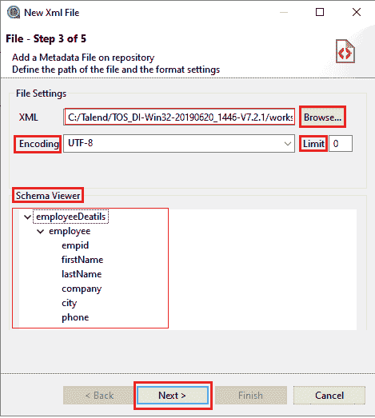

*   之后，点击**下一步**按钮进行进一步处理。

**第 4 步:定义模式**

在这一步中，我们将定义解析作业的设置。

如下图所示，我们有四个部分可以定义模式:

**源模式:**显示 XML 文件的树形视图。

**目标模式:**显示提取和迭代信息。

**预览:**将目标模式的预览和所选列的输入数据按照定义的顺序一起显示。

**文件查看器:**显示 Xml 文件的预览。

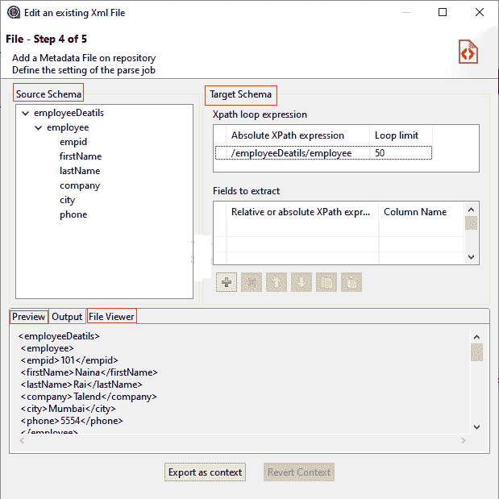

*   要定义文件参数，首先，我们将定义 XPath 循环和循环可以运行的最大次数。
*   有两种方法生成 **Xpath 循环表达式**字段，具有绝对 Xpath 表达式。

**首先:**输入要强调的节点的绝对 Xpath 表达式。

**第二步:**将节点从源模式中拖放到目标模式下的绝对 Xpath 表达式字段中。

*   橙色箭头表示节点和相应表达式之间的连接。

#### 注意:Xpath 循环表达式是必填字段。

*   **循环限制**字段用于定义所选节点可以迭代的最大次数，如果我们想对所有行运行它，则为-1。
*   我们可以通过按下 **Ctrl** 或 **Shift** 键并点击节点来选择多个节点放在桌子上。
*   **蓝色**箭头表示从**源模式**到**字段提取**的选定节点的链接，未选定的节点用**灰色**表示。
*   我们可以在**字段中增加很多列来提取**表进行提取，也可以在工具栏的帮助下删除列并改变列的顺序。
*   添加列时，点击 **[+]** 按钮，删除时，点击工具栏上的 **[X]** 按钮。
*   要更改列的顺序，请使用工具栏中向上的**和向下的**箭头按钮，如下图所示:****

****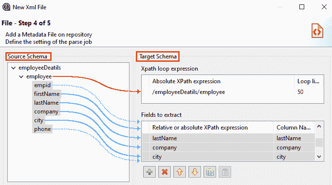

*   要查看目标的预览，点击**刷新预览**按钮，如下图所示:

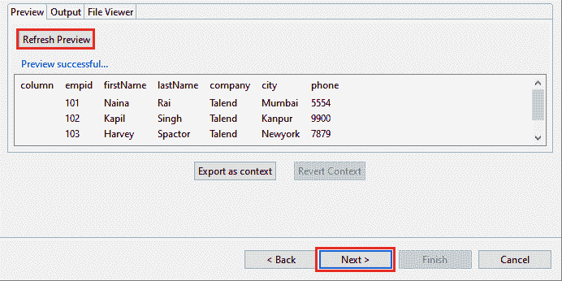

#### 注意:如果我们加载 XSD 文件，预览功能无效。

*   并且，要验证和编辑结束模式，点击**下一步**

**第 5 步:最终确定结束模式**

在最后一步中，我们将完成最终模式。

*   要自定义文件模式，请检查**类型**列中的数据类型是否正确。
*   **猜测**按钮用于更新和恢复 XML 文件模式。

#### 注意:如果我们已经定制了模式，那么 Guess 特性不会保留这些更改。

*   之后，点击**完成**按钮完成该过程，如下图所示:

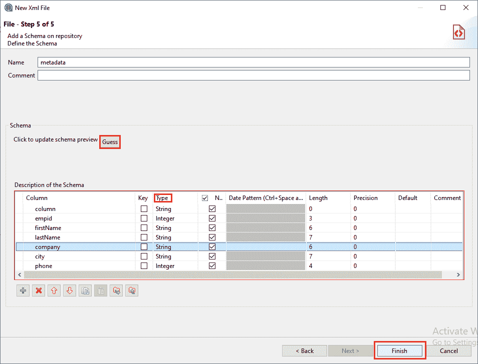

要在 Talend 工作室中查看新创建的元数据:

*   转到**存储库面板，**然后转到元数据。
*   之后，展开**文件 XML** 节点，选择 **New_XML_input** 元数据，如下图截图所示:

**资源库→元数据→文件 XML → New_XML_input**

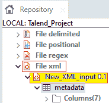

要将元数据作为新组件或现有组件重用，只需将文件连接或模式从存储库的元数据节点拖放到设计工作区窗口。

要修改现有的文件连接:

*   转到**存储库面板**，然后转到**元数据节点**。
*   之后，展开**文件 XML，**右键点击 **New_XML_input** 模式，选择**编辑文件 XML** ，如下图所示:

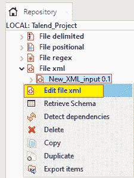

要向现有文件连接添加新模式，请执行以下操作:

*   转到**存储库面板**，右键单击**文件 xml。**
*   从**元数据**的弹出菜单中选择**检索模式**，如下图所示:

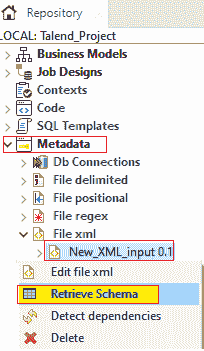

## 为输出文件设置 XML 元数据:

在本节中，我们将了解如何描述文件连接和上传输出文件的 XML 模式。

然后**新的 XML 文件**窗口将打开，文件连接和模式定义分五步完成:

*   **定义常规属性**
*   **设置元数据类型(输入)**
*   **上传 XML 文件**
*   **定义模式**
*   **最终确定结束模式**

**步骤 1:定义常规属性**

在第一步中，我们将定义模式的一般属性。

*   填写必要的细节，如**名称、目的和描述。**
*   我们还可以在**项目设置**对话框中管理**版本**和**状态**字段。
*   点击路径字段旁边的**选择**按钮，选择**文件 XML** 节点下的文件夹，保存我们新创建的文件连接。
*   填写完所有常规属性的详细信息后，点击**下一步**按钮选择元数据的类型，如下图所示:

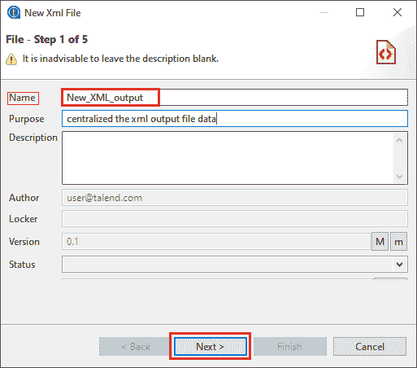

**第二步:设置元数据类型(输出)**

现在，我们将把元数据的类型设置为输出。

在下面的对话框中，选择**输出 XML** 创建 XML 元数据。

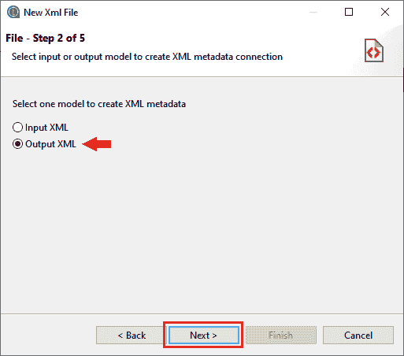

然后，点击**下一步**按钮继续。

**第三步:定义输出文件**

在下一步中，我们将定义输出文件。

*   要定义输出文件，我们将选择手动创建文件，或者从现有的 XML 或 XSD 文件创建文件。
*   如果我们选择**手动创建**选项，我们将不得不自己配置模式、源和目标列。
*   该文件将在一个作业中借助于一个 XML 输出组件来创建，如

要从 XML 文件创建输出 Xml 结构，请遵循以下过程:

*   在输出设置区域，选择**从文件**创建
*   点击**浏览**按钮，对应 **XML 或 XSD 文件**字段，从我们的本地系统中浏览 XML 文件的路径，双击该文件。

例如，我们将从系统中选择 **carr.xml** 文件。

*   如果系统没有自动找到，我们也可以根据我们的文件格式更改**编码**类型。
*   **限制**字段用于输入要执行 Xpath 查询的列数，或者我们可以将 0 放在所有列上运行查询。

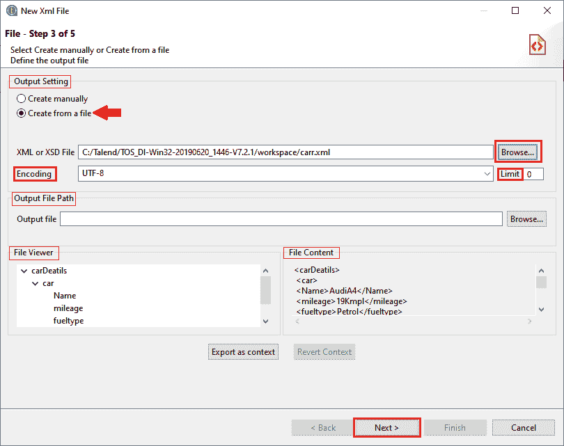

*   **文件查看器**部分显示 XML 结构的预览，文件内容部分用于显示文件前 50 行的最大值。
*   之后，在**输出文件路径**区域，我们可以在**输出文件**中浏览输出文件的路径，如果该文件还不存在，将在作业执行过程中借助**组件创建，如果该文件已经存在，将被覆盖。**
*   点击**下一步**按钮进行进一步处理。

**第 4 步:定义模式**

在这一步中，我们将定义模式。

*   在上一步定义输出文件后，**链接器源**部分将自动映射到**链接器目标**部分的相关部分，用蓝色箭头链接表示。
*   为了定义输出模式，我们有以下选项来执行:
*   在**链接器源**部分，我们可以通过点击**模式管理**按钮从头开始创建一个模式，它会打开模式编辑器编辑源模式并传递输出模式。
*   在**链接器目标**部分，右键单击我们想要运行循环的元素，并从弹出菜单中选择**设置为循环元素**，如下图所示:

#### 注意:这是定义要运行循环的元素的强制选项。

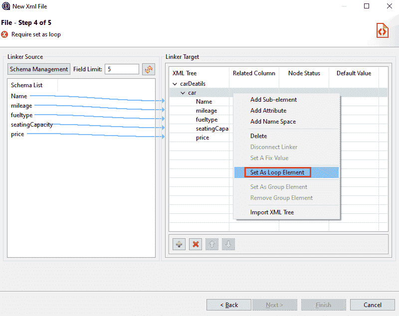

*   借助 **Ctrl + Shift** 键，我们可以一次选择和删除多个字段，并进行各种选择。

这使得映射更快，我们还可以通过右键操作进行各种选择，例如:

*   **创建为目标节点的子元素**
*   **创建目标节点的属性**
*   **向目标节点添加链接器**

如下图所示，我们选择了第二个选项**，创建目标节点的属性**，点击**确定**按钮**。**

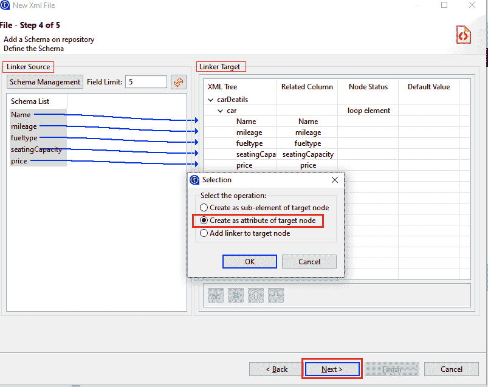

并且，要验证和编辑结束模式，点击**下一步**按钮。

**第 5 步:最终确定结束模式**

在最后一步中，我们将完成最终模式。

*   要自定义 XML 文件模式，请检查**类型**列中的数据类型是否正确。
*   **猜测**按钮用于更新、恢复 XML 文件模式。

#### 注意:如果我们已经定制了模式，那么 Guess 特性不会保留这些更改。

*   添加列时，点击 **[+]** 按钮，删除时，点击工具栏上的 **[X]** 按钮。
*   要更改列的顺序，请使用工具栏中的**向上**和**向下**箭头按钮。
*   之后，点击**完成**按钮完成该过程，如下图所示:

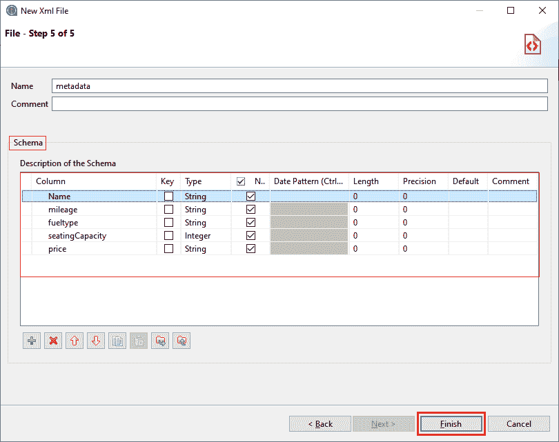

要在 Talend 工作室中查看新创建的元数据:

*   转到**存储库面板，**然后转到元数据。
*   之后，展开**文件 xml** 节点，选择 **New_XML_output** 元数据，如下图截图所示:

**资源库→元数据→文件 XML→New _ XML _ 输出**

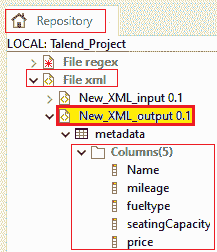

要将元数据作为新组件或现有组件重用，只需将文件连接或模式从存储库的元数据节点拖放到设计工作区窗口。

要修改现有的文件连接:

*   转到**存储库面板**，然后转到**元数据节点**。
*   之后，展开**文件 xml，**，右键单击**新建 _ XML _ 输出**模式，选择**编辑文件 xml** ，如下图所示:

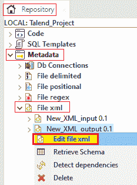

要向现有文件连接添加新模式，请执行以下操作:

*   转到**存储库面板**，右键单击**文件 xml** 中的 new_XML_output 模式。
*   从**元数据**的弹出菜单中选择**检索模式**，如下图所示:

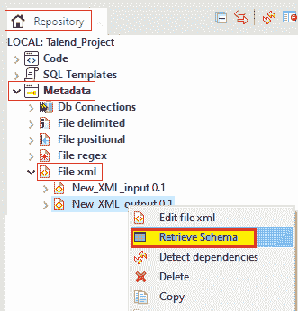

* * *****