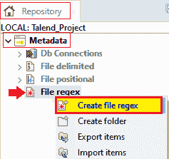
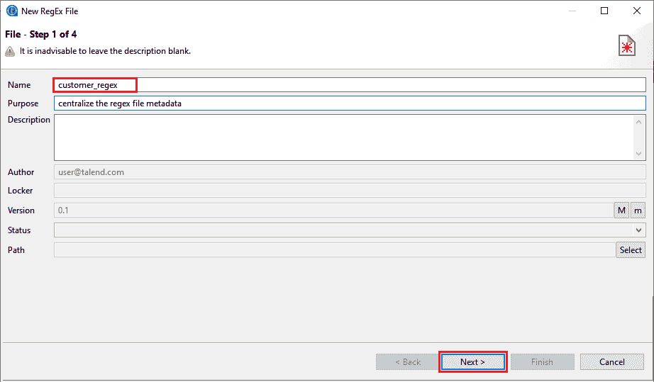
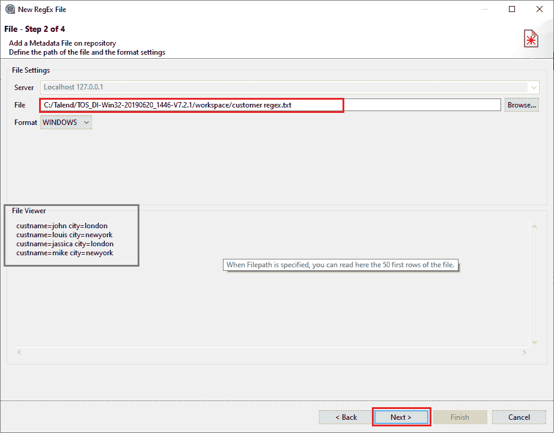
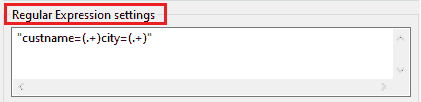
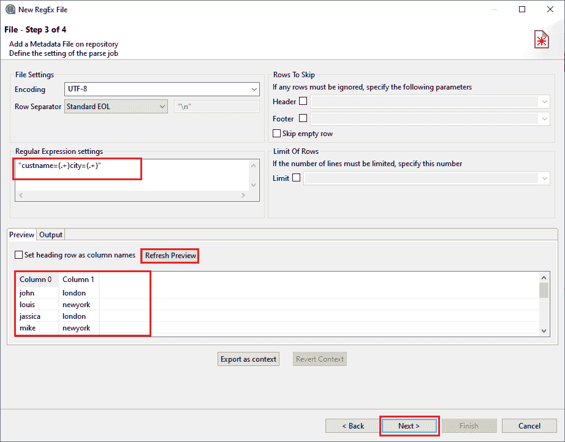
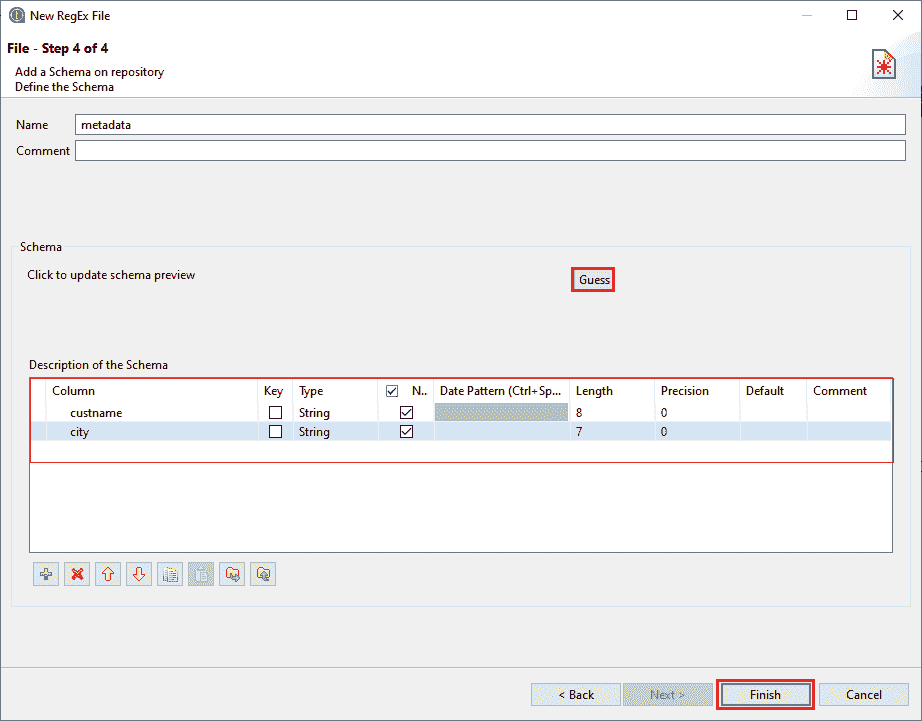
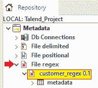
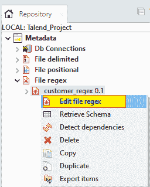
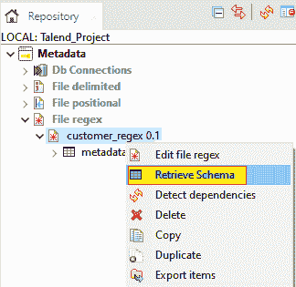

# 集中文件正则表达式元数据

> 原文：<https://www.javatpoint.com/talend-centralizing-regex-file-metadata>

在本节中，我们将学习如何在 Talend Studio 数据集成平台中集中 Regex 文件元数据。

在本章继续之前，我们将首先了解为什么我们将使用 Regex 文件。

由正则表达式组成的文件，由正则表达式文件模式使用。

例如:**日志文件**

如果我们想要连接到一个正则表达式文件，我们将在存储库中集中连接和模式信息，以实现可重用性。

要从头开始创建 Regex 文件连接:

*   转到**存储库面板。**
*   然后展开**元数据**，右键点击**文件正则表达式**，在弹出菜单中选择**创建文件正则表达式**选项，如下图所示:

**存储库→元数据→文件正则表达式→创建文件正则表达式**

#### 注意:要在我们的工作中使用集中式文件正则表达式，请转到必要组件的基本设置视图，其属性类型设置为打开文件元数据设置窗口的内置选项。

然后**新的正则表达式文件**窗口将会打开，文件连接和模式定义分四步完成:

*   **定义常规属性**
*   **定义文件路径和格式**
*   **定义文件解析参数**
*   **检查和定制文件模式**

**步骤 1:定义常规属性**

在第一步中，我们将填写所有必要的详细信息，如**名称，**是必填字段，如果我们想更具体，请填写目的和描述字段。

我们还可以在**项目设置**对话框中管理**版本**和**状态**字段。

点击路径字段旁边的**选择**按钮，在**文件注册表**节点下选择一个文件夹，保存我们新创建的文件连接。

#### 注意:如果我们正在编辑一个现有的连接，我们不能选择一个文件夹，但是我们可以随时将它拖放到一个新的文件夹中。

填写完所有通用属性的详细信息后，点击**下一步**按钮。

**第二步:定义文件路径和格式**

下一步，我们将点击**浏览**按钮，从本地系统中定位我们的文件。

例如，我们将从系统中选择 **customer_regex.txt** 文件。

*   选择与我们的**相关的**格式**。txt**
*   为此，我们从给定的下拉列表中选择格式为**窗口**。
*   如果给定的下拉列表中没有合适的格式，请忽略它。
*   我们有**文件查看器，**，它给出了文件加载的即时图片，正如我们在下面的快照中看到的:

*   之后，点击**下一步**按钮进行进一步处理。

**第三步:定义文件解析参数**

在这一步中，我们描述文件解析变量来正确恢复文件模式。

*   我们可以在**文件设置**中设置**字段**和**行**分隔符
*   如果我们文件的**行分隔符**不是标准 EOL【行尾】，我们可以从**行分隔符**下拉列表中选择**自定义字符串**，并将字符串写入**对应字符**
*   要进入**正则表达式**，我们将进入正则表达式设置来定界文件。

#### 注意:正则表达式:用于搜索文本的特定模式；我们可以为任何文本模式创建一个正则表达式。

我们可以在下面的截图中注意到:

#### 注意:正则表达式代码应该用单引号或双引号引起来。

我们的文本文件的正则表达式是:“ **custname=(。+)城市=(。+)”**

在这里，

**【。]它是一个特殊字符，用于匹配任何单个字符。**

**[+]用于一次或多次匹配前面的元素。**

*   要查看新的设置影响，请查看**文件查看**面板，并选中**将处理行设置为列名**框，将第一个解析的行转换为模式列的标签。

要查看效果和结果视图，在查看器上，点击**刷新预览**按钮。

之后，点击**下一步**按钮。

**第 4 步:检查和定制文件模式**

在最后一步中，我们将检查并定制文件模式:

*   要自定义文件模式，请检查**类型**列中的数据类型是否正确，在模式的**描述部分，我们可以修改实际文件中提到的列名。**
*   **猜测**按钮用于更新和恢复 Regex 文件模式。
*   之后，点击**完成**按钮，如下图所示:

要在 Talend 工作室中查看新创建的元数据:

*   转到存储库面板，然后转到元数据。
*   之后，展开 File Regex 节点，如下图所示:

**存储库→元数据→文件 Regex → customer_regex**

要将元数据作为新组件或现有组件重用，只需将文件连接或模式从存储库的元数据节点拖放到设计工作区窗口。

要修改现有的文件连接:

*   转到**存储库面板**，然后转到**元数据节点**。
*   之后，展开**文件正则表达式，**并右键单击模式，然后选择**编辑文件正则表达式**，如下图所示:

要向现有文件连接添加新模式，请执行以下操作:

*   转到**存储库面板**，右键单击**文件注册表**。
*   从**元数据**的弹出菜单中选择**检索模式**，如下图所示:

* * *