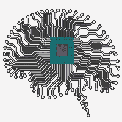
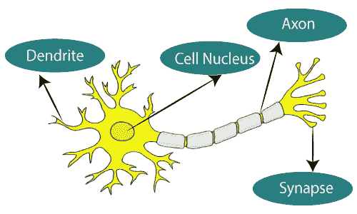
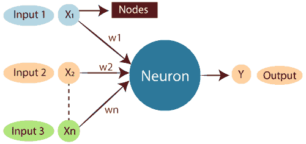
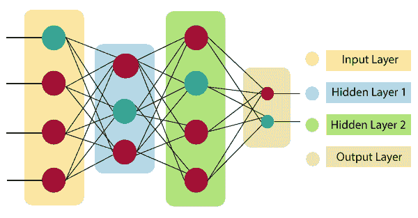
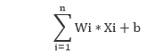
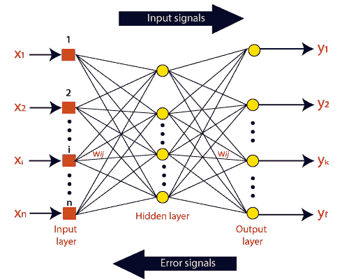

# 人工神经网络教程

> 原文：<https://www.javatpoint.com/artificial-neural-network>

人工神经网络教程提供人工神经网络的基本和高级概念。我们的人工神经网络教程是为初学者和专业人士开发的。

术语“人工神经网络”是指模仿大脑的人工智能的一个受生物学启发的子领域。人工神经网络通常是基于构建人脑结构的生物神经网络的计算网络。类似于人的大脑具有相互连接的神经元，人工神经网络也具有在网络的不同层中相互连接的神经元。这些神经元被称为节点。

人工神经网络教程涵盖了与人工神经网络相关的所有方面。在本教程中，我们将讨论人工神经网络、自适应共振理论、科霍宁自组织图、积木、无监督学习、遗传算法等。

## 什么是人工神经网络？

术语“**人工神经网络**”来源于开发人脑结构的生物神经网络。与神经元相互连接的人脑类似，人工神经网络也有神经元在网络的不同层相互连接。这些神经元被称为节点。

**图示为生物神经网络的典型图。**

**典型的人工神经网络看起来有点像给定的图。**

生物神经网络的树突代表人工神经网络的输入，细胞核代表节点，突触代表权重，轴突代表输出。

生物神经网络与人工神经网络的关系；

| 生物神经网络 | 人工神经网络 |
| 树突 | 输入 |
| 细胞核 | 节点 |
| 突触 | 砝码 |
| 轴突 | 输出 |

**人工智能领域的一个**人工神经网络****它试图模仿神经元网络组成一个人脑，这样计算机就可以选择以类似人类的方式理解事物和做出决定。人工神经网络是通过给计算机编程来设计的，其行为就像相互连接的脑细胞一样简单。

人类大脑中大约有 10000 亿个神经元。每个神经元都有一个介于 1000 到 100000 之间的关联点。在人脑中，数据是以分布式的方式存储的，必要时我们可以并行地从记忆中提取出不止一条这样的数据。我们可以说，人脑是由令人难以置信的惊人的并行处理器组成的。

我们可以用一个例子来理解人工神经网络，考虑一个数字逻辑门的例子，它接受输入并给出输出。“或”门，接受两个输入。如果一个或两个输入为“开”，那么输出为“开”。如果两个输入都为“关”，那么输出为“关”。这里输出取决于输入。我们的大脑不执行同样的任务。由于我们大脑中的神经元在“学习”，输出与输入的关系不断变化。

## 人工神经网络的结构；

要理解人工神经网络体系结构的概念，我们必须了解神经网络由什么组成。为了定义一个由大量人工神经元组成的神经网络，这些神经元被称为按层序列排列的单元。让我们看看人工神经网络中可用的各种类型的层。

人工神经网络主要由三层组成:

**输入图层:**

顾名思义，它接受程序员提供的几种不同格式的输入。

**隐藏层:**

隐藏层位于输入层和输出层之间。它执行所有的计算来寻找隐藏的特征和模式。

**输出层:**

输入通过使用隐藏层的一系列转换，最终产生使用该层传递的输出。

人工神经网络接受输入，计算输入的加权和，并包含偏差。该计算以传递函数的形式表示。

它确定加权总数是否作为输入传递给激活函数以产生输出。激活函数选择节点是否应该激发。只有被解雇的人才能进入输出层。有一些独特的激活功能可以应用于我们正在执行的任务。

## 人工神经网络的优势

**并行处理能力:**

人工神经网络具有可以同时执行多个任务的数值。

**在整个网络上存储数据:**

传统编程中使用的数据存储在整个网络上，而不是数据库上。一个地方几条数据的消失并不妨碍网络的运行。

**不完全知识的工作能力:**

经过人工神经网络训练后，即使数据不充分，信息也可能产生输出。这里的性能损失取决于丢失数据的重要性。

**具有记忆分布:**

为了使人工神经网络能够适应，重要的是确定示例，并通过向网络演示这些示例，根据期望的输出来鼓励网络。网络的连续性与选择的实例成正比，如果事件不能出现在网络的所有方面，它会产生错误的输出。

**有容错能力:**

对 ANN 的一个或多个单元的勒索并不禁止其产生输出，这一特性使得网络具有容错性。

## 人工神经网络的缺点:

**保证适当的网络结构:**

没有确定人工神经网络结构的特别指南。适当的网络结构是通过经验、试验和错误来完成的。

**网络无法识别的行为:**

这是人工神经网络最重要的问题。当人工神经网络产生一个测试解决方案时，它不能提供关于为什么和如何的洞察力。这会降低对网络的信任。

**硬件依赖:**

根据人工神经网络的结构，它需要具有并行处理能力的处理器。因此，设备的实现是依赖的。

**向网络展示问题的难度:**

人工神经网络可以处理数字数据。在引入人工神经网络之前，必须将问题转换为数值。这里要解决的呈现机制将直接影响网络的性能。它依赖于用户的能力。

**网络持续时间未知:**

网络被简化为一个特定的误差值，这个值不能给我们最佳的结果。

> 科学人工神经网络在 20 世纪中期已经深入世界，并呈指数级发展。目前，我们已经研究了人工神经网络的优点和在使用过程中遇到的问题。不可忽视的是，人工神经网络作为一个蓬勃发展的科学分支，其缺点被逐一消除，优点日益增多。这意味着人工神经网络将逐渐成为我们生活中不可替代的重要部分。

## 人工神经网络是如何工作的？

人工神经网络可以最好地表示为加权有向图，其中人工神经元形成节点。神经元输出和神经元输入之间的关联可以被视为具有权重的有向边。人工神经网络从外部源接收模式形式的输入信号和矢量形式的图像。然后，对于每 n 个输入，用符号 x(n)对这些输入进行数学赋值。

然后，每个输入乘以其相应的权重(这些权重是人工神经网络用来解决特定问题的细节)。一般来说，这些权重通常代表人工神经网络内部神经元之间的互连强度。所有加权输入都在计算单元内汇总。

如果加权和等于零，则增加偏差以使输出非零，或者根据系统的响应进行调整。Bias 有相同的输入，权重等于 1。这里，加权输入的总数可以在 0 到正无穷大的范围内。这里，为了将响应保持在期望值的限度内，某个最大值被基准化，加权输入的总和通过激活函数传递。

激活函数是指用于实现所需输出的一组传递函数。有一种不同的激活函数，但主要是线性或非线性函数集。一些常用的激活函数集是二元、线性和谭双曲乙状结肠激活函数。让我们详细了解一下其中的每一项:

## 二进制:

在二进制激活函数中，输出不是 1 就是 0。这里，为了实现这一点，设置了一个阈值。如果神经元的净加权输入大于 1，那么激活函数的最终输出返回为 1，否则输出返回为 0。

## 乙状结肠双曲线:

乙状线双曲线函数通常被视为“ **S** ”形曲线。这里，tan 双曲函数用于近似实际净输入的输出。该功能定义为:

**F(x) = (1/1 + exp(-？？？？×)**

哪里？？？？被认为是陡度参数。

## 人工神经网络的类型:

根据人脑神经元和网络功能，有各种类型的人工神经网络，人工神经网络类似地执行任务。大多数人工神经网络将与更复杂的生物伙伴有一些相似之处，并且在它们的预期任务中非常有效。例如，分段或分类。

### 反馈人工神经网络:

在这种类型的人工神经网络中，输出返回到网络中，以在内部实现最佳进化结果。根据马萨诸塞州大学洛厄尔大气研究中心。反馈网络将信息反馈到自身，非常适合解决优化问题。内部系统误差校正利用反馈神经网络。

### 前馈神经网络:

A feed-forward network is a basic neural network comprising of an input layer, an output layer, and at least one layer of a neuron. Through assessment of its output by reviewing its input, the intensity of the network can be noticed based on group behavior of the associated neurons, and the output is decided. The primary advantage of this network is that it figures out how to evaluate and recognize input patterns.

## 先决条件

在开始本教程之前，不需要特定的专业知识作为先决条件。

## 观众

我们的人工神经网络教程是为初学者和专业人士开发的，以帮助他们理解人工神经网络的基本概念。

## 问题

我们向您保证，您在本人工神经网络教程中不会发现任何问题。但是如果有什么问题或者错误，请把问题贴在联系单上，以便我们进一步改进。

* * *