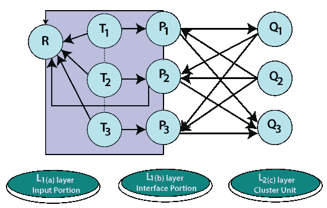
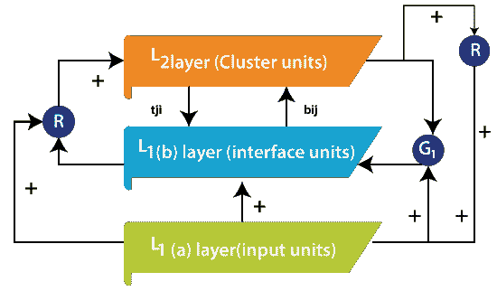
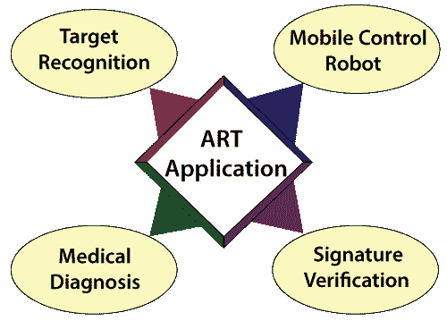

# 自适应共振理论

> 原文：<https://www.javatpoint.com/artificial-neural-network-adaptive-resonance-theory>

自适应共振理论(ART)作为人类认知数据处理的一个假设被纳入。这一假设促进了模式识别和无监督学习的神经模型。ART 系统已被用于阐明不同类型的认知和大脑数据。

自适应共振理论解决了一个系统的**稳定性-可塑性**(稳定性可以定义为记忆学习的本质，可塑性是指它们灵活地获得新信息的事实)困境，该系统要求学习如何在响应巨大输入模式的同时不失去无关模式的稳定性。除此之外，稳定性和弹性的两难问题是关于一个系统如何适应新的数据，同时保留以前学到的东西。对于这样的任务，在 ART 神经网络层中包括反馈机制。在这个神经网络中，数据以处理元素输出的形式在各层之间来回反映。如果建立了适当的模式，达到了共振，那么在此期间可以进行自适应。

它可以被定义为对如何克服竞争学习模型完成的学习不稳定性的形式分析，更不用说提出一个扩展的假设，称为**自适应共振理论** (ART)。这种正式的调查表明，一种特定类型的自上而下的学习反馈和匹配机制可以显著克服不稳定性问题。据了解，自上而下的注意机制，之前已经通过研究认知和强化机制之间的联系发现，具有与这些代码稳定机制相似的特征。换句话说，一旦人们意识到如何正式解决不稳定问题，就可以肯定，人们不需要开发任何新的定量机制来解决这个问题。一个人只需要确保整合先前发现的注意力机制。这些额外的机制使代码学习能够自我稳定，以响应本质上任意的输入系统。**格罗斯伯格**提出了自适应共振理论的基本原理。carpenter 和 Grossberg 将一种称为 ART1 的艺术类别描述为常微分方程的排列。这些定理可以根据系统的学习历史和输入模式来预测搜索的顺序。

ART1 是一种无监督学习模型，主要设计用于识别二进制模式。它包括注意子系统、定向子系统、警戒参数和复位模块，如下图所示。警戒参数对系统有巨大的影响。高度警惕产生更高的细节记忆。ART1 注意包括两个竞争网络，比较场层 L1 和识别场层 L2，两个控制增益 Gain1 和 Gain2，以及两个短期记忆阶段 S1 和 S2。长期记忆(LTM)跟随在 S1 和 S2 的某个范围内，在这些路径中倍增信号。

增益控制使 L1 和 L2 能够认识到运行周期的当前阶段。当自下而上和自上而下的信号不匹配发生在 L1 时，扫描隧道显微镜复位波阻止有源 L2 单元。比较层获得二进制外部输入，并将其传递给负责将其与分类类别协调的识别层。这个结果返回给比较层，以找出类别何时与输入向量相匹配。如果匹配，则读取新的输入向量，循环再次开始。如果存在不匹配，则定向系统负责防止先前的类别在识别层中获得新的类别匹配。给定的两个增益分别控制识别层和比较层的活动。在电流停止之前，复位波特别且持久地阻止活跃的 L2 单元。输入模式的偏移结束其处理 L1，并触发增益 2 的偏移。增益 2 偏移导致 L2 的扫描隧道显微镜持续衰减，从而使 L2 准备编码下一个输入模式，而不使用百色。

## ART1 实施流程:

ART1 是一个自组织神经网络，其输入和输出神经元使用自下而上和自上而下的自适应权重相互耦合，以执行识别。为了开始我们的方法，首先根据自适应共振理论，通过将 5*5 矩阵类型的参考模式数据输入到神经元中来训练系统，以便在输出神经元中进行聚类。接下来，根据警戒参数定义 L2 的最大节点数。输入的模式将自己登记为节点 L1 域上的短期记忆活动。从 L1 到编码场 L2 的组合和分离路径，每个路径由自适应长期记忆轨迹加权，转换成净信号向量 T。L2 的内部竞争动态进一步转换 T，创建压缩代码或内容可寻址存储器。竞争激烈时，激活集中在获得最大 L1 → L2 信号的 L2 节点。这项工作的主要目标分为以下四个阶段:比较、识别、搜索和学习。

**适应性学习理论(ART)的优势:**

它可以通过不同的技术进行协调和利用，以给出更精确的结果。

它不能确保形成集群的稳定性。

它可以应用于人脸识别、嵌入式系统、机器人、目标识别、医疗诊断、签名验证等不同领域。

它表现出稳定性，并且不受提供给输入的各种输入的干扰。

它比竞争性学习有好处。当认为有必要时，竞争性学习不能包括新的集群。

## 抗逆转录病毒疗法的应用:

ART 代表自适应共振理论。用于快速、稳定学习和预测的 ART 神经网络已在不同领域得到应用。该应用集成了目标识别、人脸识别、医疗诊断、签名验证、移动控制机器人。

**目标识别:**

模糊 ARTMAP 神经网络可以根据目标的雷达距离像进行自动分类。对合成数据的测试表明，当与 k 个最近邻(kNN)分类器相关时，模糊 ARTMAP 可以节省大量内存需求。多波长轮廓的使用主要提高了两种分类器的性能。

**医学诊断:**

医学数据库提出了在一般信息管理环境中发现的大量挑战，在这些环境中，速度、使用、效率和准确性是首要考虑因素。改进的计算机辅助医学的一个直接目标是帮助在不太理想的情况下提供重症监护。处理这些问题刺激了一些艺术建筑的发展，包括艺术地图集成电路。

**签名验证:**

自动签名验证是一个众所周知且活跃的研究领域，具有各种应用，如银行支票确认、自动柜员机访问等。网络的训练使用 ART1 完成，ART1 使用全局特征作为输入向量，验证和识别阶段使用两步过程。在初始步骤中，输入向量与被用作训练集的存储的参考向量相协调，并且在第二步骤中，发生聚类形成。

**移动控制机器人:**

如今，我们看到了各种各样的机器人设备。这仍然是他们项目中的一个研究领域，叫做人工智能。作为这种智能系统的模型，人脑是一个有趣的课题。受人脑结构的启发，一种人工神经出现了。类似于大脑，ANN包含许多简单的计算单元，神经元相互连接，允许信号从神经元传递到神经元。与其他决策算法相比，ANN用于解决不同的问题，具有良好的结果。

## 抗逆转录病毒疗法的局限性:

一些 ART 网络是矛盾的，因为它们依赖于训练数据的顺序，或者依赖于学习速率。

* * *