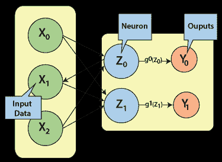
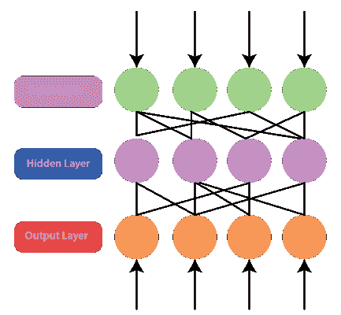
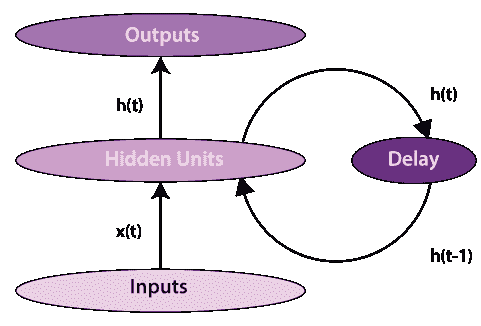
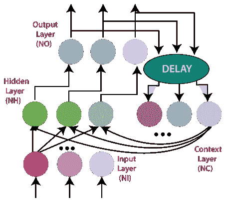
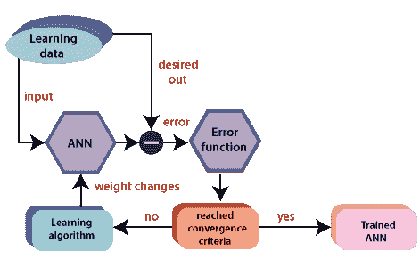
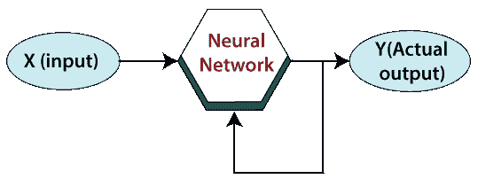
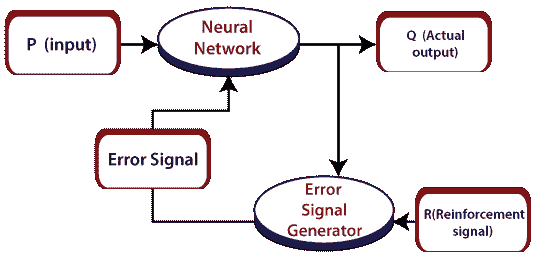

# 积木

> 原文：<https://www.javatpoint.com/artificial-neural-network-building-blocks>

神经网络由更短的模块或积木组成，就像物质中的原子和电子电路中的逻辑门一样。一旦我们知道了这些块是什么，我们就可以将它们组合起来解决各种问题。

人工神经网络的处理取决于给定的三个构件:

*   网络拓扑结构
*   调整权重或学习
*   激活功能

在本教程中，我们将详细讨论人工神经网络的这三个组成部分。

## 网络拓扑:

神经网络的拓扑指的是神经元如何关联，它是网络功能和学习的一个重要因素。无监督学习中的一种常见拓扑是将输入直接映射到代表类别的一组单元，例如自组织映射。监督学习中最广泛认可的拓扑是完全关联的三层前馈网络(反向传播、径向基函数网络)。所有输入值都与隐藏层中的所有神经元相关联(隐藏是因为它们在输入或输出中不明显)，隐藏神经元的输出与输出层中的所有神经元相关联，输出神经元的激活函数建立整个网络的输出。这种网络是众所周知的，部分原因是假设它们是通用函数逼近器，例如，sigmoid 或 Gaussian。

### 前馈网络:

分层前馈网络的发展始于 20 世纪 50 年代末，由 T2 的感知机和 T4 的自适应线性元件给出。感知器和 ADLINE 可以定义为单层网络，通常被称为单层感知器。单层感知器只能解决线性可分问题。单层网络的局限性促使了具有至少一个隐藏层的多层前馈网络的发展，这种网络被称为多层感知器(MLP)网络。MLP 网络克服了单层感知器的各种限制，可以准备利用反向传播算法。反向传播方法被自主发明了几次。

1974 年，Werbos 创建了一个反向传播训练算法。然而，Werbos 的工作在科学界仍然不为人知，1985 年，帕克重新发现了这项技术。帕克发表他的发现后不久，鲁梅尔哈特、辛顿和威廉姆斯也重新发现了这种方法。正是鲁梅尔哈特和另一个人并行分布式处理小组的努力，使得反向传播方法成为神经计算的支柱。

### 单层前馈网络；

罗森布拉特在 20 世纪 50 年代末和 90 年代初首次构建了单层前馈网络。只有一个加权层的前馈人工神经网络的概念。换句话说，我们可以说输入层与外层是完全关联的。

### 多层前馈网络:

多层前馈神经网络是感知器的连接，其中信息和计算是单向流动的，从输入数据到输出。神经网络的总层数与感知器的总层数相同。最简单的神经网络是具有单一输入层和感知器输出层的网络。具有多个加权层的前馈人工神经网络的概念。由于系统在输入层和输出层之间至少有一层，因此称为隐藏层。

### 反馈网络:

基于反馈的预测指的是以迭代方式对结果的近似，其中每次迭代的操作取决于当前的结果。反馈是从控制假说到心理学等不同领域进行预测的常见方式。生物有机体也在使用反馈联想，大脑在复杂的认知中扮演着重要的角色。

换句话说，我们可以说反馈网络有反馈路径，这意味着信号可以使用环路双向流动。它构成一个非线性动态系统，这个系统不断变化，直到达到平衡状态。它可以分为以下几种类型:

### 循环网络:

人脑是一个递归神经网络，指的是具有反馈连接的神经元网络。它可以学习许多传统学习技术无法学习的行为、序列、处理任务、算法和程序。这解释了为什么人们对技术应用中的人工递归网络的兴趣迅速增长。例如，通用计算机可以学习算法，将输入排列映射到输出排列，有或没有教师。与其他适应性方法相比，它们在计算上更占优势，在生物学上更容易想象。例如，隐马尔可夫模型(无连续内部状态)、前馈网络和支持向量机(无内部状态)。

### 全循环网络:

完全递归神经网络最直接的形式是多层感知器(MLP)，它具有先前的一组隐藏单元激活，并与输入一起反馈。换句话说，这是最简单的神经网络设计，因为所有节点都与所有其他节点相关联，每个节点都作为输入和输出工作。

请注意，时间' **t** '必须离散化，激活在每个时间间隔更新。时间尺度可以与真实神经元的活动相比较，或者对于人工系统，只要适合给定问题的步长可以使用。应该引入延迟单元来保持激活，直到它们在下一个时间间隔准备好。

### 约旦网络:

乔丹网络是指一种简单的神经结构，其中只有过程输入信号的一个值(来自前一次采样)和模型的延迟输出信号的一个值(来自前一次采样)被用作网络的输入。为了得到计算上基本的模型预测控制算法，非线性乔丹神经模型在一个工作点附近被反复在线线性化，这引起了二次优化问题。将所描述的 MPC 算法的充分性与在每个采样时刻执行在线非线性优化的非线性 MPC 方案的充分性进行比较。

## 权重调整或学习:

人工神经网络中的学习是改变特定网络的神经元之间的关联权重的技术。人工神经网络中的学习可以分为三个不同的类别，即监督学习、无监督学习和强化学习。

### 监督学习:

监督学习由监督和学习两个词组成。监督经理部的指导。我们有监督人员，他们的职责是引导和指引方向。我们可以在学习的情况下看到类似的情况。在这里，机器或程序在现有数据集的帮助下进行学习。我们有一个数据集，我们根据现有数据集的行为假设新数据的结果。这意味着现有的数据集充当了主管或老板的角色来寻找新的数据。一个基本的例子是电子产品价格预测。电子产品的价格是根据观察到的其他数字产品的价格来预测的。

在监督学习下的人工神经网络训练过程中，输入向量被提供给网络，网络提供输出向量。然后，将输出向量与期望的输出向量进行比较。如果实际输出和期望输出向量之间存在差异，则会产生误差信号。基于该误差信号，调整权重，直到实际输出与期望输出相匹配。

### 无监督学习:

顾名思义，无监督学习是指在没有任何监督或现有数据帮助的情况下预测某事。在这种学习中，程序通过将具有相似特征的数据分成相似的组来学习。在监督学习中，数据被分组，依靠相似的特征。在这种情况下，没有现有的数据可以寻找方向。换句话说，没有主管。在无监督学习下的人工神经网络的训练期间，比较类型的输入向量被连接以形成聚类。当实现新的输入模式时，神经网络给出输出响应，显示输入模式所属的类别。对于理想的输出应该是什么，以及它是正确的还是不正确的，没有来自环境的反馈。因此，在这种类型的学习中，网络本身必须从输入数据中找到模式和特征，并通过输出找到输入数据的连接。

### 强化学习:

强化学习是一种有助于解决控制优化问题的技术。通过使用控制优化，我们可以识别系统访问的每个状态中的最佳动作，以便优化一些目标函数。典型地，当系统具有大量的状态和复杂的随机结构时，强化学习就产生了，它不负责封闭形式的分析。如果问题的状态数量相对较少，那么随机结构就相对简单，这样就可以利用动态规划。

顾名思义，这种学习是用来加强一些分析师数据的网络。这个学习过程就像监督学习。然而，我们可能只有很少的信息。在强化学习中，在网络的训练过程中，网络从系统中获得一些反馈。这使得它相当像监督学习。这里获得的反馈是评价性的，而不是指导性的，这意味着在监督学习中没有教师。获得反馈后，网络对权重进行修改，以在未来获得更好的分析师数据。

## 激活功能:

激活函数是指神经网络中用来计算输入和偏差的加权和的函数，用于选择可以被激发或不被激发的神经元。它通过一些梯度处理(通常是梯度下降)来控制所呈现的信息。它为神经网络产生输出，包括数据中的参数。

激活函数可以是线性的，也可以是非线性的，取决于它所显示的函数。它用于控制外部神经网络在各个领域的输出，如语音识别、分割、指纹检测、癌症检测系统等。

在人工神经网络中，我们可以使用输入上的激活函数来获得精确的输出。这些是人工神经网络中使用的一些激活函数。

### 线性激活函数:

线性激活函数的方程与直线方程相同，即

**Y= MX+ C**

如果我们有很多层，并且所有层本质上都是线性的，那么最后一层的最终激活函数与第一层的线性函数相同。线性函数的范围是–不定式到+不定式。

线性激活函数只能在输出层使用。

### Sigmoid 函数:

Sigmoid 函数是指投影为 S 形图的函数。

**A = 1/(1+e -x )**

这个函数是非线性的，x 的值在-2 到+2 之间。所以 X 的值与 y 的值成正比。这意味着 X 值的微小变化也会导致 y 值的变化。

### Tanh 函数:

The activation function, which is more efficient than the sigmoid function is Tanh function. Tanh function is also known as Tangent Hyperbolic Function. It is a mathematical updated version of the sigmoid function. Sigmoid and Tanh function are similar to each other and can be derived from each other.

**F(x)= tanh(x)= 2/(1+e-2X)-1**

运筹学

**Tanh (x) = 2 * sigmoid(2x) - 1**

This function is non-linear, and the value range lies between -1 to +1

* * *